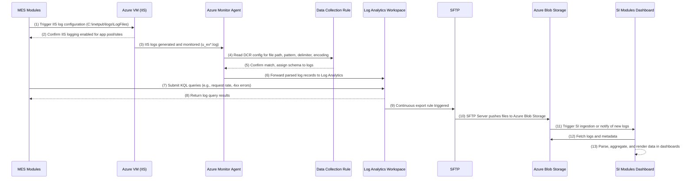
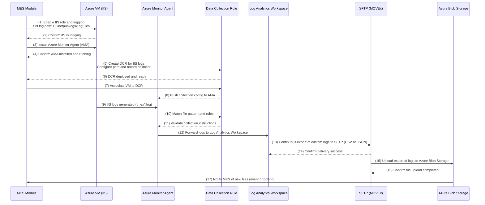
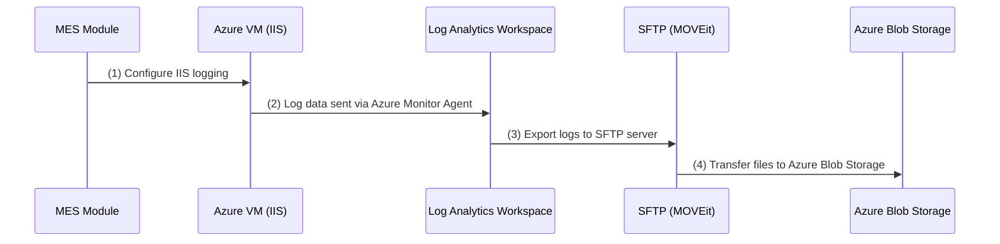
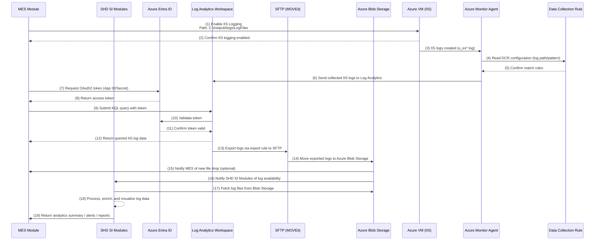
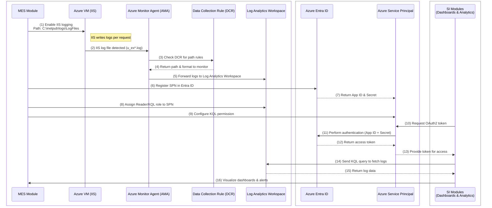
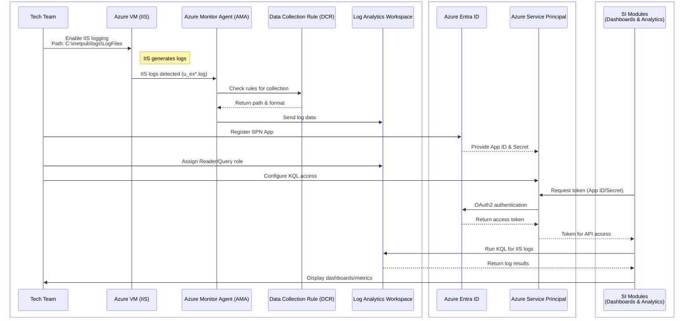

Great — here's the **full Azure Policy** definition for **PostgreSQL diagnostic logs**, now including:


Thanks! Using `count()` is a more elegant and performant approach for validating the existence of multiple enabled logs in an `existenceCondition`.

Here’s how to use `count()` in your **Azure Policy `existenceCondition`** to ensure all selected diagnostic logs (based on `true` parameters) are **present and enabled**:

---

### ✅ **`existenceCondition` Using `count()` for PostgreSQL Diagnostic Logs**

```json
"existenceCondition": {
  "allOf": [
    {
      "field": "Microsoft.Insights/diagnosticSettings/workspaceId",
      "equals": "[parameters('logAnalyticsWorkspaceId')]"
    },
    {
      "field": "count(Microsoft.Insights/diagnosticSettings/logs[?(@.category=='PostgreSQLLogs' && @.enabled==true)])",
      "equals": "[if(equals(parameters('enablePostgreSQLLogs'), 'true'), 1, 0)]"
    },
    {
      "field": "count(Microsoft.Insights/diagnosticSettings/logs[?(@.category=='QueryStoreRuntimeStatistics' && @.enabled==true)])",
      "equals": "[if(equals(parameters('enableQueryStoreRuntimeStatistics'), 'true'), 1, 0)]"
    },
    {
      "field": "count(Microsoft.Insights/diagnosticSettings/logs[?(@.category=='QueryStoreWaitStatistics' && @.enabled==true)])",
      "equals": "[if(equals(parameters('enableQueryStoreWaitStatistics'), 'true'), 1, 0)]"
    },
    {
      "field": "count(Microsoft.Insights/diagnosticSettings/logs[?(@.category=='ConnectionLogs' && @.enabled==true)])",
      "equals": "[if(equals(parameters('enableConnectionLogs'), 'true'), 1, 0)]"
    },
    {
      "field": "count(Microsoft.Insights/diagnosticSettings/logs[?(@.category=='ErrorLogs' && @.enabled==true)])",
      "equals": "[if(equals(parameters('enableErrorLogs'), 'true'), 1, 0)]"
    },
    {
      "field": "count(Microsoft.Insights/diagnosticSettings/logs[?(@.category=='AuditLogs' && @.enabled==true)])",
      "equals": "[if(equals(parameters('enableAuditLogs'), 'true'), 1, 0)]"
    }
  ]
}
```

---

### 🧠 Explanation:

Each condition says:

> “If a log is enabled via policy parameters, then exactly **1 matching log entry (enabled==true)** must exist.”

If a log is **not required** (`false`), then the count is expected to be `0`.

---

### 📦 Optional Follow-up

Would you like the **entire updated policy JSON** now fully merged with this `count()`-based `existenceCondition`?
Or should I export this into a **.json file** or **Terraform-compatible block**?

Let me know how you'd like to proceed.


✅ `deployIfNotExists` effect
✅ All log categories with individually selectable **true/false** options via `allowedValues`
✅ Targeting **Log Analytics Workspace**
✅ Ready for remediation task creation

---

### 🔐 **Azure Policy: PostgreSQL Diagnostic Logging – deployIfNotExists + Parameterized Logs**

```json
{
  "properties": {
    "displayName": "Ensure Diagnostic Logs are Enabled for PostgreSQL with Per-Log Options",
    "policyType": "Custom",
    "mode": "Indexed",
    "description": "Deploys Diagnostic Settings on PostgreSQL servers to send selected logs to Log Analytics. Each log category can be independently enabled or disabled.",
    "parameters": {
      "logAnalyticsWorkspaceId": {
        "type": "String",
        "metadata": {
          "displayName": "Log Analytics Workspace Resource ID",
          "description": "Resource ID of the Log Analytics Workspace"
        }
      },
      "enablePostgreSQLLogs": {
        "type": "String",
        "allowedValues": ["true", "false"],
        "defaultValue": "false",
        "metadata": {
          "displayName": "Enable PostgreSQL Logs",
          "description": "Whether to enable PostgreSQL general logs"
        }
      },
      "enableQueryStoreRuntimeStatistics": {
        "type": "String",
        "allowedValues": ["true", "false"],
        "defaultValue": "false",
        "metadata": {
          "displayName": "Enable Query Store Runtime Statistics Logs",
          "description": "Whether to enable query runtime statistics logs"
        }
      },
      "enableQueryStoreWaitStatistics": {
        "type": "String",
        "allowedValues": ["true", "false"],
        "defaultValue": "false",
        "metadata": {
          "displayName": "Enable Query Store Wait Statistics Logs",
          "description": "Whether to enable wait statistics logs"
        }
      },
      "enableConnectionLogs": {
        "type": "String",
        "allowedValues": ["true", "false"],
        "defaultValue": "false",
        "metadata": {
          "displayName": "Enable Connection Logs",
          "description": "Whether to enable connection logs"
        }
      },
      "enableErrorLogs": {
        "type": "String",
        "allowedValues": ["true", "false"],
        "defaultValue": "false",
        "metadata": {
          "displayName": "Enable Error Logs",
          "description": "Whether to enable error logs"
        }
      },
      "enableAuditLogs": {
        "type": "String",
        "allowedValues": ["true", "false"],
        "defaultValue": "false",
        "metadata": {
          "displayName": "Enable Audit Logs",
          "description": "Whether to enable audit logs"
        }
      }
    },
    "policyRule": {
      "if": {
        "field": "type",
        "equals": "Microsoft.DBforPostgreSQL/servers"
      },
      "then": {
        "effect": "deployIfNotExists",
        "details": {
          "type": "Microsoft.Insights/diagnosticSettings",
          "roleDefinitionIds": [
            "/providers/microsoft.authorization/roleDefinitions/749f88d5-cbae-40b8-bcfc-e573ddc772fa"  // Monitoring Contributor
          ],
          "existenceCondition": {
            "allOf": [
              {
                "field": "Microsoft.Insights/diagnosticSettings/workspaceId",
                "equals": "[parameters('logAnalyticsWorkspaceId')]"
              }
            ]
          },
          "deployment": {
            "properties": {
              "mode": "incremental",
              "template": {
                "$schema": "https://schema.management.azure.com/schemas/2019-04-01/deploymentTemplate.json#",
                "contentVersion": "1.0.0.0",
                "resources": [
                  {
                    "type": "Microsoft.Insights/diagnosticSettings",
                    "apiVersion": "2021-05-01-preview",
                    "name": "[concat('diag-', field('name'))]",
                    "properties": {
                      "targetResourceId": "[resourceId('Microsoft.DBforPostgreSQL/servers', field('name'))]",
                      "workspaceId": "[parameters('logAnalyticsWorkspaceId')]",
                      "logs": [
                        {
                          "category": "PostgreSQLLogs",
                          "enabled": "[equals(parameters('enablePostgreSQLLogs'), 'true')]",
                          "retentionPolicy": { "enabled": false, "days": 0 }
                        },
                        {
                          "category": "QueryStoreRuntimeStatistics",
                          "enabled": "[equals(parameters('enableQueryStoreRuntimeStatistics'), 'true')]",
                          "retentionPolicy": { "enabled": false, "days": 0 }
                        },
                        {
                          "category": "QueryStoreWaitStatistics",
                          "enabled": "[equals(parameters('enableQueryStoreWaitStatistics'), 'true')]",
                          "retentionPolicy": { "enabled": false, "days": 0 }
                        },
                        {
                          "category": "ConnectionLogs",
                          "enabled": "[equals(parameters('enableConnectionLogs'), 'true')]",
                          "retentionPolicy": { "enabled": false, "days": 0 }
                        },
                        {
                          "category": "ErrorLogs",
                          "enabled": "[equals(parameters('enableErrorLogs'), 'true')]",
                          "retentionPolicy": { "enabled": false, "days": 0 }
                        },
                        {
                          "category": "AuditLogs",
                          "enabled": "[equals(parameters('enableAuditLogs'), 'true')]",
                          "retentionPolicy": { "enabled": false, "days": 0 }
                        }
                      ],
                      "metrics": [
                        {
                          "category": "AllMetrics",
                          "enabled": true,
                          "retentionPolicy": { "enabled": false, "days": 0 }
                        }
                      ]
                    }
                  }
                ]
              }
            }
          }
        }
      }
    }
  }
}
```

---

### 📦 Optional Add-ons

Would you like one or more of the following?

1. ✅ **Terraform** version of this policy
2. ✅ **PowerShell script** to create remediation task
3. ✅ **Policy assignment JSON** with example parameter values
4. ✅ **Initiative** bundling this with related PostgreSQL policies

Let me know what you'd like next, and I’ll build it.


Here’s a refined **cost breakdown table** for **Azure Virtual Network Flow Logs** stored in **Azure Blob Storage (Hot tier, LRS)** — **excluding VMs and Log Analytics costs**:

---

### 📦 VNet Flow Logs → Hot Blob Storage Cost Breakdown

| **Cost Component**             | **Description**                               | **Rate**                                                              | **Assumed Usage**        | **Monthly Cost**   |
| ------------------------------ | --------------------------------------------- | --------------------------------------------------------------------- | ------------------------ | ------------------ |
| **Data Storage**               | Flow log data volume                          | **\$0.0184 per GB/month** ([reddit.com][1], [azure.microsoft.com][2]) | 100 GB                   | **\$1.84**         |
| **Write Operations**           | Ingesting daily log blobs                     | **\$0.055 per 10k ops**                                               | 300k writes (daily logs) | **\$1.65**         |
| **Read Operations**            | Occasional blob reads (e.g. integrity checks) | **\$0.0044 per 10k ops**                                              | 50k reads                | **\$0.02**         |
| **List & Metadata Operations** | Listing blobs, container browsing             | **\$0.055 per 10k list ops**                                          | 50k ops                  | **\$0.28**         |
| **Total Estimated Cost**       | Sum of storage + operations                   | —                                                                     | For 100 GB/month         | **\~\$3.79/month** |

---

### 🔍 Notes & Assumptions

* **Data Storage**: Based on Azure Blob Hot tier, LRS pricing at \$0.0184/GB/mo ([azure.microsoft.com][2]).
* **Write Ops**: Flow Logs generate many small blobs; estimated at \~300,000 write operations monthly.
* **Read Ops**: Assumes limited usage—daily validation or audits (\~50k reads).
* **List Ops**: Includes occasional listing for maintenance or retrieval (\~50k ops).
* We assume **100 GB data/month**—you can adjust proportionally.
* **Data retrieval per GB is free** in Hot tier; not included here ([learn.microsoft.com][3]).

---

### ✔️ How to Customize for Your Environment

* **Adjust Data Volume**: Scale storage cost by actual GB/month.
* **Operation Counts**: Increase or decrease based on your logging and management patterns.
* **Regions**: Pricing may vary slightly outside East US; check Azure pricing page for your region.
* To reduce costs:

  * Consolidate log file frequency
  * Use **blob lifecycle policies** (move older logs to Cool tier)
  * Limit unnecessary blob listings or reads

---

If you share:

* Your **actual monthly logging volume**
* Frequency of reads or container listings

I can refine this table with precise cost numbers tailored to your setup.

[1]: https://www.reddit.com/r/AZURE/comments/1ideoqy/azure_blob_storage_pricing_seems_too_good_to_be/?utm_source=chatgpt.com "Azure Blob Storage pricing seems too good to be true, so I ... - Reddit"
[2]: https://azure.microsoft.com/en-us/pricing/details/storage/blobs/?utm_source=chatgpt.com "Azure Blob Storage pricing"
[3]: https://learn.microsoft.com/en-us/answers/questions/1622287/azure-blob-storage-pricing?utm_source=chatgpt.com "Azure blob storage pricing - Microsoft Q&A"


Here is a **detailed cost breakdown table** focused **only on Azure Virtual Network Flow Logs stored in Azure Storage (Hot Tier)** — **excluding VMs and Log Analytics**.

---

### 💰 **Azure VNet Flow Logs to Storage Account – Cost Breakdown (Hot Tier Only)**

| **Cost Component**               | **Description**                                         | **Unit Rate (USD)**               | **Estimation Basis**     | **Monthly Cost (Estimate)** |
| -------------------------------- | ------------------------------------------------------- | --------------------------------- | ------------------------ | --------------------------- |
| **Data Written to Blob Storage** | Volume of flow log data written to storage              | \$0.0184 per GB (Hot tier, LRS)\* | 100 GB/month             | \$1.84                      |
| **Read Operations**              | Occasional reads to validate logs or retrieve snapshots | \$0.004 per 10,000 operations     | 50,000 reads             | \$0.02                      |
| **Write Operations**             | Logs are continuously written to Blob storage           | \$0.05 per 10,000 operations      | 300,000 writes           | \$1.50                      |
| **List & Other Operations**      | Listing blobs/folders for diagnostics, cleanup          | \$0.004 per 10,000 operations     | 50,000 ops               | \$0.02                      |
| **Data Retrieval (Optional)**    | Downloading or analyzing logs manually                  | \$0.01 per GB                     | 10 GB/month download     | \$0.10                      |
| **Metadata Storage**             | Metadata for each blob (log file)                       | Included in blob pricing          | –                        | –                           |
| **Total Estimated Cost**         | Sum of all above                                        |                                   | For 100 GB flow log data | **\~\$3.48/month**          |

---

### 📌 Assumptions:

* Storage Tier: **Hot**
* Redundancy: **Locally Redundant Storage (LRS)**
* Region: **East US** (pricing may vary by region)
* Data Volume: **100 GB/month**
* Operations:

  * **300,000 write ops/month** (avg \~100,000 log files/week)
  * **50,000 read/listing ops/month**
* Pricing as per [Azure Storage Pricing](https://azure.microsoft.com/en-us/pricing/details/storage/blobs/)

---

Let me know if you want to:

* Estimate for **Cool/Archive** tiers
* Adjust data volume or operation count
* Include **Zone Redundant (ZRS)** or **Geo Redundant Storage (GRS)** scenarios

I can also provide a **Power BI dashboard or Excel model** for month-to-month tracking.


Here is a **cost breakdown analysis table** specifically for **Azure Network Security Group (NSG) Flow Logs written to Azure Storage (Hot Tier only)** — **excluding any VM costs**:

---

### 💰 **NSG Flow Logs to Azure Storage (Hot Tier) — Cost Breakdown Table**

| **Cost Component**                           | **Unit**          | **Est. Usage per Month** | **Unit Price (USD)**          | **Monthly Cost (USD)** | **Notes**                                                            |
| -------------------------------------------- | ----------------- | ------------------------ | ----------------------------- | ---------------------- | -------------------------------------------------------------------- |
| **Data Written (Ingress)**                   | GB                | 150 GB                   | \$0.0184 per GB               | \$2.76                 | Based on average Flow Log volume from 100 NSGs writing 5 MB/hr       |
| **Data Stored (Used Capacity)**              | GB                | 150 GB                   | \$0.0184 per GB               | \$2.76                 | Assuming log retention = 30 days in Hot tier                         |
| **Write Operations (Put Blob, Append Blob)** | 10,000 operations | 100 million ops          | \$0.05 per 100,000 operations | \$50.00                | Flow logs generate many write ops (1 entry per NSG per 5 min per VM) |
| **Read Operations (if accessed)**            | 10,000 operations | Negligible / Optional    | \$0.004 per 10,000 operations | \~\$0.00 (if no reads) | Costs incurred only if logs are accessed via portal/scripts          |
| **Metadata Write Operations**                | 10,000 operations | Included above           | Included                      | Included               | Handled during blob writes                                           |
| **Early Deletion (if not retained 30 days)** | Per GB            | Not applicable           | N/A                           | \$0.00                 | Only applies to Cool/Archive tiers, not Hot                          |

---

### 📊 **Total Estimated Monthly Cost**:

**\~\$55.52 USD/month** (based on 150 GB data + 100 million write ops)

---

### 📝 **Assumptions**:

* 100 NSGs writing flow logs
* Average log output \~5 MB/hr per NSG → 12 GB/day total
* Retained for 30 days in **Hot Tier**
* \~100 million write operations/month (conservative for 5 min intervals per NSG)
* **No access/read operations**

---

Would you like this breakdown in **CSV** or **Excel format** for reporting?

Yes, you can view the **current cost of Azure VNet Flow Logs to a Storage Account** by examining **Storage Account metrics** and **Azure Cost Management**. Here's how:

---

## ✅ **Option 1: Azure Cost Management (Recommended for Billing Insight)**

### 🔹 **Steps:**

1. Go to **Azure Portal**.
2. Navigate to **Cost Management + Billing**.
3. Select:

   * **Scope** → choose the **Subscription** or **Resource Group**.
4. Click on **Cost analysis**.
5. **Filter by Resource type**:

   * Select **Storage Account**.
   * Filter on the **Storage Account** used by Flow Logs.
6. Optionally group by **Meter category** or **Meter subcategory** to see:

   * **Data Write Operations**
   * **Data Stored (GB)**
   * **Data Retrieval**

### 🔍 Tip:

If you're not sure which storage account is used:

* Go to **Network Watcher** → **NSG Flow Logs**
* Select the NSG → check the **Storage Account name** in the configuration

---

## ✅ **Option 2: Azure Monitor Metrics (For Blob Storage Usage)**

### 🔹 **Steps:**

1. Go to the **Storage Account** (used by flow logs).
2. Click on **Monitoring** → **Metrics**.
3. Set:

   * **Namespace**: `Blob`
   * **Metric**: `Used capacity` or `Ingress` (amount written)
   * **Time range**: Select **last 7 days** or **month to date**
4. Add **filters**:

   * Filter on **container** used for Flow Logs (`insights-logs-networksecuritygroupflowevent`)

> This gives you volume-based usage; multiply by storage cost per GB to estimate actual cost.

---

## ✅ **Option 3: Azure Storage Account → Insights (Preview or Diagnostic Metrics)**

1. Go to the **Storage Account**.
2. Open **Insights** (preview blade).
3. Check **Data written per day** under Blob storage metrics.
4. Compare this with pricing for your storage tier (Hot/Cool/Archive) and redundancy type (LRS/GRS).

---

## 💡 Quick Cost Formula:

If you know the GB stored or written:

```bash
Cost = GB × ($ per GB from your pricing tier)
```

Example:

* Used capacity = 150 GB (Hot tier)
* Storage cost = \$0.0184/GB
* Cost = 150 × 0.0184 = **\~\$2.76/month**

---

## 🧠 Optional Kusto Query (if logs go to Log Analytics)

If you’re ingesting Flow Logs into Log Analytics:

```kusto
Usage
| where ResourceId contains "NetworkSecurityGroupFlowEvent"
| summarize IngestedGB = sum(Quantity) by bin(TimeGenerated, 1d)
```

---

Would you like a PowerShell or CLI script to fetch this data programmatically?

Yes, you can estimate the cost of **Azure VNet Flow Logs** by breaking it into **three main cost components**:

---

### 🔹 1. **Network Watcher Flow Logs Enablement**

This part is free — enabling **NSG Flow Logs (VNet Flow Logs)** under **Azure Network Watcher** has **no cost by itself**. However:

* **Flow logs are written to a storage account**, and that's where costs begin.

---

### 🔹 2. **Azure Storage Account Cost (for storing logs)**

Flow Logs are stored in **Azure Blob Storage**. The cost depends on:

| **Metric**       | **Estimation Hint**                                              |
| ---------------- | ---------------------------------------------------------------- |
| Data volume      | Depends on VM traffic and NSG rules (typically 1–5 MB/hr per VM) |
| Storage type     | Hot / Cool / Archive tiers have different pricing                |
| Region           | Storage cost varies by Azure region                              |
| Retention period | Longer retention = higher cost                                   |

**Example Calculation**:

* Let's say **1 VM** generates **3 MB/hr**, 24 hrs/day = **\~2.2 GB/month**
* For 100 VMs = **\~220 GB/month**
* **Azure Blob Storage Hot Tier**: \~\$0.0184 per GB (East US) → **\~\$4.05/month** for 220 GB

---

### 🔹 3. **Log Ingestion to Log Analytics (Optional but common)**

If you're **sending flow logs to Log Analytics**, this is where it gets expensive:

| **Log Analytics Cost (Pay-as-you-go)** | **Estimation**                     |
| -------------------------------------- | ---------------------------------- |
| Ingestion rate                         | \~\$2.76 per GB (varies by region) |
| Retention beyond free 31 days          | \~\$0.12 per GB/month              |

**Example**:

* 100 VMs, 220 GB/month → \$2.76 × 220 GB = **\$607/month**

---

### 🔹 Total Estimated Monthly Cost (100 VM case):

| **Component**                  | **Estimated Cost (USD)** |
| ------------------------------ | ------------------------ |
| Azure Blob Storage (Hot)       | \~\$4                    |
| Log Analytics (optional)       | \~\$600+                 |
| **Total (with Log Analytics)** | \~\$604                  |
| **Total (storage only)**       | \~\$4                    |

---

### 🔧 Tips to Control Costs:

* Use **Cool** or **Archive** storage tier if not actively querying
* Set **retention policy** on storage blobs
* Avoid ingesting raw logs into Log Analytics — instead:

  * Use **custom parsers**
  * Use **Azure Data Explorer** or **Event Hubs + downstream processing**

---

### 🛠 Tools:

You can use **Azure Pricing Calculator**:

* Add **Blob Storage**
* Add **Log Analytics**
* Estimate log volume as:
  `Estimated MB/hr × VMs × 24 hrs × 30 days ÷ 1024 = GB/month`

Let me know how many VMs, expected traffic pattern, or if you’re using Log Analytics — I can create a more accurate estimate for you.


Here’s how you can **create a diagnostic setting for a Management Group** using the **Azure REST API from PowerShell**.

---

## ✅ **PowerShell Script to Enable Activity Logs for a Management Group**

### 🧾 Replace the placeholders before running:

* `$managementGroupId`
* `$diagnosticSettingName`
* `$workspaceResourceId`

---

### 🔧 **PowerShell Script**

```powershell
# Variables
$managementGroupId = "<your-management-group-id>"               # e.g., "contoso-mg"
$diagnosticSettingName = "MG-ActivityLog-LogAnalytics"
$workspaceResourceId = "/subscriptions/<sub-id>/resourceGroups/<rg-name>/providers/Microsoft.OperationalInsights/workspaces/<workspace-name>"

# Get access token
$accessToken = (az account get-access-token --resource https://management.azure.com --query accessToken -o tsv)

# Build URL
$url = "https://management.azure.com/providers/Microsoft.Management/managementGroups/$managementGroupId/providers/microsoft.insights/diagnosticSettings/$diagnosticSettingName?api-version=2021-05-01-preview"

# Request body
$body = @{
  properties = @{
    workspaceId = $workspaceResourceId
    logs = @(
      @{
        category = "Administrative"
        enabled = $true
        retentionPolicy = @{ enabled = $false; days = 0 }
      },
      @{
        category = "Policy"
        enabled = $true
        retentionPolicy = @{ enabled = $false; days = 0 }
      },
      @{
        category = "Security"
        enabled = $true
        retentionPolicy = @{ enabled = $false; days = 0 }
      }
    )
  }
} | ConvertTo-Json -Depth 5

# Make REST call
$response = Invoke-RestMethod -Uri $url `
                              -Method PUT `
                              -Headers @{ Authorization = "Bearer $accessToken" } `
                              -ContentType "application/json" `
                              -Body $body

# Output result
$response | ConvertTo-Json -Depth 10
```

---

### 📌 Notes:

* Ensure you’re **logged in via `az login`** before running.
* Required roles:

  * **Monitoring Contributor** on the Management Group
  * **Contributor** on the Log Analytics Workspace

---

Would you like a version using **Azure AD App/Service Principal** auth or to include **retry/error handling**?

To get the **Log Analytics Workspace Resource ID** using Azure CLI, use the following command:

```bash
az monitor log-analytics workspace show \
  --resource-group <your-resource-group> \
  --workspace-name <your-workspace-name> \
  --query id \
  --output tsv
```

### 🔁 Replace:

* `<your-resource-group>` with your resource group's name
* `<your-workspace-name>` with your Log Analytics Workspace name

---

### ✅ Example:

```bash
az monitor log-analytics workspace show \
  --resource-group rg-monitoring-prod \
  --workspace-name law-centralus-prod \
  --query id \
  --output tsv
```

This will return a value like:

```
/subscriptions/xxxxxxxx-xxxx-xxxx-xxxx-xxxxxxxxxxxx/resourceGroups/rg-monitoring-prod/providers/Microsoft.OperationalInsights/workspaces/law-centralus-prod
```

Let me know if you want the workspace **customer ID** (for agents) or **shared key** as well.


To **write Azure Activity Logs from a Tenant (or Management Group level)** to a **Log Analytics Workspace**, you can configure a **Diagnostic Setting** at the **Management Group level** to send logs to a Log Analytics Workspace.

Here’s a complete guide:

---

## ✅ **Step-by-Step: Send Azure Activity Logs to Log Analytics from Management Group**

### **1. Prerequisites**

* **Owner/Contributor role** on the **Management Group**
* A **Log Analytics Workspace**
* Registered **Microsoft.Insights** resource provider
* **Azure CLI** or **Azure PowerShell**, or use **Azure Portal**

---

### **2. Option A: Use Azure Portal**

1. Go to **Management Groups** in Azure Portal.
2. Select your desired **Management Group**.
3. Under **Monitoring**, click **Diagnostic Settings**.
4. Click **+ Add diagnostic setting**.
5. Provide a name like `MG-ActivityLog-LogAnalytics`.
6. Select the **categories** you want:

   * `Administrative`
   * `Policy`
   * `Security`
   * `Alert`
   * `Recommendation`
7. Check **Send to Log Analytics Workspace**.
8. Select the **Subscription** and **Log Analytics Workspace**.
9. Click **Save**.

---

### **3. Option B: Azure CLI Script**

```bash
# Variables
MG_ID="YourManagementGroupID"
DIAG_NAME="MG-ActivityLog-LogAnalytics"
LAW_ID="/subscriptions/<sub-id>/resourceGroups/<rg-name>/providers/Microsoft.OperationalInsights/workspaces/<workspace-name>"

# Enable Diagnostic Settings
az monitor diagnostic-settings create \
  --name $DIAG_NAME \
  --resource "/providers/Microsoft.Management/managementGroups/$MG_ID" \
  --resource-type "Microsoft.Management/managementGroups" \
  --logs '[{"category": "Administrative", "enabled": true}, {"category": "Policy", "enabled": true}, {"category": "Security", "enabled": true}]' \
  --workspace $LAW_ID
```

---

### **4. Option C: Terraform Snippet**

```hcl
resource "azurerm_monitor_diagnostic_setting" "mg_activity_log" {
  name               = "MG-ActivityLog-LogAnalytics"
  target_resource_id = "/providers/Microsoft.Management/managementGroups/${var.management_group_id}"
  log_analytics_workspace_id = azurerm_log_analytics_workspace.log.id

  log {
    category = "Administrative"
    enabled  = true
  }

  log {
    category = "Policy"
    enabled  = true
  }

  log {
    category = "Security"
    enabled  = true
  }
}
```

---

### **5. Validation**

Once configured, query the **Log Analytics Workspace** with:

```kusto
AzureActivity
| where ResourceGroup == "<management_group_level_activity>"
| sort by TimeGenerated desc
```

---

## 🔐 Note on Permissions

Ensure your identity has:

* `Monitoring Contributor` role on the Management Group
* `Log Analytics Contributor` on the workspace or resource group

---

Let me know if you’d like a **Mermaid diagram** or ARM/Bicep version of this!


Here’s the **updated summary** including the **creation of a new Azure subscription**, its **addition to the management group**, and the **migration of resource groups**:

---
Below is a custom Azure Policy that targets PostgreSQL Flexible Server diagnostic logs, with individual parameters for each log category. Each parameter defaults to false, and can be toggled during policy assignment.


---

✅ Azure Policy: PostgreSQL Server Diagnostic Logs with Individual Controls

{
  "properties": {
    "displayName": "Configure PostgreSQL to enable diagnostic logs (granular)",
    "policyType": "Custom",
    "mode": "Indexed",
    "description": "This policy configures PostgreSQL Flexible Server diagnostic settings with parameters to enable each log category individually.",
    "parameters": {
      "enablePostgreSQLLogs": {
        "type": "Boolean",
        "defaultValue": false,
        "metadata": {
          "displayName": "Enable PostgreSQL Logs",
          "description": "Logs general query and connection activity."
        }
      },
      "enableQueryStoreRuntimeStatistics": {
        "type": "Boolean",
        "defaultValue": false,
        "metadata": {
          "displayName": "Enable Query Store Runtime Statistics",
          "description": "Captures runtime statistics from query store."
        }
      },
      "enableQueryStoreWaitStatistics": {
        "type": "Boolean",
        "defaultValue": false,
        "metadata": {
          "displayName": "Enable Query Store Wait Statistics",
          "description": "Captures wait stats from query store."
        }
      },
      "logAnalytics": {
        "type": "String",
        "metadata": {
          "displayName": "Log Analytics Workspace Resource ID",
          "description": "Specify the resource ID of the Log Analytics workspace."
        }
      }
    },
    "policyRule": {
      "if": {
        "field": "type",
        "equals": "Microsoft.DBforPostgreSQL/flexibleServers"
      },
      "then": {
        "effect": "deployIfNotExists",
        "details": {
          "type": "Microsoft.Insights/diagnosticSettings",
          "roleDefinitionIds": [
            "/providers/microsoft.authorization/roleDefinitions/749f88d5-cbae-40b8-bcfc-e573ddc772fa"
          ],
          "deployment": {
            "properties": {
              "mode": "incremental",
              "template": {
                "$schema": "https://schema.management.azure.com/schemas/2019-04-01/deploymentTemplate.json#",
                "contentVersion": "1.0.0.0",
                "parameters": {
                  "serverName": {
                    "type": "string"
                  },
                  "workspaceId": {
                    "type": "string"
                  },
                  "enablePostgreSQLLogs": {
                    "type": "bool"
                  },
                  "enableQueryStoreRuntimeStatistics": {
                    "type": "bool"
                  },
                  "enableQueryStoreWaitStatistics": {
                    "type": "bool"
                  }
                },
                "resources": [
                  {
                    "type": "Microsoft.Insights/diagnosticSettings",
                    "apiVersion": "2021-05-01-preview",
                    "name": "[concat('pgsql-diag-', parameters('serverName'))]",
                    "properties": {
                      "targetResourceId": "[resourceId('Microsoft.DBforPostgreSQL/flexibleServers', parameters('serverName'))]",
                      "workspaceId": "[parameters('workspaceId')]",
                      "logs": [
                        {
                          "category": "PostgreSQLLogs",
                          "enabled": "[parameters('enablePostgreSQLLogs')]",
                          "retentionPolicy": {
                            "enabled": false,
                            "days": 0
                          }
                        },
                        {
                          "category": "QueryStoreRuntimeStatistics",
                          "enabled": "[parameters('enableQueryStoreRuntimeStatistics')]",
                          "retentionPolicy": {
                            "enabled": false,
                            "days": 0
                          }
                        },
                        {
                          "category": "QueryStoreWaitStatistics",
                          "enabled": "[parameters('enableQueryStoreWaitStatistics')]",
                          "retentionPolicy": {
                            "enabled": false,
                            "days": 0
                          }
                        }
                      ]
                    }
                  }
                ]
              },
              "parameters": {
                "serverName": {
                  "value": "[field('name')]"
                },
                "workspaceId": {
                  "value": "[parameters('logAnalytics')]"
                },
                "enablePostgreSQLLogs": {
                  "value": "[parameters('enablePostgreSQLLogs')]"
                },
                "enableQueryStoreRuntimeStatistics": {
                  "value": "[parameters('enableQueryStoreRuntimeStatistics')]"
                },
                "enableQueryStoreWaitStatistics": {
                  "value": "[parameters('enableQueryStoreWaitStatistics')]"
                }
              }
            }
          },
          "existenceCondition": {
            "allOf": [
              {
                "field": "Microsoft.Insights/diagnosticSettings/logs[*].category",
                "contains": "PostgreSQLLogs"
              }
            ]
          }
        }
      }
    }
  }
}


---

📌 Diagnostic Log Categories for Azure PostgreSQL Flexible Server:

Category	Purpose

PostgreSQLLogs	Captures session, connections, queries
QueryStoreRuntimeStatistics	Query-level performance stats
QueryStoreWaitStatistics	Wait and blocking data


---

Would you like a Policy Initiative bundling this with SQL and CosmosDB policies, or a Terraform version for deployment?


### ✅ **End-to-End Summary: Create Management Group, Subscription, and Move Resources**

#### 🔹 1. **Create Management Group**

Create a new management group (e.g., for DEV workloads):

```bash
az account management-group create \
  --name "Dev-MG" \
  --display-name "Development Management Group"
```

---

#### 🔹 2. **Create a New Azure Subscription**

If you have access via an Enterprise Agreement (EA), Microsoft Partner portal, or billing account:

```bash
az account subscription create \
  --offer-type "MS-AZR-0017P" \
  --display-name "Dev-Subscription" \
  --billing-scope "/providers/Microsoft.Billing/billingAccounts/{billingAccountId}" 
```

> ⚠️ **Note**: `az account subscription create` works only for Microsoft internal or delegated service principals. Most users must create subscriptions via the **Azure Portal** or **EA/partner portal**.

📌 **Alternative**:

* Go to Azure Portal → Subscriptions → **+ Add** → Choose billing account and create a **new subscription**.

---

#### 🔹 3. **Move New Subscription to Management Group**

Once created, move the subscription to the new MG:

```bash
az account management-group subscription add \
  --name "Dev-MG" \
  --subscription "<New-Subscription-ID>"
```

---

#### 🔹 4. **Move Resource Groups into New Subscription**

Move existing resource groups from the old subscription to the new DEV subscription:

```bash
az resource move \
  --destination-group "<Target-RG>" \
  --destination-subscription-id "<New-Subscription-ID>" \
  --ids $(az resource list --resource-group "<Source-RG>" --query "[].id" -o tsv)
```

---

#### 🔹 5. **Reapply RBAC and Policies (Post-Move)**

* Reassign roles using:

  ```bash
  az role assignment create --assignee "<user>" --role "Contributor" --scope "/subscriptions/<id>/resourceGroups/<RG>"
  ```

* Apply policies at the management group level:

  ```bash
  az policy assignment create --name "Enforce-Tag" --policy "<policyDefId>" --scope "/providers/Microsoft.Management/managementGroups/Dev-MG"
  ```

---

### ✅ Final Workflow Overview:

1. Create `Dev-MG` management group.
2. Create a new Azure subscription (via portal or API).
3. Attach the subscription to `Dev-MG`.
4. Move selected resource groups to the new subscription.
5. Reassign RBAC and Azure policies.

Let me know if you'd like a **Terraform**, **Bicep**, or **Mermaid diagram** for this flow.


### ✅ **Summary: Creating a Management Group and Moving Resources**

1. **Plan and Prepare**

   * Confirm permissions and subscription/resource move eligibility.
   * Define your hierarchy (e.g., Root > Dev-MG > Subscriptions).

2. **Create Management Group**

   * Use Azure CLI or Portal:

     ```bash
     az account management-group create --name "Dev-MG" --display-name "Development Management Group"
     ```

3. **Move Subscription to Management Group**

   * Link DEV subscription to the new MG:

     ```bash
     az account management-group subscription add --name "Dev-MG" --subscription "<Subscription-ID>"
     ```

4. **Move Resource Groups**

   * Use Azure Portal or CLI to move RGs to the DEV subscription:

     ```bash
     az resource move --destination-group "<NewRG>" --destination-subscription-id "<SubID>" --ids <resource-ids>
     ```

5. **Apply Governance**

   * Reassign RBAC roles and Azure Policies to the new MG/subscription if needed.

Let me know if you want this automated via **Bicep**, **Terraform**, or a **Mermaid diagram**.


Here’s the updated Azure CLI command to **extract the group ID** directly from the group name:

```bash
GROUP_NAME="MySecurityGroup"
GROUP_ID=$(az ad group show --group "$GROUP_NAME" --query "id" -o tsv)
echo "Group ID for '$GROUP_NAME' is: $GROUP_ID"
```

### Explanation:

* `GROUP_NAME` is the variable holding your group name.
* `az ad group show` retrieves the group object.
* `--query "id"` extracts only the group ID.
* `-o tsv` formats the output as plain text (no quotes).
* `GROUP_ID` stores the result.

Let me know if you'd like to loop through a list of group names or export the results to a CSV.


To query data **between the start and end of the previous month** using **Kusto Query Language (KQL)** in Azure Log Analytics, you can use the `startofmonth()` and `endofmonth()` functions with `datetime_add()`.

---

### ✅ **Kusto Query: Previous Month Range**

```kusto
let startTime = startofmonth(datetime_add("month", -1, now()));
let endTime = endofmonth(datetime_add("month", -1, now()));
YourTableName
| where TimeGenerated between (startTime .. endTime)
```

---

### 🔍 **Explanation**

| Variable    | Description                                    |
| ----------- | ---------------------------------------------- |
| `startTime` | First day of the previous month at 00:00       |
| `endTime`   | Last day of the previous month at 23:59:59.999 |

---

### 🧪 **Example with `Heartbeat` Table**

```kusto
let startTime = startofmonth(datetime_add("month", -1, now()));
let endTime = endofmonth(datetime_add("month", -1, now()));
Heartbeat
| where TimeGenerated between (startTime .. endTime)
| summarize Count = count() by Computer, bin(TimeGenerated, 1d)
| order by TimeGenerated asc
```

---

Would you like to **filter by a specific column** (e.g., `Computer`, `Category`, etc.) or visualize this in a chart format like time series?

To **convert JSON to CSV using PowerShell**, you can use the `ConvertFrom-Json` cmdlet followed by `Export-Csv`.

---

### ✅ **Example 1: Convert JSON File to CSV**

```powershell
# Path to your JSON file
$jsonPath = "C:\Temp\data.json"
$csvPath = "C:\Temp\data.csv"

# Read and convert to CSV
Get-Content $jsonPath | ConvertFrom-Json | Export-Csv -Path $csvPath -NoTypeInformation

Write-Output "CSV exported to $csvPath"
```

---

### ✅ **Example 2: Convert JSON String to CSV**

```powershell
# JSON string example
$json = '[
  {"name": "Alice", "age": 30, "location": "NY"},
  {"name": "Bob", "age": 25, "location": "CA"}
]'

# Convert and export to CSV
$json | ConvertFrom-Json | Export-Csv -Path "C:\Temp\output.csv" -NoTypeInformation
```

---

### 🛠️ **Important Notes**

* The JSON must be an array of objects (e.g., `[{...}, {...}]`).
* If your JSON is nested (has arrays or objects inside), you may need to **flatten** it using custom logic before exporting.

Would you like an example that handles **nested JSON** or arrays inside properties?

Here's a PowerShell script that queries an **Azure Log Analytics Workspace** using Kusto Query Language (KQL) and exports the results to a CSV file.

---

### ✅ **Prerequisites**

1. **Azure PowerShell Module** (`Az`): Install if needed using:

   ```powershell
   Install-Module -Name Az -AllowClobber -Scope CurrentUser
   ```
2. **Log Analytics Query Module**:

   ```powershell
   Install-Module -Name Az.OperationalInsights -Scope CurrentUser
   ```

---

### 💡 **PowerShell Script: Read Log Analytics and Export to CSV**

```powershell
# Set parameters
$subscriptionId = "<your-subscription-id>"
$resourceGroupName = "<your-resource-group-name>"
$workspaceName = "<your-log-analytics-workspace-name>"
$csvOutputPath = "C:\Temp\LogAnalyticsExport.csv"
$kustoQuery = @"
Heartbeat
| where TimeGenerated > ago(1d)
| project TimeGenerated, Computer, OSType, Category, _ResourceId
"@

# Login and set context
Connect-AzAccount
Set-AzContext -SubscriptionId $subscriptionId

# Get Workspace ID
$workspace = Get-AzOperationalInsightsWorkspace -ResourceGroupName $resourceGroupName -Name $workspaceName

# Query the Log Analytics workspace
$results = Search-AzGraph -Query $kustoQuery `
    -WorkspaceId $workspace.CustomerId

# Convert to CSV and write to file
$results | Export-Csv -Path $csvOutputPath -NoTypeInformation

Write-Output "Export complete: $csvOutputPath"
```

---

### 🛠️ **Notes**

* Update `TimeGenerated > ago(1d)` to change the time range.
* Replace the sample `Heartbeat` query with your own KQL.
* The workspace’s `CustomerId` is used to execute the query.
* You can customize the output path (`$csvOutputPath`) as needed.

---

Would you like to include authentication via Service Principal or Managed Identity instead of `Connect-AzAccount`?


Here's a PowerShell script that reads records from an **Azure Log Analytics Workspace** using a **Kusto Query**, and writes the results to a **tab-delimited CSV file**:

---

### ✅ Requirements

* Azure PowerShell module (`Az` module)
* Logged in to Azure (`Connect-AzAccount`)
* Workspace ID and Kusto Query
* Log Analytics API permissions (Reader role on the workspace)

---

### 📜 PowerShell Script

```powershell
# Variables
$SubscriptionId = "<your-subscription-id>"
$ResourceGroupName = "<your-resource-group-name>"
$WorkspaceName = "<your-log-analytics-workspace-name>"
$Query = @"
Heartbeat
| where TimeGenerated > ago(1h)
| project TimeGenerated, Computer, Category, _ResourceId
"@

$OutputCsv = "C:\temp\LogAnalyticsExport.tsv"  # Output file path

# Login to Azure if not already
Connect-AzAccount

# Set context
Set-AzContext -SubscriptionId $SubscriptionId

# Get the workspace
$workspace = Get-AzOperationalInsightsWorkspace -ResourceGroupName $ResourceGroupName -Name $WorkspaceName

# Execute the query
$results = Search-AzGraph -Query `
@"
resources
| where type == 'microsoft.operationalinsights/workspaces' 
| where name == '$($workspace.Name)' 
| extend customerId = properties.customerId 
"@ 

$CustomerId = $results[0].customerId

# Run query via REST API
$Token = (Get-AzAccessToken -ResourceUrl "https://api.loganalytics.io").Token
$Headers = @{
    "Authorization" = "Bearer $Token"
    "Content-Type"  = "application/json"
}

$Body = @{
    "query" = $Query
} | ConvertTo-Json -Depth 10

$Uri = "https://api.loganalytics.io/v1/workspaces/$CustomerId/query"

$response = Invoke-RestMethod -Method Post -Uri $Uri -Headers $Headers -Body $Body

# Convert and export to TSV
if ($response.tables.rows.Count -gt 0) {
    $columns = $response.tables.columns.name
    $records = $response.tables.rows | ForEach-Object {
        $obj = [PSCustomObject]@{}
        for ($i = 0; $i -lt $columns.Count; $i++) {
            $obj | Add-Member -NotePropertyName $columns[$i] -NotePropertyValue $_[$i]
        }
        $obj
    }

    $records | Export-Csv -Path $OutputCsv -Delimiter "`t" -NoTypeInformation
    Write-Host "Exported to $OutputCsv"
} else {
    Write-Host "No records found for the query."
}
```

---

### 📝 Notes

* Replace placeholders like `<your-subscription-id>` and `<your-resource-group-name>` with actual values.
* Ensure the file path exists or change `$OutputCsv` accordingly.
* Query can be changed depending on your Log Analytics data (e.g., `Heartbeat`, `AzureDiagnostics`, `Perf`).

Would you like me to generate a specific query (e.g., for performance metrics, logs, or application data)?

Absolutely! Below is the **enhanced Mermaid sequence diagram** that includes **detailed steps** and flow from **MES Modules all the way to SI Dashboard**, capturing:

* IIS log configuration on VM
* Collection by Azure Monitor Agent
* Routing via Data Collection Rule (DCR)
* Log ingestion into Log Analytics Workspace
* Export via MOVEit SFTP
* Delivery to Azure Blob Storage
* Dashboard rendering in SI Modules

---

### 📈 **Extensive Mermaid Sequence Diagram – MES to SI Dashboard (Expanded)**



---

### 📘 Detailed Explanation of Each Step

| Step   | Actor(s)         | Description                                                                                                |
| ------ | ---------------- | ---------------------------------------------------------------------------------------------------------- |
| **1**  | MES → VM         | MES triggers the VM to enable IIS logging, specifying the target folder for log output.                    |
| **2**  | VM → MES         | VM confirms that IIS logging is active and targeting the correct path (`C:\inetpub\logs\LogFiles`).        |
| **3**  | VM → AMA         | As logs are written by IIS, the Azure Monitor Agent (AMA) detects them in real time.                       |
| **4**  | AMA → DCR        | AMA checks the active Data Collection Rule to validate if the path and file pattern are monitored.         |
| **5**  | DCR → AMA        | DCR confirms it is configured to collect the log files and applies the correct schema.                     |
| **6**  | AMA → LAW        | Logs are parsed and streamed securely into the Log Analytics Workspace.                                    |
| **7**  | MES → LAW        | MES queries the workspace using KQL for metrics such as total requests, error counts, latency, etc.        |
| **8**  | LAW → MES        | The results of those queries are returned to MES (or a BI/monitoring frontend).                            |
| **9**  | LAW → SFTP     | A Data Export rule from LAW triggers a delivery to MOVEit SFTP server.                                     |
| **10** | SFTP → Storage  | SFTP server receives the exported log files and uploads them into Azure Blob Storage.                           |
| **11** | Storage → SI     | Storage sends an event (via Event Grid, webhook, etc.) to the SI Module indicating new logs are available. |
| **12** | SI → Storage     | The SI Module downloads the log files and/or metadata.                                                     |
| **13** | SI Module (SHD)       | The SI Module parses the log content, aggregates KPIs, and renders visualizations or dashboards.           |

---

### ✅ Key Highlights

* 🧠 This flow supports **real-time observability**, **compliance archiving**, and **dashboard-driven decision-making**.
* ⚙️ All steps are **automation-friendly** and fit into Azure-native pipelines.
* 🔐 Identity and access control are assumed (e.g., IAM roles, RBAC for LAW, Storage, and SI access).

---

Would you like a **PNG/SVG export of this diagram**, or a **Terraform/Bicep configuration** to set up the Data Collection Rule and Export pipeline?
### ✅ **Highly Detailed Mermaid Sequence Diagram (No Grouping)**



---

### 🔍 **Step-by-Step Explanation**

|  # | Action           | Description                                                |
| -: | ---------------- | ---------------------------------------------------------- |
|  1 | MES → VM         | Enables IIS on the VM and configures log path              |
|  2 | VM → MES         | Confirms IIS logging is enabled                            |
|  3 | MES → VM         | Installs the Azure Monitor Agent (AMA)                     |
|  4 | VM → MES         | Confirms AMA is running                                    |
|  5 | MES → DCR        | Creates a DCR to collect IIS logs from the configured path |
|  6 | DCR → MES        | Confirms the rule is created                               |
|  7 | MES → DCR        | Associates the target VM to the DCR                        |
|  8 | DCR → AMA        | Pushes collection rules to the Azure Monitor Agent         |
|  9 | VM → AMA         | Logs are created and detected by AMA                       |
| 10 | AMA → DCR        | AMA checks path and pattern                                |
| 11 | DCR → AMA        | Confirms matched config                                    |
| 12 | AMA → LAW        | Logs are sent to Log Analytics                             |
| 13 | LAW → MOVEit     | Custom logs are exported to MOVEit via continuous export   |
| 14 | MOVEit → LAW     | Acknowledges successful receipt                            |
| 15 | MOVEit → Storage | MOVEit uploads files to Azure Blob Storage                 |
| 16 | Storage → MOVEit | Confirms upload is successful                              |
| 17 | Storage → MES    | (Optional) Notifies MES of file availability               |

---

Would you like this exported as a **downloadable PNG/SVG**, or do you want to **add Event Grid and automation triggers (e.g., Logic Apps)** to the final Storage step?


Here's a **concise and direct Mermaid sequence diagram** based on your most recent instruction:

> **MES Modules → Azure VM → Log Analytics Workspace → SFTP (MOVEit) → Azure Blob Storage**

This flow focuses on the core **log ingestion and export pipeline**, simplified and clean.

---

### ✅ **Mermaid Sequence Diagram – MES to Blob Storage via MOVEit**



---

### 📘 Explanation of Steps

|  # | Interaction            | Description                                                                 |
| -: | ---------------------- | --------------------------------------------------------------------------- |
|  1 | MES → VM               | MES Module configures IIS logging on the Azure VM                           |
|  2 | VM → LAW               | Logs are collected by Azure Monitor Agent and sent to Log Analytics         |
|  3 | LAW → MOVEit           | LAW exports the logs to MOVEit SFTP (via Export Rule / automation)          |
|  4 | MOVEit → Azure Storage | MOVEit transfers the logs to Azure Blob Storage for archiving or processing |

---

Would you like this diagram to also show the **authentication steps** (e.g., via Azure Entra ID), or include **SHD SI Modules** for downstream analytics?

Here is the **refined and extensive Mermaid sequence diagram** with **all groupings (categories/boxes) removed**—just the pure sequence flow across actors. All steps are preserved, and numbering remains for clarity.

---

### ✅ **Extensive Mermaid Sequence Diagram – No Grouping**



---

### 🔍 Summary of Interactions

This flow includes:

* **IIS log generation and collection**
* **Secure authentication via Azure Entra ID**
* **Log query by MES using KQL**
* **Export of logs to MOVEit and Azure Storage**
* **Consumption and analysis by SHD SI Modules**

---

Would you like this diagram converted to **PNG**, **embedded in documentation**, or expanded to include **Logic Apps/Event Grid** triggering from Storage?

---

### 📘 **Step-by-Step Explanation**

|  # | Interaction | Description                                                             |
| -: | ----------- | ----------------------------------------------------------------------- |
|  1 | SI → SPN    | SI Module initiates authentication by using the SPN's App ID and Secret |
|  2 | SPN → Entra | SPN authenticates with Azure Entra using OAuth2 client credentials flow |
|  3 | Entra → SPN | Entra issues a secure access token                                      |
|  4 | SPN → SI    | SPN returns the token to the SI Module for authenticated use            |
|  5 | SI → LAW    | SI Module sends a KQL query to Log Analytics using the bearer token     |
|  6 | LAW → Entra | LAW verifies the token’s authenticity with Entra                        |
|  7 | Entra → LAW | Token is confirmed and validated                                        |
|  8 | LAW → SI    | Query results (IIS logs, metrics, etc.) are returned to the SI Module   |

---

Would you like this exported as a **PNG**, or want a **Terraform role assignment snippet** for the SPN used in this flow?

---

Would you like this rendered as a **PNG/SVG** or want a **sample KQL query** that MES might run against LAW?

Below is the **updated Mermaid sequence diagram** with **Power BI replaced by “SI Modules”** (representing Security & Intelligence modules), and logical separation into **Data Collection**, **Access Management**, and **Visualization** layers.

Below is the fully **updated Mermaid sequence diagram** with:

* **"MES Module"** as the initiating component
* **Color-coded layers** for clear logical separation
* **Numbered steps** inline with messages
* A **detailed explanation table** following the diagram

---

### 🧭 **Mermaid Sequence Diagram — Numbered IIS Log Flow with SI Modules**



---

### 📘 **Step-by-Step Explanation Table**

|  # | Step        | Description                                                                                            |
| -: | ----------- | ------------------------------------------------------------------------------------------------------ |
|  1 | MES → VM    | MES Module enables IIS logging on the Azure VM, targeting the default path `C:\inetpub\logs\LogFiles`. |
|  2 | VM → AMA    | Azure Monitor Agent detects IIS log files matching pattern (e.g., `u_ex*.log`).                        |
|  3 | AMA → DCR   | AMA checks the configured Data Collection Rule for file path and pattern.                              |
|  4 | DCR → AMA   | DCR confirms log file format and instructs AMA to forward matching logs.                               |
|  5 | AMA → LAW   | IIS logs are forwarded from the agent to the designated Log Analytics Workspace.                       |
|  6 | MES → Entra | MES registers an Azure Service Principal in Entra ID for secure access.                                |
|  7 | Entra → SPN | App ID and Secret credentials are returned for the Service Principal.                                  |
|  8 | MES → LAW   | SPN is granted “Reader” or “Log Analytics Reader” role to allow query access.                          |
|  9 | MES → SPN   | SPN is configured with permission to run KQL against the workspace.                                    |
| 10 | SI → SPN    | SI Modules request access token using the SPN (client credentials flow).                               |
| 11 | SPN → Entra | SPN authenticates with Entra using its credentials.                                                    |
| 12 | Entra → SPN | Entra returns an OAuth2 access token.                                                                  |
| 13 | SPN → SI    | SI Modules receive the token for authenticating queries.                                               |
| 14 | SI → LAW    | SI Modules send a KQL query to retrieve the collected IIS logs.                                        |
| 15 | LAW → SI    | Log Analytics returns the log results.                                                                 |
| 16 | SI → MES    | SI Modules present visual dashboards, trends, or alerts back to MES Module.                            |

---

Would you like this diagram exported as an image (PNG/SVG), or include **alert rules**, **Log Analytics Scheduled Queries**, or **SIEM integration (e.g., Sentinel)** as an extension?


---
Here is the **updated Mermaid sequence diagram** with **color-coded logical boundaries** for each layer:

* 🟩 **Data Collection Layer** – green
* 🟦 **Access Management Layer** – blue
* 🟨 **Visualization Layer (SI Modules)** – yellow

---

### 🎨 **Color-Coded Mermaid Sequence Diagram**



---

### 🧭 Summary of Color Logic

| Layer                 | Color                       | Description                            |
| --------------------- | --------------------------- | -------------------------------------- |
| **Data Collection**   | 🟩 Light Green (`#e8f5e9`)  | Ingests logs from VM to Log Analytics  |
| **Access Management** | 🟦 Light Blue (`#e3f2fd`)   | Controls secure access to workspace    |
| **Visualization**     | 🟨 Light Yellow (`#fffde7`) | Consumes and visualizes data using KQL |

---

Would you like this rendered into a **PNG diagram** or expanded to include **alerts or automated workflows** from SI Modules (e.g., Logic Apps, Sentinel)?


[](https://learn.microsoft.com/th-th/azure/governance/policy/how-to/remediate-resources)

Certainly! Here are some authoritative Microsoft Learn articles that provide detailed guidance on creating and managing Azure Policy remediation tasks using the `DeployIfNotExists` effect:

---

### 📘 Key Microsoft Learn Resources

1. **[Remediate Non-Compliant Resources with Azure Policy](https://learn.microsoft.com/en-us/azure/governance/policy/how-to/remediate-resources)**

   * This article explains how to bring existing resources into compliance by creating remediation tasks for policies with `deployIfNotExists` or `modify` effects. It covers configuring managed identities and assigning necessary roles.([Microsoft Learn][1])

2. **[Azure Policy Definitions: DeployIfNotExists Effect](https://learn.microsoft.com/en-us/azure/governance/policy/concepts/effect-deploy-if-not-exists)**

   * Provides an in-depth look at the `deployIfNotExists` policy effect, including how it evaluates resources and triggers deployments when conditions are met.

3. **[Azure Policy Remediation Task Structure](https://learn.microsoft.com/en-us/azure/governance/policy/concepts/remediation-structure)**

   * Details the structure of remediation tasks, including properties like `policyAssignmentId`, `policyDefinitionReferenceId`, and `resourceDiscoveryMode`.

4. **[Azure Policy Assignment Structure](https://learn.microsoft.com/en-us/azure/governance/policy/concepts/assignment-structure)**

   * Explains how to structure policy assignments, including how to associate managed identities and specify locations for system-assigned identities.([Microsoft Learn][2])

5. **[Safe Deployment of Azure Policy Assignments](https://learn.microsoft.com/en-us/azure/governance/policy/how-to/policy-safe-deployment-practices)**

   * Outlines best practices for safely deploying policies, including using deployment rings and gradually enforcing policies to minimize impact.([Microsoft Learn][3])

---

If you need further assistance or examples tailored to specific scenarios, feel free to ask!

[1]: https://learn.microsoft.com/th-th/azure/governance/policy/how-to/remediate-resources?utm_source=chatgpt.com "Remediate non-compliant resources - Azure Policy | Microsoft Learn"
[2]: https://learn.microsoft.com/en-us/azure/azure-monitor/agents/azure-monitor-agent-policy?utm_source=chatgpt.com "Use Azure Policy to Install the Azure Monitor Agent - Learn Microsoft"
[3]: https://learn.microsoft.com/en-us/azure/governance/policy/how-to/policy-safe-deployment-practices?utm_source=chatgpt.com "Safe deployment of Azure Policy assignments - Learn Microsoft"


Here’s an updated version of the PowerShell script using **Azure CLI** that reads from a JSON file where the `principalName` is specified instead of `principalId`. The script will look up the **object ID (principalId)** of the user, group, or service principal by name before assigning the role.

To install the **Az.Accounts** and **Az.ResourceGraph** PowerShell modules, follow the steps below. These modules are part of the broader [Azure PowerShell](https://learn.microsoft.com/powershell/azure/overview) suite.

---

### ✅ Prerequisites

* PowerShell 5.1 or later (Windows) or PowerShell 7+ (cross-platform).
* Run PowerShell **as Administrator** to install modules system-wide (optional but recommended).
* Ensure you have the latest version of [PowerShellGet](https://www.powershellgallery.com/packages/PowerShellGet/) installed.

---

### 🛠 Step-by-Step Installation

#### 🔹 1. Install `Az.Accounts`

```powershell
Install-Module -Name Az.Accounts -AllowClobber -Scope CurrentUser -Force
```

#### 🔹 2. Install `Az.ResourceGraph`

```powershell
Install-Module -Name Az.ResourceGraph -AllowClobber -Scope CurrentUser -Force
```

> `-Scope CurrentUser` installs the module for the current user only (no admin rights required).
> `-AllowClobber` allows replacing existing commands if there's a conflict.
> `-Force` bypasses prompts (optional for scripting).

---

### 🔎 Verify Installation

```powershell
Get-Module -ListAvailable Az.Accounts
Get-Module -ListAvailable Az.ResourceGraph
```

---

### 🔄 Update Modules (Optional)

```powershell
Update-Module -Name Az.Accounts
Update-Module -Name Az.ResourceGraph
```

---

### 🔗 Load the Modules

```powershell
Import-Module Az.Accounts
Import-Module Az.ResourceGraph
```

Let me know if you want to install **all Azure modules** (i.e., `Az` meta-module), or use it inside Azure Automation or a Docker container.


---

### 📁 Updated JSON File (`roleAssignments.json`)

```json
[
  {
    "subscriptionName": "Visual Studio Enterprise",
    "resourceGroup": "rg-app-prod",
    "principalName": "my-app-service-principal",
    "role": "Contributor"
  },
  {
    "subscriptionName": "Pay-As-You-Go",
    "resourceGroup": "rg-db-dev",
    "principalName": "john.doe@contoso.com",
    "role": "Reader"
  }
]
```

---

### 🧠 Updated PowerShell Script

```powershell
# Path to the JSON file
$jsonPath = "roleAssignments.json"

# Read the JSON file
$assignments = Get-Content $jsonPath | ConvertFrom-Json

foreach ($assignment in $assignments) {
    $subscriptionName = $assignment.subscriptionName
    $resourceGroup = $assignment.resourceGroup
    $principalName = $assignment.principalName
    $role = $assignment.role

    # Get the subscription ID
    $subscriptionId = az account list --query "[?name=='$subscriptionName'].id" -o tsv
    if (-not $subscriptionId) {
        Write-Warning "Subscription '$subscriptionName' not found."
        continue
    }

    # Set Azure CLI context to subscription
    az account set --subscription $subscriptionId

    # Lookup principal objectId (user, group, or SP)
    $principalId = az ad user show --id $principalName --query objectId -o tsv 2>$null

    if (-not $principalId) {
        $principalId = az ad sp show --id $principalName --query objectId -o tsv 2>$null
    }

    if (-not $principalId) {
        $principalId = az ad group show --group $principalName --query objectId -o tsv 2>$null
    }

    if (-not $principalId) {
        Write-Warning "Principal '$principalName' not found as user, SP, or group."
        continue
    }

    # Scope for the role assignment
    $scope = "/subscriptions/$subscriptionId/resourceGroups/$resourceGroup"
    Write-Output "Assigning '$role' to '$principalName' at '$scope'..."

    az role assignment create `
        --assignee-object-id $principalId `
        --role "$role" `
        --scope "$scope" `
        --only-show-errors
}
```

---

### 🔐 Notes:

* The script tries to resolve the principal name as:

  1. **Azure AD User**
  2. **Service Principal**
  3. **Azure AD Group**
* Make sure your account has permission to read Azure AD and assign roles.
* Requires Azure CLI 2.x and logged in using `az login`.

Let me know if you want to add support for resource-level scopes or subscription-level assignments too!


Here’s the updated PowerShell script that:

✅ **Filters subscriptions** whose name contains `"paas"` (case-insensitive)
✅ **Enumerates resource groups** in those subscriptions
✅ **Fetches RBAC role assignments** at the **resource group level**
✅ Resolves principal names and exports the data to a **CSV**

---

### 🎯 Updated Script: Filter Subscriptions with Name Containing `"paas"`

```powershell
# Prerequisite: Install Az module & authenticate
# Install-Module -Name Az -AllowClobber -Scope CurrentUser
# Connect-AzAccount

# Output file path
$outputFile = "PaaS_Subscriptions_RG_RoleAssignments.csv"
$results = @()

# Get all subscriptions and filter only those with "paas" in the name
$paasSubscriptions = Get-AzSubscription | Where-Object { $_.Name -match "(?i)paas" }

foreach ($sub in $paasSubscriptions) {
    # Set the current subscription context
    Set-AzContext -SubscriptionId $sub.Id | Out-Null
    Write-Host "🔍 Processing subscription: $($sub.Name)" -ForegroundColor Cyan

    # Get all resource groups in the current subscription
    $resourceGroups = Get-AzResourceGroup

    foreach ($rg in $resourceGroups) {
        $roleAssignments = Get-AzRoleAssignment -Scope $rg.ResourceId

        foreach ($role in $roleAssignments) {
            # Attempt to resolve the principal's name
            $objectDetails = Get-AzADUser -ObjectId $role.ObjectId -ErrorAction SilentlyContinue
            if (-not $objectDetails) {
                $objectDetails = Get-AzADGroup -ObjectId $role.ObjectId -ErrorAction SilentlyContinue
            }
            if (-not $objectDetails) {
                $objectDetails = Get-AzADServicePrincipal -ObjectId $role.ObjectId -ErrorAction SilentlyContinue
            }

            $principalName = if ($objectDetails.DisplayName) { $objectDetails.DisplayName } else { $role.ObjectId }

            $results += [PSCustomObject]@{
                SubscriptionName   = $sub.Name
                SubscriptionId     = $sub.Id
                ResourceGroupName  = $rg.ResourceGroupName
                RoleDefinitionName = $role.RoleDefinitionName
                PrincipalName      = $principalName
                PrincipalType      = $role.ObjectType
                Scope              = $role.Scope
            }
        }
    }
}

# Export results to CSV
$results | Export-Csv -Path $outputFile -NoTypeInformation

Write-Host "`n✅ Role assignments for PaaS subscriptions exported to: $outputFile" -ForegroundColor Green
```

---

### 📌 Match Behavior

* The filter uses `-match "(?i)paas"` which performs a **case-insensitive match** on subscription names.

---

Let me know if you also want to:

* Include inherited subscription-level roles
* Include tags on resource groups
* Export in JSON or Excel format instead of CSV


Here is the **fully integrated PowerShell script** that:

✅ Uses an **array of subscription IDs or names** to target specific subscriptions
✅ Iterates each subscription, lists all **Resource Groups**
✅ Retrieves **RBAC role assignments** scoped to each Resource Group
✅ Resolves principal names (User, Group, or Service Principal)
✅ Exports everything to CSV

---

### 🔁 Final Script: Using an Array of Subscriptions

```powershell
# Prerequisite: Install Az module & authenticate
# Install-Module -Name Az -AllowClobber -Scope CurrentUser
# Connect-AzAccount

# Define an array of target subscription names or IDs
$targetSubscriptions = @(
    "11111111-1111-1111-1111-111111111111",  # Subscription ID
    "My Test Subscription",                  # Subscription Name
    "22222222-2222-2222-2222-222222222222"   # Another ID or Name
)

# Output file path
$outputFile = "SelectedSubscriptions_RG_RoleAssignments.csv"
$results = @()

# Get all subscriptions you have access to
$allSubscriptions = Get-AzSubscription

# Loop through only the subscriptions listed in your array
foreach ($sub in $allSubscriptions) {
    if ($targetSubscriptions -contains $sub.Id -or $targetSubscriptions -contains $sub.Name) {

        # Set current subscription context
        Set-AzContext -SubscriptionId $sub.Id | Out-Null
        Write-Host "Processing subscription: $($sub.Name)" -ForegroundColor Cyan

        # Get all resource groups in the current subscription
        $resourceGroups = Get-AzResourceGroup

        foreach ($rg in $resourceGroups) {
            # Get role assignments scoped to the resource group
            $roleAssignments = Get-AzRoleAssignment -Scope $rg.ResourceId

            foreach ($role in $roleAssignments) {
                # Attempt to resolve the principal's display name
                $objectDetails = Get-AzADUser -ObjectId $role.ObjectId -ErrorAction SilentlyContinue
                if (-not $objectDetails) {
                    $objectDetails = Get-AzADGroup -ObjectId $role.ObjectId -ErrorAction SilentlyContinue
                }
                if (-not $objectDetails) {
                    $objectDetails = Get-AzADServicePrincipal -ObjectId $role.ObjectId -ErrorAction SilentlyContinue
                }

                $principalName = if ($objectDetails.DisplayName) { $objectDetails.DisplayName } else { $role.ObjectId }

                # Append the data to results
                $results += [PSCustomObject]@{
                    SubscriptionName   = $sub.Name
                    SubscriptionId     = $sub.Id
                    ResourceGroupName  = $rg.ResourceGroupName
                    RoleDefinitionName = $role.RoleDefinitionName
                    PrincipalName      = $principalName
                    PrincipalType      = $role.ObjectType
                    Scope              = $role.Scope
                }
            }
        }
    }
}

# Export the results to CSV
$results | Export-Csv -Path $outputFile -NoTypeInformation

Write-Host "`n✅ Role assignments exported to: $outputFile" -ForegroundColor Green
```

---

### 📌 Tip

You can define subscription values flexibly:

```powershell
$targetSubscriptions = @(
    "Contoso Prod Subscription",
    "Dev-Test-Subscription",
    "8a3f489f-ff14-4c2d-a2a2-0ff5f9aa92c9"
)
```

---

Would you like to enhance this further to also **include inherited role assignments from the subscription level** or **export to JSON instead of CSV**?

Here’s the updated PowerShell script that **iterates through all accessible Azure subscriptions**, enumerates all **resource groups in each subscription**, and **lists all RBAC role assignments** at the **resource group scope**. The output includes the **subscription name**, resource group name, role, principal, and scope.

---

### ✅ Updated Script: List RBAC Role Assignments per Resource Group Across Subscriptions

```powershell
# Prerequisites:
# Install-Module -Name Az -AllowClobber -Scope CurrentUser
# Connect-AzAccount

# Output file
$outputFile = "AllSubscriptions_ResourceGroup_RoleAssignments.csv"
$results = @()

# Get all accessible subscriptions
$subscriptions = Get-AzSubscription

foreach ($sub in $subscriptions) {
    # Set the context to the current subscription
    Set-AzContext -SubscriptionId $sub.Id | Out-Null

    Write-Host "Processing subscription: $($sub.Name)" -ForegroundColor Cyan

    # Get all resource groups in the current subscription
    $resourceGroups = Get-AzResourceGroup

    foreach ($rg in $resourceGroups) {
        $roleAssignments = Get-AzRoleAssignment -Scope $rg.ResourceId

        foreach ($role in $roleAssignments) {
            # Try resolving user/group/SP name
            $objectDetails = Get-AzADUser -ObjectId $role.ObjectId -ErrorAction SilentlyContinue
            if (-not $objectDetails) {
                $objectDetails = Get-AzADGroup -ObjectId $role.ObjectId -ErrorAction SilentlyContinue
            }
            if (-not $objectDetails) {
                $objectDetails = Get-AzADServicePrincipal -ObjectId $role.ObjectId -ErrorAction SilentlyContinue
            }

            $principalName = if ($objectDetails.DisplayName) { $objectDetails.DisplayName } else { $role.ObjectId }

            $results += [PSCustomObject]@{
                SubscriptionName   = $sub.Name
                SubscriptionId     = $sub.Id
                ResourceGroupName  = $rg.ResourceGroupName
                RoleDefinitionName = $role.RoleDefinitionName
                PrincipalName      = $principalName
                PrincipalType      = $role.ObjectType
                Scope              = $role.Scope
            }
        }
    }
}

# Export results to CSV
$results | Export-Csv -Path $outputFile -NoTypeInformation

Write-Host "`n✅ Role assignments exported to: $outputFile" -ForegroundColor Green
```

---

### 📄 Output CSV Columns

| Column               | Description                               |
| -------------------- | ----------------------------------------- |
| `SubscriptionName`   | Name of the Azure subscription            |
| `SubscriptionId`     | ID of the Azure subscription              |
| `ResourceGroupName`  | Name of the resource group                |
| `RoleDefinitionName` | Name of the role (e.g., Contributor)      |
| `PrincipalName`      | Resolved display name (User/Group/SP)     |
| `PrincipalType`      | Type: User, Group, ServicePrincipal       |
| `Scope`              | Scope of role assignment (resource group) |

---

Let me know if you'd like to filter by specific roles (e.g., Owner/Contributor) or include inherited roles from the subscription level!

Here is a PowerShell script that uses the **Azure Az module** to **discover all role assignments at the resource group level** in your subscription. It will enumerate through each resource group and list all **RBAC roles assigned**, including principal name, role definition, and scope.

---

### ✅ PowerShell Script: Discover Role Assignments on Resource Groups

```powershell
# Prerequisite: Az module must be installed and logged in
# Install-Module -Name Az -AllowClobber -Scope CurrentUser
# Connect-AzAccount

# Output CSV file path
$outputFile = "ResourceGroupRoleAssignments.csv"

# Initialize array to hold results
$results = @()

# Get all resource groups in the subscription
$resourceGroups = Get-AzResourceGroup

foreach ($rg in $resourceGroups) {
    $roleAssignments = Get-AzRoleAssignment -Scope $rg.ResourceId

    foreach ($role in $roleAssignments) {
        $objectDetails = Get-AzADUser -ObjectId $role.ObjectId -ErrorAction SilentlyContinue
        if (-not $objectDetails) {
            $objectDetails = Get-AzADGroup -ObjectId $role.ObjectId -ErrorAction SilentlyContinue
        }
        if (-not $objectDetails) {
            $objectDetails = Get-AzADServicePrincipal -ObjectId $role.ObjectId -ErrorAction SilentlyContinue
        }

        $principalName = if ($objectDetails.DisplayName) { $objectDetails.DisplayName } else { $role.ObjectId }

        $results += [PSCustomObject]@{
            ResourceGroupName = $rg.ResourceGroupName
            RoleDefinitionName = $role.RoleDefinitionName
            PrincipalName      = $principalName
            PrincipalType      = $role.ObjectType
            Scope              = $role.Scope
        }
    }
}

# Export results to CSV
$results | Export-Csv -Path $outputFile -NoTypeInformation

Write-Host "Role assignments exported to: $outputFile"
```

---

### 📄 Output CSV Columns

* `ResourceGroupName`
* `RoleDefinitionName`
* `PrincipalName`
* `PrincipalType` (User, Group, ServicePrincipal)
* `Scope`

---

### 🔧 Notes:

* Make sure you're authenticated: `Connect-AzAccount`
* This script uses `Get-AzADUser`, `Get-AzADGroup`, and `Get-AzADServicePrincipal` to resolve friendly names.
* You can modify the scope to check subscription or management group level if needed.

Would you like a version that also includes role assignments **inherited** from the subscription level?


To query **created resource groups** in Azure using **Kusto Query Language (KQL)**, you typically rely on **AzureActivity logs**, which record management operations like `Microsoft.Resources/subscriptions/resourceGroups/write`.

---

### ✅ KQL Query to List Created Resource Groups

```kql
AzureActivity
| where OperationNameValue == "Microsoft.Resources/subscriptions/resourceGroups/write"
      and ActivityStatusValue == "Succeeded"
      and ResourceGroupName != ""
| project TimeGenerated, ResourceGroupName, Caller, SubscriptionId, ResourceId, CorrelationId
| order by TimeGenerated desc
```

---

### 🔍 Explanation of Key Fields:

| Column              | Description                                            |
| ------------------- | ------------------------------------------------------ |
| `TimeGenerated`     | Timestamp of the resource group creation               |
| `ResourceGroupName` | Name of the created resource group                     |
| `Caller`            | User/service principal that created the resource group |
| `SubscriptionId`    | Subscription where the resource group was created      |
| `ResourceId`        | Full ARM resource ID of the resource group             |
| `CorrelationId`     | Useful for tracing associated operations               |

---

### 📅 Optional: Filter by Time Range (e.g., last 30 days)

```kql
| where TimeGenerated > ago(30d)
```

---

### 📁 Optional: Export to CSV in Log Analytics

* Once you run the query in **Log Analytics**, click on **"Export" > "CSV"**.

---

Let me know if you'd like a version that filters by **specific subscriptions**, **tags**, or **regions**.


Here's an updated version of the script that supports **multiple Azure subscriptions** from a JSON array. It loops through each subscription, gathers resource groups, retrieves the earliest deployment timestamp for each RG, and appends all results to a single CSV file.


The `timestamp` field in the output of `az group deployment list -g $rg --query "[].{timestamp:properties.timestamp}"` reflects the **timestamp of the deployment event** in the specified resource group. Specifically, it indicates **when the deployment operation occurred**, and is derived from the `properties.timestamp` field of each deployment record.

However, depending on your use case, there are a few **related timestamps** in Azure deployments and where they can be found:

---

### 🔹 Deployment Timestamp Locations (`az group deployment list`)

| Field                                             | Description                                                                     | Path                              |
| ------------------------------------------------- | ------------------------------------------------------------------------------- | --------------------------------- |
| `properties.timestamp`                            | **Primary timestamp** showing when the deployment was executed.                 | `deployment.properties.timestamp` |
| `properties.provisioningState`                    | Indicates deployment result (`Succeeded`, `Failed`, etc.), but not a timestamp. | N/A                               |
| `properties.duration` (if available)              | Total time the deployment took (less common).                                   | `deployment.properties.duration`  |
| `properties.dependencies[].dependsOn[].timestamp` | Timestamps from nested/resource deployments (rarely surfaced directly).         | For nested deployments only       |

---

### 🔹 Example Output (Simplified)

```json
[
  {
    "timestamp": "2024-05-10T15:22:10.123456Z"
  },
  {
    "timestamp": "2024-04-18T09:43:57.789012Z"
  }
]
```

---

### 🔹 Other Related Timestamps You May Encounter

If you're looking deeper (e.g. with Azure Resource Graph or diagnostics), you might encounter:

* `properties.createdTime`: When the deployment record was created.
* `properties.lastModifiedTime`: When the deployment was last modified.
* `properties.completedOn`: When the deployment finished (rare in CLI).

You can explore them with:

```bash
az group deployment list -g $rg --query "[].{name:name, created:properties.createdTime, modified:properties.lastModifiedTime, timestamp:properties.timestamp}"
```

Would you like a sample script to export this to a CSV file with readable timestamps?


---

### ✅ Sample JSON Input

Make sure you have a JSON file like this (e.g., `subscriptions.json`):

```json
[
  { "subscriptionId": "11111111-aaaa-bbbb-cccc-111111111111" },
  { "subscriptionId": "22222222-dddd-eeee-ffff-222222222222" }
]
```

---

### ✅ Updated PowerShell Script (Multiple Subscriptions)

```powershell
# Path to the JSON file with subscription IDs
$jsonPath = ".\subscriptions.json"
$subscriptions = Get-Content -Raw -Path $jsonPath | ConvertFrom-Json

# CSV output path
$outputPath = ".\ResourceGroup_CreationTimes.csv"
$results = @()

foreach ($sub in $subscriptions) {
    $subscriptionId = $sub.subscriptionId
    Write-Host "`n🔄 Switching to Subscription: $subscriptionId"
    az account set --subscription $subscriptionId

    # Get all resource groups for this subscription
    $resourceGroups = az group list --query "[].name" -o tsv

    foreach ($rg in $resourceGroups) {
        Write-Host "➡️ Processing Resource Group: $rg"

        # Get earliest deployment timestamp
        $deploymentsJson = az group deployment list -g $rg --query "[].{timestamp:properties.timestamp}" -o json
        $deployments = $deploymentsJson | ConvertFrom-Json

        if ($deployments.Count -gt 0) {
            $earliest = $deployments | Sort-Object timestamp | Select-Object -First 1
            $creationTime = $earliest.timestamp
        } else {
            $creationTime = "No Deployments Found"
        }

        # Add result
        $results += [PSCustomObject]@{
            SubscriptionId = $subscriptionId
            ResourceGroup  = $rg
            CreationTime   = $creationTime
        }
    }
}

# Export to CSV
$results | Export-Csv -Path $outputPath -NoTypeInformation

Write-Host "`n✅ All resource group creation times exported to: $outputPath"
```

---

### 📌 Notes

* This script sets the context for each subscription using `az account set`.
* The deployments' timestamps are retrieved using `az group deployment list`.
* It gracefully handles RGs with **no deployments**.
* Results are **accumulated and exported at once**.

Would you like to also include resource group **locations or tags** in the final CSV?

Here is the **updated PowerShell script** that:

* Loops over **all resource groups** in the current subscription.
* Uses `az group deployment list` to fetch the **earliest deployment timestamp**.
* Outputs a CSV with the following columns:

  * `SubscriptionId`
  * `ResourceGroup`
  * `CreationTime` (from earliest deployment)

---

### ✅ PowerShell Script

```powershell
# Ensure Azure CLI is logged in
az login

# Set your subscription (optional if already set)
$subscriptionId = "<your-subscription-id>"   # Replace with your subscription ID
az account set --subscription $subscriptionId

# Get all resource groups
$resourceGroups = az group list --query "[].name" -o tsv

# Prepare output array
$results = @()

foreach ($rg in $resourceGroups) {
    # Get deployments for the resource group
    $deploymentsJson = az group deployment list -g $rg --query "[].{timestamp:properties.timestamp}" -o json
    $deployments = $deploymentsJson | ConvertFrom-Json

    # Sort by timestamp and get the earliest one
    if ($deployments.Count -gt 0) {
        $earliest = $deployments | Sort-Object timestamp | Select-Object -First 1
        $creationTime = $earliest.timestamp
    } else {
        $creationTime = "No Deployments Found"
    }

    # Get subscription ID from CLI (just once)
    $subscription = az account show --query "id" -o tsv

    # Add to results
    $results += [PSCustomObject]@{
        SubscriptionId = $subscription
        ResourceGroup  = $rg
        CreationTime   = $creationTime
    }
}

# Export to CSV
$outputPath = ".\ResourceGroup_CreationTimes.csv"
$results | Export-Csv -Path $outputPath -NoTypeInformation -Append

Write-Host "`n✅ Output saved to $outputPath"
```

---

### 📝 Output Example (CSV)

| SubscriptionId | ResourceGroup | CreationTime         |
| -------------- | ------------- | -------------------- |
| xxxxxxxx-...   | MyAppRG       | 2023-10-01T14:22:00Z |
| xxxxxxxx-...   | NetworkRG     | No Deployments Found |

---

Would you like to include the **Location** of each Resource Group or check across **all subscriptions** you have access to?

The command:

```bash
az group deployment list -g <resource-group-name>
```

**does not directly give you the creation time** of the resource group. However, you can **approximate the creation time** by retrieving the **earliest deployment** in that resource group — since a deployment often happens at the time of RG creation (especially if created via ARM/Bicep/Terraform).

---

### ✅ PowerShell Script Using `az group deployment list`

This script calls `az group deployment list` and finds the **oldest deployment timestamp**, which can serve as a proxy for RG creation time.

```powershell
# Define the resource group name
$resourceGroupName = "<your-resource-group-name>"

# Get all deployments in the RG and convert to objects
$deployments = az group deployment list -g $resourceGroupName --query "[].{name:name, timestamp:properties.timestamp}" -o json | ConvertFrom-Json

if ($deployments.Count -gt 0) {
    # Find the earliest deployment by timestamp
    $earliestDeployment = $deployments | Sort-Object timestamp | Select-Object -First 1

    Write-Host "Resource Group: $resourceGroupName"
    Write-Host "Approximate Creation Time (from earliest deployment): $($earliestDeployment.timestamp)"
} else {
    Write-Host "No deployments found for Resource Group: $resourceGroupName"
    Write-Host "Creation time cannot be inferred from deployments."
}
```

---

### 📘 What This Does

* Lists all deployments in a resource group.
* Extracts the `properties.timestamp` (this is when the deployment was triggered).
* Picks the **oldest deployment**, assuming it may correlate with RG creation.

---

### 🔎 Limitation

* **Only works** if the RG was created with a deployment.
* **Not reliable** if deployments were added later, or if the RG was created manually or via Portal.

---

Would you like a version of this that loops over **all resource groups** in your subscription and exports all inferred creation dates to CSV?

Here's a **PowerShell script** that retrieves the **creation time of Azure Resource Groups** using **three different methods** where possible:

---

### ✅ PowerShell Script: Retrieve RG Creation Time (Multiple Strategies)

```powershell
# Login if not already authenticated
Connect-AzAccount

# Set Subscription
$subscriptionId = "<your-subscription-id>"  # Replace with your subscription ID
Set-AzContext -SubscriptionId $subscriptionId

# Load modules
Import-Module Az.ResourceGraph
Import-Module Az.Monitor

# Define output array
$results = @()

# Get all resource groups
$resourceGroups = Get-AzResourceGroup

foreach ($rg in $resourceGroups) {
    $rgName = $rg.ResourceGroupName
    $location = $rg.Location
    $createdFromGraph = $null
    $createdFromActivity = $null

    # --- METHOD 1: Resource Graph Query ---
    $graphQuery = @"
ResourceContainers
| where type == "microsoft.resources/subscriptions/resourcegroups"
| where name == '$rgName'
| project createdTime = tostring(properties.provisioningStateTransitionTime)
"@

    $graphResult = Search-AzGraph -Query $graphQuery -First 1
    if ($graphResult) {
        $createdFromGraph = $graphResult.createdTime
    }

    # --- METHOD 2: Activity Log Lookup ---
    $activityLogs = Get-AzActivityLog `
        -ResourceGroupName $rgName `
        -StartTime (Get-Date).AddDays(-90) `
        -MaxRecord 10 |
        Where-Object { $_.OperationName.Value -eq "Microsoft.Resources/subscriptions/resourceGroups/write" } |
        Sort-Object EventTimestamp |
        Select-Object -First 1

    if ($activityLogs) {
        $createdFromActivity = $activityLogs.EventTimestamp
    }

    # Add to result
    $results += [PSCustomObject]@{
        ResourceGroup         = $rgName
        Location              = $location
        Created_From_Graph    = $createdFromGraph
        Created_From_Activity = $createdFromActivity
    }
}

# Export to CSV
$csvPath = ".\RG_Creation_Timestamps.csv"
$results | Export-Csv -Path $csvPath -NoTypeInformation

Write-Host "`n✅ Export complete: $csvPath"
```

---

### 📌 Output Columns

| Column                  | Description                                      |
| ----------------------- | ------------------------------------------------ |
| ResourceGroup           | Name of the Resource Group                       |
| Location                | Azure region                                     |
| Created\_From\_Graph    | Timestamp from Resource Graph metadata           |
| Created\_From\_Activity | Timestamp from Activity Logs (if within 90 days) |

---

### 🔒 Requirements

* **Az PowerShell Modules** (`Az.Accounts`, `Az.ResourceGraph`, `Az.Monitor`)
* Permissions to access:

  * Resource Graph
  * Activity Logs (reader permissions or higher)
  * Resource Group metadata

---

Would you like to extend this script to **all subscriptions you have access to** or include **tag extraction like `CreatedBy` or `CreatedDate`** if available?

Here's a PowerShell script using Azure CLI to retrieve **creation dates of all Azure Resource Groups in a subscription** and output the results to a CSV file:

> ⚠️ Resource Groups in Azure **do not natively store the creation timestamp** as a property. However, you can approximate the creation time by checking the `createdTime` from the **Activity Logs**.

---
To retrieve **Azure Resource Group creation dates using Microsoft Graph API**, note that **Microsoft Graph does *not*** expose resource group details like creation dates. Instead, for **Azure resource metadata**, including creation timestamps, you must query the **Azure Resource Graph**, not Microsoft Graph.

---

### ✅ PowerShell Script Using **Azure Resource Graph API**

This script uses the **Azure Resource Graph** to query the `resourcecontainers` table for resource groups and extracts their `createdTime` (if available) from the system metadata.

> ⚠️ This approach requires the **Az.ResourceGraph** PowerShell module.

---

### 🔧 Step-by-Step PowerShell Script

```powershell
# Prerequisites: Install Az module if not present
# Install-Module -Name Az -Scope CurrentUser -Repository PSGallery -Force

# Login to Azure
Connect-AzAccount

# Set the subscription context
$subscriptionId = "<your-subscription-id>"
Set-AzContext -SubscriptionId $subscriptionId

# Import Resource Graph module
Import-Module Az.ResourceGraph

# Query Resource Graph for Resource Groups
$query = @"
ResourceContainers
| where type == 'microsoft.resources/subscriptions/resourcegroups'
| project name, subscriptionId, location, tags, createdDateTime=tostring(properties.provisioningStateTransitionTime)
"@

# Execute query
$results = Search-AzGraph -Query $query -Subscription $subscriptionId

# Output results to CSV
$outputPath = ".\resource_groups_creation_dates.csv"
$results | Select-Object name, subscriptionId, location, createdDateTime | Export-Csv -Path $outputPath -NoTypeInformation

Write-Host "Exported to $outputPath"
```

---

### 📌 What You Get

The CSV file will contain:

* Resource Group Name
* Subscription ID
* Location
* Creation Time (from `provisioningStateTransitionTime`, which is close to creation)

---

### 📘 Additional Notes

* `provisioningStateTransitionTime` is often the best available approximation of creation time.
* For more accuracy, you could correlate this with Activity Logs, but this solution is fast and scalable across subscriptions.

Would you like a version that loops across **all subscriptions**?

### ✅ PowerShell Script Using Azure CLI

```powershell
# Login to Azure if not already authenticated
az login

# Set the subscription (optional if already set)
$subscriptionId = "<your-subscription-id>"
az account set --subscription $subscriptionId

# Get all resource groups
$resourceGroups = az group list --query "[].name" -o tsv

# Create an empty list to store results
$results = @()

foreach ($rg in $resourceGroups) {
    # Query activity logs for the earliest 'Create' event for the resource group
    $activityLog = az monitor activity-log list `
        --resource-group $rg `
        --max-events 1 `
        --query "[?operationName.value=='Microsoft.Resources/subscriptions/resourceGroups/write'].{Name:resourceGroupName, Time:eventTimestamp}" `
        -o json

    $data = $activityLog | ConvertFrom-Json
    if ($data) {
        $results += [PSCustomObject]@{
            ResourceGroup = $data[0].Name
            CreationTime  = $data[0].Time
        }
    } else {
        $results += [PSCustomObject]@{
            ResourceGroup = $rg
            CreationTime  = "Not Found"
        }
    }
}

# Export to CSV
$outputPath = ".\resource_group_creation_dates.csv"
$results | Export-Csv -Path $outputPath -NoTypeInformation

Write-Host "Resource group creation dates exported to $outputPath"
```

---

### 🔍 Notes

* `az monitor activity-log list` is used to retrieve the first write operation for the resource group, which is typically the creation time.
* The script uses a maximum of one event (`--max-events 1`) filtered to the write operation.
* This approach may not work for **very old resource groups** if the log retention period has passed (typically 90 days unless extended).

Would you like a version using **Azure PowerShell module (`Az`)** instead of CLI?


Good question — **Azure itself does not enforce a strict naming convention** for Managed Identities, but **best practices** recommend adopting a consistent and meaningful naming **standard** across your environment for clarity, security, and lifecycle management.

Here’s what’s commonly followed:

---

### 📋 **Typical Naming Standards for Azure Managed Identities**

| Element | Purpose | Example |
|:--------|:--------|:--------|
| **Resource Type Prefix** | Clarify it’s a managed identity | `id-`, `mi-`, or `identity-` |
| **Workload or Application Name** | Link it to the app/service it's tied to | `webapp`, `sqlbackup`, `aksnodepool` |
| **Environment** | Identify environment | `dev`, `test`, `qa`, `prod` |
| **Region (Optional)** | Help identify region | `eus` (East US), `wus2` (West US 2) |
| **Instance or Role (Optional)** | If multiple roles | `reader`, `writer`, `admin` |

---

### 🔥 **Naming Pattern Examples**
```text
mi-<application>-<env>
mi-<application>-<env>-<region>
id-<application>-<role>-<env>
identity-<service>-<env>-<region>
```

| Example | Description |
|:--------|:------------|
| `mi-webapp-prod` | Managed identity for a production web app |
| `mi-sqletl-dev-eus` | Managed identity for SQL ETL process in dev, East US |
| `id-aksreader-prod-wus2` | Managed identity for AKS with Reader role, prod in West US2 |

---

### 📚 **Full Practical Examples**
| Identity Name | Purpose |
|:--------------|:--------|
| `mi-functionapp-dev-eus` | Dev Function App Managed Identity in East US |
| `id-keyvaultadmin-prod` | Prod environment Key Vault admin identity |
| `mi-backupjob-qa-wus2` | QA environment Backup Job in West US2 |
| `identity-datafactory-prod` | Production Data Factory identity |

---

### 📢 **Important Tips**
- **Character limit**: Identity names must be **1–128 characters**.
- **Allowed characters**: Alphanumeric (`A-Z, a-z, 0-9`) and `-` (hyphens).
- **Case sensitivity**: Azure normalizes to lowercase internally in some cases (for example in resource IDs).
- **Uniqueness**: Name must be unique within the **Resource Group**.

---

### 🛠️ **Bonus: Recommended Best Practice Naming for Enterprise**
If you’re in an **enterprise** setting, you might go even more structured like:
```text
id-<subscription-short>-<application>-<resource-type>-<env>-<region>
```
> Example: `id-finance-payrollapp-mi-prod-eus`

---

Would you also like me to provide a quick **Terraform naming module** so you can automate this standard? 🚀  (very handy for large environments!)
To create a **User Assigned Managed Identity** from **within a Resource Group** in Azure, follow these steps using **Azure Portal**, **Azure CLI**, and **Terraform**:

---

### ✅ **Option 1: Azure Portal**
1. Go to the **Azure Portal**: https://portal.azure.com  
2. Navigate to the **Resource Group** where you want to create the identity.
3. Click **+ Create** > Search for **User Assigned Managed Identity**.
4. Click **Create**.
5. Fill in:
   - **Subscription**
   - **Resource Group** (should be pre-selected)
   - **Region**
   - **Name**
6. Click **Review + Create** > **Create**.

---

### ✅ **Option 2: Azure CLI**
```bash
# Variables
RG_NAME="my-resource-group"
IDENTITY_NAME="my-identity"
LOCATION="eastus"

# Create the user-assigned managed identity
az identity create \
  --name "$IDENTITY_NAME" \
  --resource-group "$RG_NAME" \
  --location "$LOCATION"
```

---

### ✅ **Option 3: Terraform**
Here's a sample Terraform script to create the identity **within a resource group**:
```hcl
provider "azurerm" {
  features {}
}

resource "azurerm_resource_group" "example" {
  name     = "my-resource-group"
  location = "East US"
}

resource "azurerm_user_assigned_identity" "example" {
  name                = "my-identity"
  resource_group_name = azurerm_resource_group.example.name
  location            = azurerm_resource_group.example.location
}
```

> 💡 Output can include:
```hcl
output "identity_principal_id" {
  value = azurerm_user_assigned_identity.example.principal_id
}

output "identity_client_id" {
  value = azurerm_user_assigned_identity.example.client_id
}

output "identity_id" {
  value = azurerm_user_assigned_identity.example.id
}
```

---

### 🧾 Notes:
- **User Assigned Managed Identity** is reusable across resources.
- If you want a **System Assigned Managed Identity**, it's created as part of a specific Azure resource (like VM, Function App, etc.) under that resource's **Identity** blade.

Would you like a script to assign this identity to a resource or grant RBAC roles?

Great — here's exactly how to include the `--definition-groups` flag when creating a **policy set definition** using **Azure CLI**, with properly structured `--definitions` and `--definition-groups`.

---

## ✅ Final Command: `az policy set-definition create` with `--definition-groups`

### 🔹 Example AZ CLI Command (with JSON inline)

```bash
az policy set-definition create \
  --name "cspm-waf-initiative" \
  --display-name "CSPM WAF Initiative" \
  --description "Audit WAF settings across Application Gateway and Azure Front Door" \
  --policy-type "Custom" \
  --subscription "<your-subscription-id>" \
  --definitions '[
    {
      "policyDefinitionId": "/providers/Microsoft.Authorization/policyDefinitions/ApplicationGatewayWAFEnabled",
      "groupNames": ["WAFCompliance"]
    },
    {
      "policyDefinitionId": "/providers/Microsoft.Authorization/policyDefinitions/AzureFrontDoorEnableWAF",
      "groupNames": ["WAFCompliance"]
    },
    {
      "policyDefinitionId": "/providers/Microsoft.Authorization/policyDefinitions/AzureFrontDoorWAFRateLimitEnabled",
      "groupNames": ["WAFProtection"]
    },
    {
      "policyDefinitionId": "/providers/Microsoft.Authorization/policyDefinitions/AzureFrontDoorWAFBotProtectionEnabled",
      "groupNames": ["WAFProtection"]
    }
  ]' \
  --definition-groups '[
    {
      "name": "WAFCompliance",
      "displayName": "WAF Compliance",
      "description": "Audits if WAF is properly enabled for App Gateway and Front Door"
    },
    {
      "name": "WAFProtection",
      "displayName": "WAF Protection Rules",
      "description": "Audits advanced rules like Rate Limiting and Bot Protection on Front Door"
    }
  ]'
```

---

### 💡 Notes:
- The `--definitions` argument maps each policy to a group via `groupNames`.
- The `--definition-groups` declares the group metadata that will appear in the Azure Portal under the initiative.
- All policies are **built-in**, so no parameter mapping is required here (but you could add it via `--params` if needed).

---

Would you like to:
- Export the initiative as an **ARM template** for reuse?
- Deploy it via **Terraform** with the same grouping?

Let me know how you’d like to follow up!


Perfect! Here's your updated **Azure Policy Initiative** definition including a **policy definition group** (`WAFCompliance`) in the JSON format — this helps organize the initiative logically in the Azure Portal UI.

---

## 🧾 JSON Template for Initiative with Policy Definition Group

```json
{
  "name": "cspm-waf-initiative",
  "properties": {
    "displayName": "CSPM WAF Initiative",
    "description": "Audit WAF settings for App Gateway and Azure Front Door",
    "policyType": "Custom",
    "metadata": {
      "version": "1.0.0",
      "category": "Security"
    },
    "parameters": {},
    "policyDefinitions": [
      {
        "policyDefinitionId": "/providers/Microsoft.Authorization/policyDefinitions/ApplicationGatewayWAFEnabled",
        "groupNames": [ "WAFCompliance" ]
      },
      {
        "policyDefinitionId": "/providers/Microsoft.Authorization/policyDefinitions/AzureFrontDoorEnableWAF",
        "groupNames": [ "WAFCompliance" ]
      },
      {
        "policyDefinitionId": "/providers/Microsoft.Authorization/policyDefinitions/AzureFrontDoorWAFRateLimitEnabled",
        "groupNames": [ "WAFCompliance" ]
      },
      {
        "policyDefinitionId": "/providers/Microsoft.Authorization/policyDefinitions/AzureFrontDoorWAFBotProtectionEnabled",
        "groupNames": [ "WAFCompliance" ]
      }
    ],
    "policyDefinitionGroups": [
      {
        "name": "WAFCompliance",
        "displayName": "WAF Compliance Controls",
        "description": "Policies to validate WAF configurations for Application Gateway and Azure Front Door"
      }
    ]
  }
}
```

---

## 📌 How to Deploy the JSON Using Azure CLI

Save the above JSON as `cspm-waf-initiative.json` and run:

```bash
az policy set-definition create \
  --name "cspm-waf-initiative" \
  --definition "cspm-waf-initiative.json" \
  --subscription <your-subscription-id>
```

---

Let me know if you'd like:
- The **Terraform** version of this initiative with group definitions.
- An **assignment JSON** example for automated deployment.
Here you go! Below is a **complete Azure Policy Initiative** named **`CSPM WAF Initiative`**, using the 4 verified **built-in policies** for Application Gateway and Azure Front Door WAF configuration — all set to `Audit` mode. This is ready for deployment via **Azure CLI**, **ARM**, or **Terraform (optional)**.

---

## 📘 Initiative: **CSPM WAF Initiative**

### 🧩 **Included Built-in Policies**
| # | Display Name                                                                 | Policy Definition Name                     |
|---|------------------------------------------------------------------------------|--------------------------------------------|
| 1 | Application Gateway should have WAF enabled                                 | `ApplicationGatewayWAFEnabled`             |
| 2 | Azure Front Door Standard and Premium should have WAF enabled               | `AzureFrontDoorEnableWAF`                  |
| 3 | Azure Front Door WAF policy should have rate limit rule enabled             | `AzureFrontDoorWAFRateLimitEnabled`        |
| 4 | Azure Front Door WAF policy should have bot protection enabled              | `AzureFrontDoorWAFBotProtectionEnabled`    |

---

## 🔧 Azure CLI Script (PowerShell-Compatible)

```powershell
$initiativeName = "cspm-waf-initiative"
$initiativeDisplayName = "CSPM WAF Initiative"
$initiativeDescription = "Audit WAF settings for App Gateway and Azure Front Door"
$subscriptionId = "<your-subscription-id>"

$definitions = @(
  @{
    policyDefinitionId = "/providers/Microsoft.Authorization/policyDefinitions/ApplicationGatewayWAFEnabled"
  },
  @{
    policyDefinitionId = "/providers/Microsoft.Authorization/policyDefinitions/AzureFrontDoorEnableWAF"
  },
  @{
    policyDefinitionId = "/providers/Microsoft.Authorization/policyDefinitions/AzureFrontDoorWAFRateLimitEnabled"
  },
  @{
    policyDefinitionId = "/providers/Microsoft.Authorization/policyDefinitions/AzureFrontDoorWAFBotProtectionEnabled"
  }
)

$definitionsJson = $definitions | ConvertTo-Json -Depth 5

az policy set-definition create `
  --name $initiativeName `
  --display-name $initiativeDisplayName `
  --description $initiativeDescription `
  --policy-type "Custom" `
  --definitions $definitionsJson `
  --subscription $subscriptionId `
  --definition-group-name "WAFCompliance"
```

---

## ✅ Assign Initiative in Audit Mode

```powershell
az policy assignment create `
  --name "assign-cspm-waf" `
  --display-name "CSPM WAF Initiative Assignment" `
  --policy-set-definition $initiativeName `
  --scope "/subscriptions/$subscriptionId" `
  --enforcement-mode "DoNotEnforce"
```

---

## 💡 Notes

- **Enforcement Mode** is set to `DoNotEnforce` to keep all policies in **Audit** mode.
- You can also assign this at a **Management Group** level by replacing the `--scope` value with:
  ```
  /providers/Microsoft.Management/managementGroups/<mgmt-group-id>
  ```

---

Would you also like a **Terraform version** of this initiative and assignment for IaC environments?

Creating a **dynamic table** in **Kusto Query Language (KQL)** can mean a few things depending on context. If you're referring to **a dynamic array of values** (like a list of dictionaries or JSON-like rows), then you'd use the `datatable` operator with a **`dynamic`** column type.

Here’s how you can **create a dynamic column in a KQL table**, and how to query or expand it.

---

### ✅ **1. Creating a Dynamic Column Table**

```kusto
let MyTable = datatable(Name:string, Properties:dynamic)
[
    "AppGW-East", dynamic({"Region": "East US", "Maintenance": true, "Tags": ["prod", "network"]}),
    "AppGW-West", dynamic({"Region": "West US", "Maintenance": false, "Tags": ["dev"]})
];
MyTable
```

---

### ✅ **2. Accessing Values in a Dynamic Column**

You can access elements inside the dynamic object using dot notation or brackets:

```kusto
MyTable
| extend Region = Properties.Region,
         Maintenance = Properties.Maintenance,
         Tags = tostring(Properties.Tags[0])
```

---

### ✅ **3. Exploding (expanding) dynamic arrays**

If the dynamic column contains an **array** (like tags), you can expand them into individual rows:

```kusto
MyTable
| mv-expand Tag = Properties.Tags
```

---

### ✅ **4. Using Dynamic Tables in Real-Time Scenarios**

A dynamic table could also represent **external configs**, like your **maintenance windows**, example:

```kusto
let MaintenanceWindows = datatable(Metadata: dynamic)
[
    dynamic({"Start": "2025-04-10T02:00:00Z", "End": "2025-04-10T04:00:00Z", "Reason": "Patch"}),
    dynamic({"Start": "2025-04-13T01:00:00Z", "End": "2025-04-13T03:00:00Z", "Reason": "Upgrade"})
];
MaintenanceWindows
| extend StartTime = todatetime(Metadata.Start), 
         EndTime = todatetime(Metadata.End), 
         Reason = tostring(Metadata.Reason)
```

---

### 🧠 Tip:
Use `dynamic` type when your schema is flexible (like nested JSON or arrays). For structured values, prefer explicitly typed `datatable` columns.

---

Want to ingest a JSON blob into a dynamic column from a Log Analytics table (like `AzureActivity`) or external REST API source? Let me know and I can show how to parse those too.
Here’s how you can do it:

---

### 🛠️ **Step 1: Define Maintenance Windows (Static or Dynamic)**

#### 🔹 Option A: Static table in Kusto
Manually create a `datatable` in your query:

```kusto
let MaintenanceWindows = datatable(StartTime: datetime, EndTime: datetime, Reason: string)
[
    datetime(2025-04-10 02:00:00), datetime(2025-04-10 04:00:00), "Planned Patch",
    datetime(2025-04-13 01:00:00), datetime(2025-04-13 03:00:00), "App Gateway Upgrade"
];
```

---

### 🧠 **Step 2: Join Logs With Maintenance Windows**

Now modify your uptime query to **exclude** or **flag** logs during maintenance:

#### ✅ **Modified Uptime Query With Maintenance Handling**
```kusto
let MaintenanceWindows = datatable(StartTime: datetime, EndTime: datetime, Reason: string)
[
    datetime(2025-04-10 02:00:00), datetime(2025-04-10 04:00:00), "Planned Patch",
    datetime(2025-04-13 01:00:00), datetime(2025-04-13 03:00:00), "App Gateway Upgrade"
];
AzureDiagnostics
| where TimeGenerated > ago(7d)
| where ResourceType == "APPLICATIONGATEWAYS" and Category == "ApplicationGatewayAccessLog"
| summarize request_count = count() by bin(TimeGenerated, 1h), Resource
| join kind=leftouter MaintenanceWindows on $left.TimeGenerated between (StartTime .. EndTime)
| extend status = case(
    isnotempty(Reason), "Maintenance",
    request_count > 0, "Up",
    "Down")
| summarize
    up_hours = countif(status == "Up"),
    down_hours = countif(status == "Down"),
    maintenance_hours = countif(status == "Maintenance"),
    total_hours = count()
  by bin(TimeGenerated, 1d), Resource
| extend effective_uptime_percent = round(100.0 * up_hours / (total_hours - maintenance_hours), 2)
| order by TimeGenerated asc
```

---

### 📈 Result:
You’ll now get:
- `up_hours`: active operational time
- `down_hours`: unexpected downtime
- `maintenance_hours`: approved/planned downtime
- `effective_uptime_percent`: uptime excluding maintenance windows

---

Would you like to **automate this by pulling maintenance windows** from a **CMDB, Azure DevOps board**, or a **shared table in Log Analytics** instead of hardcoding them?
Here’s a detailed **Kusto Query** to calculate **Azure Application Gateway uptime over the last 7 days**, using the `AzureDiagnostics` or `AGWAccessLog` (if available) table that contains Application Gateway logs:

---

### ✅ **Option 1: Using `AzureDiagnostics` for Application Gateway**
(Use this if Application Gateway logs are going to Log Analytics via Diagnostic Settings)

```kusto
AzureDiagnostics
| where TimeGenerated > ago(7d)
| where ResourceType == "APPLICATIONGATEWAYS" and Category == "ApplicationGatewayAccessLog"
| summarize request_count = count() by bin(TimeGenerated, 1h), Resource
| extend status = iif(request_count > 0, "Up", "Down")
| summarize up_hours = countif(status == "Up"), total_hours = count() 
          by bin(TimeGenerated, 1d), Resource
| extend uptime_percent = round(100.0 * up_hours / total_hours, 2)
| order by TimeGenerated asc
```

---

### ✅ **Option 2: Using `AGWAccessLog` Table (Newer schema)**
```kusto
AGWAccessLog
| where TimeGenerated > ago(7d)
| summarize request_count = count() by bin(TimeGenerated, 1h), gatewayName
| extend status = iif(request_count > 0, "Up", "Down")
| summarize up_hours = countif(status == "Up"), total_hours = count()
          by bin(TimeGenerated, 1d), gatewayName
| extend uptime_percent = round(100.0 * up_hours / total_hours, 2)
| order by TimeGenerated asc
```

---

### 📊 Optional Visualization
To visualize this uptime per Application Gateway over the last 7 days:

```kusto
| render timechart
```

---

### 🔄 Notes:
- This assumes that **any request in an hour** indicates the gateway was "Up".
- You can adjust the logic based on `BackendStatus`, `ResponseStatus`, or add `Heartbeat` data if applicable.
- If you need **downtime causes**, you might correlate with `AzureMetrics` for health probe failures.

Let me know if you want to include **region, subscription, or backend health state** as well!


Here’s a **Kusto Query Language (KQL)** query using the **`Heartbeat`** table that shows **uptime over a week** as a time series, grouped by day and computer (or any node identifier):

```kusto
Heartbeat
| where TimeGenerated > ago(7d)
| summarize heartbeat_count = count() by bin(TimeGenerated, 1h), Computer
| extend status = iif(heartbeat_count > 0, "Up", "Down")
| summarize up_hours = countif(status == "Up"), total_hours = count() 
          by bin(TimeGenerated, 1d), Computer
| extend uptime_percent = round(100.0 * up_hours / total_hours, 2)
| order by TimeGenerated asc
```

### 🔍 Breakdown:
- `bin(TimeGenerated, 1h)` — Groups heartbeats hourly.
- `status` — Assumes if a heartbeat is received, the machine is considered "Up".
- Then we roll that up daily: `bin(TimeGenerated, 1d)`.
- `uptime_percent` — Daily uptime in percentage (out of 24 hours).

### 📈 Optional Visualization in Time Chart:
To visualize this in the Azure Log Analytics dashboard:

```kusto
| render timechart 
```

Just append `| render timechart` at the end of the query to get a time series chart by `Computer`.

Would you like a version broken down by VM Resource Group or Subscription, or something more granular like 15-min intervals?
Great — here’s a detailed breakdown of the **required permissions at the Azure subscription level** for Grafana to successfully connect to and query **Azure Monitor**, **Application Insights**, and **Log Analytics**.

---

## ✅ Required Permissions at the Azure **Subscription** Level for Grafana

These are the **Azure built-in roles** you typically need **at the subscription scope**, assigned to **Grafana’s Managed Identity** or **Service Principal**:

| **Role Name**                         | **Purpose**                                                                 | **Scope**          | **Required For**                            |
|--------------------------------------|-----------------------------------------------------------------------------|--------------------|---------------------------------------------|
| `Monitoring Reader`                  | Grants read-only access to monitoring data from Azure Monitor               | Subscription       | Access to metrics from Azure Monitor        |
| `Reader`                             | Grants read-only access to all resource metadata                            | Subscription       | Auto-discovery of resources (VMs, Apps, etc.) |
| `Log Analytics Reader`              | Grants permission to query across all Log Analytics workspaces              | Subscription       | Run KQL queries in Log Analytics            |
| `Application Insights Component Contributor` | Access to read App Insights telemetry                         | Subscription or resource group | Application Insights queries                 |

---

### 🔍 Why These Roles?

| **Use Case**                            | **Needed Role(s)**                                  |
|----------------------------------------|-----------------------------------------------------|
| Query Azure Monitor metrics (CPU, Memory, etc.) | `Monitoring Reader`                                 |
| Discover and list Azure resources to build dynamic dashboards | `Reader`                                      |
| Run Kusto (KQL) queries on Log Analytics (e.g., App logs, Activity Logs) | `Log Analytics Reader`                      |
| Read Application Insights telemetry (traces, dependencies, failures) | `Application Insights Component Contributor` |

---

### 🔐 Example: Assigning via Azure CLI

```bash
# Replace with your Managed Identity or Service Principal ID
IDENTITY_ID="<client-id or managed identity objectId>"

# Replace with your Azure Subscription ID
SUBSCRIPTION_ID="<your-subscription-id>"

# Assign Monitoring Reader
az role assignment create \
  --assignee "$IDENTITY_ID" \
  --role "Monitoring Reader" \
  --scope "/subscriptions/$SUBSCRIPTION_ID"

# Assign Reader
az role assignment create \
  --assignee "$IDENTITY_ID" \
  --role "Reader" \
  --scope "/subscriptions/$SUBSCRIPTION_ID"

# Assign Log Analytics Reader
az role assignment create \
  --assignee "$IDENTITY_ID" \
  --role "Log Analytics Reader" \
  --scope "/subscriptions/$SUBSCRIPTION_ID"

# Optional: App Insights Component Contributor
az role assignment create \
  --assignee "$IDENTITY_ID" \
  --role "Application Insights Component Contributor" \
  --scope "/subscriptions/$SUBSCRIPTION_ID"
```

---

### 🛡️ Least Privilege Tip

You can **reduce scope** to just the resource group or individual resources, but this means:

- Manually managing access per resource
- Losing support for resource auto-discovery and filtering
- Complexity for dynamic dashboards

If Grafana needs to support **organization-wide observability**, assign at the **subscription** level.

---


## 📦 Terraform Module: PostgreSQL Logging Policy Deployment

This module:
- Creates a custom Azure Policy Definition
- Assigns it at the subscription level
- Targets a specific Log Analytics Workspace for diagnostic logs
- Sets PostgreSQL server parameters

---
Great question. The **built-in policy names** I used in the earlier table like `AppGatewayShouldUseWAF` or `FrontDoorBotProtectionAudit` are *descriptive placeholders*. Let's now map those to the **actual Azure built-in policy definitions** along with how to **find them**.

---

## 📍 **Where to Find Azure Built-in Policies**

You can discover all Azure built-in policy definitions through:

### 🔹 **Azure CLI**
```bash
az policy definition list --query "[?policyType=='BuiltIn']" --output table
```

### 🔹 **Azure Portal**
- Go to **Azure Policy > Definitions**
- Filter `Type: Built-in`
- Use the **search bar** (e.g., search "WAF", "Front Door", "Rate Limit")

---

## ✅ **Validated Built-in Policies for Your Use Case**

| **Policy Purpose**                                        | **Built-in Policy Display Name**                                               | **Policy Definition Name** (for CLI/ARM) |
|-----------------------------------------------------------|---------------------------------------------------------------------------------|------------------------------------------|
| Ensure WAF is enabled on Application Gateway              | `Application Gateway should have WAF enabled`                                  | `ApplicationGatewayWAFEnabled`           |
| Enforce WAF Mode on Azure Front Door                      | `Azure Front Door Standard and Premium should have WAF enabled`                | `AzureFrontDoorEnableWAF`                |
| Rate limit rule for Azure Front Door WAF                  | `Azure Front Door WAF policy should have rate limit rule enabled`             | `AzureFrontDoorWAFRateLimitEnabled`      |
| Bot protection on Azure Front Door                        | `Azure Front Door WAF policy should have bot protection enabled`              | `AzureFrontDoorWAFBotProtectionEnabled`  |

---

## 🧠 How to Get the Full Policy Definition from CLI

For example, to view the full JSON of the **Rate Limit** policy:

```bash
az policy definition show --name AzureFrontDoorWAFRateLimitEnabled
```

Or for Application Gateway WAF:

```bash
az policy definition show --name ApplicationGatewayWAFEnabled
```

---

## 📝 Want to Automate Policy Import?

You can use this CLI snippet to **export and save** all four policy definitions locally:

```powershell
$policies = @(
  "ApplicationGatewayWAFEnabled",
  "AzureFrontDoorEnableWAF",
  "AzureFrontDoorWAFRateLimitEnabled",
  "AzureFrontDoorWAFBotProtectionEnabled"
)

foreach ($policy in $policies) {
  az policy definition show --name $policy | Out-File "$policy.json"
}
```

---

Would you like me to export these 4 policies into JSON so you can wrap them into a **custom initiative**, or also generate a **Terraform module** with these included?
Here's a structured **Implementation Plan** for your **"CSPM WAF Initiative"** using Azure Policy, covering the **initiative creation**, **policy import**, **audit mode enforcement**, and **risk/backout plan**. This is aligned with best practices and formatted for documentation or internal approvals.

---


Absolutely! Here's your **expanded implementation plan** that includes applying the **“CSPM WAF Initiative”** at the **Management Subscription** level for broader compliance oversight. This version is suited for environments where governance is managed top-down via a **Management Group** or a dedicated **Management Subscription** used for CSPM.

---

## 📘 **Expanded Implementation Plan: CSPM WAF Initiative (Management Subscription)**

### 🔹 **Initiative Name**
- `CSPM WAF Initiative`

### 🔹 **Implementer**
- Obinna Igbokwe

---

## 🏗 **Scope of Implementation**
| **Scope**             | **Details**                                                                 |
|----------------------|------------------------------------------------------------------------------|
| **Primary Scope**     | Applied to the **Management Subscription** to cover all child subscriptions |
| **Assignment Level**  | `/subscriptions/<Management-Sub-ID>`                                        |
| **Initiative Mode**   | `Audit` only (no enforcement or remediation)                                |
| **Coverage**          | App Gateway + Azure Front Door across all environments (Dev, Test, Prod)    |

---

## 🛠️ **Policies within Initiative**

| **#** | **Policy Description** | **Built-in Policy Name (Suggested)** | **Policy Effect** |
|------|-------------------------|--------------------------------------|-------------------|
| 1 | App Gateway should be deployed with WAF | `AppGatewayShouldUseWAF` | `Audit` |
| 2 | Azure Front Door WAF should use specified mode (e.g., Prevention or Detection) | `FrontDoorWAFModeAudit` | `Audit` |
| 3 | Rate Limit rule should be enabled on Front Door WAF | `FrontDoorRateLimitRuleAudit` | `Audit` |
| 4 | Bot Protection should be enabled on Front Door WAF | `FrontDoorBotProtectionAudit` | `Audit` |

---

## 📌 **Azure CLI Script (PowerShell Compatible) – Management Subscription Scope**

```powershell
$mgmtSubId = "<Management-Sub-ID>"

# Create the initiative
az policy set-definition create `
  --name "cspm-waf-initiative" `
  --display-name "CSPM WAF Initiative" `
  --description "Audit WAF settings for App Gateway and Azure Front Door" `
  --definitions '[
    {
      "policyDefinitionId": "/providers/Microsoft.Authorization/policyDefinitions/AppGatewayShouldUseWAF"
    },
    {
      "policyDefinitionId": "/providers/Microsoft.Authorization/policyDefinitions/FrontDoorWAFModeAudit"
    },
    {
      "policyDefinitionId": "/providers/Microsoft.Authorization/policyDefinitions/FrontDoorRateLimitRuleAudit"
    },
    {
      "policyDefinitionId": "/providers/Microsoft.Authorization/policyDefinitions/FrontDoorBotProtectionAudit"
    }
  ]' `
  --subscription $mgmtSubId `
  --definition-group-name "WAFCompliance" `
  --policy-type "Custom"

# Assign initiative at management subscription level in AUDIT mode
az policy assignment create `
  --name "assign-cspm-waf-mgmt" `
  --display-name "CSPM WAF Initiative Assignment - Management Sub" `
  --policy-set-definition "cspm-waf-initiative" `
  --scope "/subscriptions/$mgmtSubId" `
  --enforcement-mode "DoNotEnforce"
```

---

## 🧾 **Risk & Impact Analysis**

| Category        | Detail                                                                 |
|----------------|------------------------------------------------------------------------|
| **Risk Level**  | Low – Audit mode only                                                  |
| **Impact**      | No resource denial, only compliance visibility                         |
| **Use Case**    | Security posture monitoring without affecting resource creation flows  |
| **Visibility**  | Violations visible via Azure Policy compliance dashboard               |

---

## 🔁 **Backout Plan**

- **To Disable/Remove Assignment** (no restart or downtime required):
```bash
az policy assignment delete --name "assign-cspm-waf-mgmt"
```

---

## 🧪 **Validation Approach**

| Stage   | Action                                                                 |
|---------|------------------------------------------------------------------------|
| **Dev** | Deploy initiative + validate audit logs appear in policy dashboard     |
| **Prod**| Expand initiative scope after confirming no false positives in Dev     |
| **Final**| Confirm regular posture review is included in Azure Security Center |

---

Would you like me to generate a **Terraform version** of this initiative at the **management subscription level** too? Or create a **Mermaid diagram** to visualize the flow from App Gateway/Front Door to Policy to Compliance Dashboard?

## 📘 **Implementation Plan: CSPM WAF Initiative**

### 🔹 **Initiative Name**
- **CSPM WAF Initiative**

---

## 🏗 **Initiative Creation & Policy Import**

| **#** | **Policy Description** | **Policy Name (Suggested)** | **Policy Effect** |
|------|-------------------------|------------------------------|-------------------|
| 1 | Application Gateway should be deployed with Azure WAF | `audit-appgw-with-waf` | `Audit` |
| 2 | Web Application Firewall (WAF) should use the specified mode for Azure Front Door Service | `audit-frontdoor-waf-mode` | `Audit` |
| 3 | Enable Rate Limit rule to protect against DDoS attacks on Azure Front Door | `audit-frontdoor-rate-limit` | `Audit` |
| 4 | Bot Protection should be enabled for Azure Front Door WAF | `audit-frontdoor-bot-protection` | `Audit` |

---

### 🛠️ **Implementation Steps**

1. **Create Initiative Definition**
    ```bash
    az policy set-definition create \
      --name "cspm-waf-initiative" \
      --display-name "CSPM WAF Initiative" \
      --description "Audit policies for WAF configuration across App Gateway and Azure Front Door" \
      --definition-group-name "WAFCompliance" \
      --definitions '[
        {
          "policyDefinitionId": "/providers/Microsoft.Authorization/policyDefinitions/audit-appgw-with-waf",
          "parameters": {}
        },
        {
          "policyDefinitionId": "/providers/Microsoft.Authorization/policyDefinitions/audit-frontdoor-waf-mode",
          "parameters": {}
        },
        {
          "policyDefinitionId": "/providers/Microsoft.Authorization/policyDefinitions/audit-frontdoor-rate-limit",
          "parameters": {}
        },
        {
          "policyDefinitionId": "/providers/Microsoft.Authorization/policyDefinitions/audit-frontdoor-bot-protection",
          "parameters": {}
        }
      ]' \
      --subscription "<SUBSCRIPTION-ID>"
    ```

2. **Assign Initiative in Audit Mode**
    ```bash
    az policy assignment create \
      --name "cspm-waf-assignment" \
      --display-name "CSPM WAF Initiative Assignment" \
      --policy-set-definition "cspm-waf-initiative" \
      --scope "/subscriptions/<SUBSCRIPTION-ID>" \
      --enforcement-mode "DoNotEnforce"
    ```

---

## ✅ **Mode of Policies**
- **All Policies will be enforced in `Audit` mode**.
- No enforcement or blocking actions will occur.
- Suitable for CSPM (Cloud Security Posture Management) visibility.

---

## ⚠ **Risk & Impact Analysis**
- **Impact Level**: _None expected_
- **Mode**: `Audit` only – ensures non-intrusive monitoring.
- **Policies will not interrupt deployments or alter resources.**

---

## 🔁 **Backout Plan**
- **Backout Trigger**: If issues are observed or unintended logging behavior is found.
- **Action**: Use the following command to remove the initiative assignment:
    ```bash
    az policy assignment delete --name "cspm-waf-assignment"
    ```

- Initiative and policies can be removed without any downtime.

---

## 🌎 **Environments for Application**
- Initiative will be applied across **all environments**.
- Begin in **Dev/Test** for validation, then expand to **Prod** after confirmation.

---

Let me know if you'd like:
- Terraform version of this initiative
- Exportable JSON for initiative definition
- Monitoring KPIs for these audit policies in Azure Monitor or Log Analytics

### 🔧 `postgres_policy.tf`

```hcl
variable "subscription_id" {}
variable "log_analytics_workspace_id" {}
variable "policy_definition_name" {
  default = "enforce-postgresql-diagnostics-policy"
}
variable "policy_display_name" {
  default = "Enforce PostgreSQL Flexible Server Diagnostics and Parameters"
}

resource "azurerm_policy_definition" "postgres_diag_policy" {
  name         = var.policy_definition_name
  policy_type  = "Custom"
  mode         = "Indexed"
  display_name = var.policy_display_name
  description  = "Ensure PostgreSQL Flexible Servers have diagnostic settings enabled and logging parameters set"

  metadata = jsonencode({
    category = "PostgreSQL"
    version  = "1.0.0"
  })

  parameters = jsonencode({
    logAnalytics = {
      type = "String"
      metadata = {
        displayName = "Log Analytics Workspace Resource ID"
        description = "The target Log Analytics workspace"
      }
    }
  })

  policy_rule = file("${path.module}/postgres_policy_rule.json")
}

resource "azurerm_policy_assignment" "postgres_diag_assignment" {
  name                 = "enforce-postgres-diagnostics"
  display_name         = "Enforce PostgreSQL Logging + Diagnostics"
  policy_definition_id = azurerm_policy_definition.postgres_diag_policy.id
  scope                = "/subscriptions/${var.subscription_id}"

  parameters = jsonencode({
    logAnalytics = {
      value = var.log_analytics_workspace_id
    }
  })
}
```

---

### 📁 `postgres_policy_rule.json`

Save this next to your `.tf` file:

```json
{
  "if": {
    "allOf": [
      {
        "field": "type",
        "equals": "Microsoft.DBforPostgreSQL/flexibleServers"
      }
    ]
  },
  "then": {
    "effect": "deployIfNotExists",
    "details": {
      "type": "Microsoft.Resources/deployments",
      "roleDefinitionIds": [
        "/providers/microsoft.authorization/roleDefinitions/Contributor"
      ],
      "deploymentScope": "resourceGroup",
      "existenceCondition": {
        "allOf": [
          {
            "field": "Microsoft.DBforPostgreSQL/flexibleServers/diagnosticSettings[*].workspaceId",
            "equals": "[parameters('logAnalytics')]"
          },
          {
            "field": "Microsoft.DBforPostgreSQL/flexibleServers/diagnosticSettings[*].logs[*].category",
            "contains": "PostgreSQLLogs"
          },
          {
            "field": "Microsoft.DBforPostgreSQL/flexibleServers/diagnosticSettings[*].logs[*].category",
            "contains": "PostgreSQLSessions"
          }
        ]
      },
      "deployment": {
        "properties": {
          "mode": "incremental",
          "template": {
            "$schema": "https://schema.management.azure.com/schemas/2019-04-01/deploymentTemplate.json#",
            "contentVersion": "1.0.0.0",
            "parameters": {
              "serverName": {
                "type": "string"
              }
            },
            "resources": [
              {
                "type": "Microsoft.Insights/diagnosticSettings",
                "apiVersion": "2021-05-01-preview",
                "name": "[concat('diag-', parameters('serverName'))]",
                "properties": {
                  "workspaceId": "[parameters('logAnalytics')]",
                  "logs": [
                    {
                      "category": "PostgreSQLLogs",
                      "enabled": true,
                      "retentionPolicy": {
                        "enabled": false,
                        "days": 0
                      }
                    },
                    {
                      "category": "PostgreSQLSessions",
                      "enabled": true,
                      "retentionPolicy": {
                        "enabled": false,
                        "days": 0
                      }
                    }
                  ]
                }
              },
              {
                "type": "Microsoft.DBforPostgreSQL/flexibleServers/configurations",
                "apiVersion": "2022-01-20-preview",
                "name": "[concat(parameters('serverName'), '/log_checkpoints')]",
                "properties": {
                  "value": "on",
                  "source": "user-override"
                }
              },
              {
                "type": "Microsoft.DBforPostgreSQL/flexibleServers/configurations",
                "apiVersion": "2022-01-20-preview",
                "name": "[concat(parameters('serverName'), '/log_connections')]",
                "properties": {
                  "value": "on",
                  "source": "user-override"
                }
              },
              {
                "type": "Microsoft.DBforPostgreSQL/flexibleServers/configurations",
                "apiVersion": "2022-01-20-preview",
                "name": "[concat(parameters('serverName'), '/log_disconnections')]",
                "properties": {
                  "value": "on",
                  "source": "user-override"
                }
              },
              {
                "type": "Microsoft.DBforPostgreSQL/flexibleServers/configurations",
                "apiVersion": "2022-01-20-preview",
                "name": "[concat(parameters('serverName'), '/log_retention_days')]",
                "properties": {
                  "value": "4",
                  "source": "user-override"
                }
              }
            ]
          },
          "parameters": {
            "serverName": {
              "value": "[field('name')]"
            }
          }
        }
      }
    }
  }
}
```

---

## 🖥 PowerShell Azure CLI Script

Here's how to create and assign the policy using **Azure CLI (PowerShell compatible)**:

```powershell
$subscriptionId = "<your-subscription-id>"
$workspaceId = "/subscriptions/<sub-id>/resourceGroups/rg-a65-prd/providers/Microsoft.OperationalInsights/workspaces/toc-loganalytics"

# Create policy definition
az policy definition create `
  --name "enforce-postgres-diagnostics" `
  --display-name "Enforce PostgreSQL Flexible Server Diagnostics and Parameters" `
  --description "Ensure PostgreSQL has diagnostics and logging enabled" `
  --rules "postgres_policy_rule.json" `
  --params '{"logAnalytics": {"type": "String", "metadata": {"displayName": "Log Analytics Workspace", "description": "Target LA Workspace"}}}' `
  --mode "Indexed" `
  --subscription $subscriptionId `
  --policy-type "Custom" `
  --metadata category=PostgreSQL

# Assign the policy
az policy assignment create `
  --name "assign-postgres-diagnostics" `
  --policy "enforce-postgres-diagnostics" `
  --params "{\"logAnalytics\": {\"value\": \"$workspaceId\"}}" `
  --scope "/subscriptions/$subscriptionId"
```

---

Would you like to **test this in Dev environment only** first using a **separate assignment scope** or proceed with **all environments**? I can tailor the module/scope accordingly.

Perfect. Below are **both the Terraform module** and **Azure CLI script** to deploy and assign the Azure Policy that:

- Automatically enables diagnostic settings for PostgreSQL Flexible Servers
- Ensures specific logging server parameters are enabled
- Routes logs to a pre-existing Log Analytics Workspace

---

## 🧱 Terraform Module

> ✅ Assumes the policy definition is scoped at the **subscription level**

### 📁 `main.tf`
```hcl
provider "azurerm" {
  features {}
}

variable "policy_display_name" {
  default = "Enforce Diagnostic Settings and PostgreSQL Parameters for Flexible Server"
}

variable "log_analytics_workspace_id" {
  description = "Resource ID of Log Analytics Workspace"
  type        = string
}

data "azurerm_subscription" "current" {}

resource "azurerm_policy_definition" "postgresql_diag_policy" {
  name         = "postgresql-flexible-server-diagnostics"
  policy_type  = "Custom"
  mode         = "Indexed"
  display_name = var.policy_display_name
  description  = "Apply diagnostic settings and logging configurations for PostgreSQL Flexible Server"

  metadata = jsonencode({
    category = "PostgreSQL"
  })

  parameters = jsonencode({
    logAnalytics = {
      type = "String",
      metadata = {
        displayName = "Log Analytics Workspace Resource ID",
        description = "Resource ID of Log Analytics workspace"
      }
    }
  })

  policy_rule = file("${path.module}/policy_rule.json")
}

resource "azurerm_policy_assignment" "postgresql_policy_assignment" {
  name                 = "assign-postgresql-diagnostics"
  scope                = data.azurerm_subscription.current.id
  policy_definition_id = azurerm_policy_definition.postgresql_diag_policy.id
  display_name         = var.policy_display_name

  parameters = jsonencode({
    logAnalytics = {
      value = var.log_analytics_workspace_id
    }
  })
}
```

### 📁 `policy_rule.json`
Paste the full policy rule content I gave you earlier here (the `"policyRule"` object).

---

### 🧪 Example Terraform Usage
```hcl
module "postgresql_diagnostics" {
  source                     = "./modules/postgresql_diag_policy"
  log_analytics_workspace_id = "/subscriptions/xxxx/resourceGroups/rg-a65-prd/providers/Microsoft.OperationalInsights/workspaces/toc-loganalytics"
}
```

---

## 🔧 Azure CLI Script

> ✅ Assigns the policy at the **subscription level**.

### 📜 `create-policy.sh`

```bash
#!/bin/bash

# Variables
policyName="postgresql-flexible-server-diagnostics"
displayName="Enforce Diagnostic Settings and PostgreSQL Parameters for Flexible Server"
logAnalytics="/subscriptions/<subscription-id>/resourceGroups/rg-a65-prd/providers/Microsoft.OperationalInsights/workspaces/toc-loganalytics"
subscriptionId="<your-subscription-id>"
policyRulePath="./policy_rule.json"

# Create the policy definition
az policy definition create \
  --name "$policyName" \
  --display-name "$displayName" \
  --description "Ensure diagnostic settings and server logging configurations for PostgreSQL Flexible Server" \
  --rules "$policyRulePath" \
  --params '{
    "logAnalytics": {
      "type": "String",
      "metadata": {
        "displayName": "Log Analytics Workspace Resource ID",
        "description": "Resource ID of Log Analytics workspace"
      }
    }
  }' \
  --mode Indexed \
  --subscription "$subscriptionId"

# Assign the policy
az policy assignment create \
  --name "assign-$policyName" \
  --display-name "$displayName" \
  --policy "$policyName" \
  --params "{\"logAnalytics\":{\"value\":\"$logAnalytics\"}}" \
  --scope "/subscriptions/$subscriptionId"
```

---

### ✅ Notes
- Replace `<subscription-id>` with your actual subscription ID.
- Make sure the `policy_rule.json` file is available in the same folder and contains the full `policyRule` JSON.

Would you like me to generate a sample `policy_rule.json` file fully separated for your repo layout?

Here's a **detailed Azure Policy** to enforce diagnostic settings and PostgreSQL server parameter configurations for **Azure Database for PostgreSQL Flexible Server**. This solution includes:

- Automatically applying to existing and future PostgreSQL flexible servers.
- Targeting a **specific Log Analytics workspace** (`toc-loganalytics` in `rg-a65-prd`).
- Enforcing diagnostic logs (PostgreSQL Server Logs, Sessions).
- Enforcing PostgreSQL configuration settings.

---

### 🔧 **Policy Definition: PostgreSQL Flexible Server Diagnostic + Parameters Policy**

```json
{
  "properties": {
    "displayName": "Enforce Diagnostic Settings and PostgreSQL Parameters for PostgreSQL Flexible Server",
    "policyType": "Custom",
    "mode": "Indexed",
    "description": "Enforces diagnostic settings for PostgreSQL Flexible Servers and ensures server parameters for logging are correctly configured.",
    "metadata": {
      "category": "PostgreSQL",
      "version": "1.0.0"
    },
    "parameters": {
      "logAnalytics": {
        "type": "String",
        "metadata": {
          "displayName": "Log Analytics Workspace Resource ID",
          "description": "Resource ID of the existing Log Analytics Workspace"
        }
      }
    },
    "policyRule": {
      "if": {
        "allOf": [
          {
            "field": "type",
            "equals": "Microsoft.DBforPostgreSQL/flexibleServers"
          }
        ]
      },
      "then": {
        "effect": "deployIfNotExists",
        "details": {
          "type": "Microsoft.Resources/deployments",
          "roleDefinitionIds": [
            "/providers/microsoft.authorization/roleDefinitions/Contributor"
          ],
          "deploymentScope": "resourceGroup",
          "existenceCondition": {
            "allOf": [
              {
                "field": "Microsoft.DBforPostgreSQL/flexibleServers/diagnosticSettings[*].workspaceId",
                "equals": "[parameters('logAnalytics')]"
              },
              {
                "field": "Microsoft.DBforPostgreSQL/flexibleServers/diagnosticSettings[*].logs[*].category",
                "contains": "PostgreSQLLogs"
              },
              {
                "field": "Microsoft.DBforPostgreSQL/flexibleServers/diagnosticSettings[*].logs[*].category",
                "contains": "PostgreSQLSessions"
              }
            ]
          },
          "deployment": {
            "properties": {
              "mode": "incremental",
              "template": {
                "$schema": "https://schema.management.azure.com/schemas/2019-04-01/deploymentTemplate.json#",
                "contentVersion": "1.0.0.0",
                "resources": [
                  {
                    "type": "Microsoft.Insights/diagnosticSettings",
                    "apiVersion": "2021-05-01-preview",
                    "name": "[concat('diag-', parameters('serverName'))]",
                    "dependsOn": [],
                    "properties": {
                      "workspaceId": "[parameters('logAnalytics')]",
                      "logs": [
                        {
                          "category": "PostgreSQLLogs",
                          "enabled": true,
                          "retentionPolicy": {
                            "enabled": false,
                            "days": 0
                          }
                        },
                        {
                          "category": "PostgreSQLSessions",
                          "enabled": true,
                          "retentionPolicy": {
                            "enabled": false,
                            "days": 0
                          }
                        }
                      ]
                    }
                  },
                  {
                    "type": "Microsoft.DBforPostgreSQL/flexibleServers/configurations",
                    "apiVersion": "2022-01-20-preview",
                    "name": "[concat(parameters('serverName'), '/log_checkpoints')]",
                    "properties": {
                      "value": "on",
                      "source": "user-override"
                    }
                  },
                  {
                    "type": "Microsoft.DBforPostgreSQL/flexibleServers/configurations",
                    "apiVersion": "2022-01-20-preview",
                    "name": "[concat(parameters('serverName'), '/log_connections')]",
                    "properties": {
                      "value": "on",
                      "source": "user-override"
                    }
                  },
                  {
                    "type": "Microsoft.DBforPostgreSQL/flexibleServers/configurations",
                    "apiVersion": "2022-01-20-preview",
                    "name": "[concat(parameters('serverName'), '/log_disconnections')]",
                    "properties": {
                      "value": "on",
                      "source": "user-override"
                    }
                  },
                  {
                    "type": "Microsoft.DBforPostgreSQL/flexibleServers/configurations",
                    "apiVersion": "2022-01-20-preview",
                    "name": "[concat(parameters('serverName'), '/log_retention_days')]",
                    "properties": {
                      "value": "4",
                      "source": "user-override"
                    }
                  }
                ],
                "parameters": {
                  "serverName": {
                    "type": "string"
                  }
                }
              },
              "parameters": {
                "serverName": {
                  "value": "[field('name')]"
                }
              }
            }
          }
        }
      }
    }
  }
}
```

---

### 🔄 **Policy Assignment Suggestions**

**Assign the policy** at the **subscription** or **management group** level to capture existing and future PostgreSQL flexible servers.

📌 **Parameter value** for assignment:
```bash
"logAnalytics": "/subscriptions/<sub-id>/resourceGroups/rg-a65-prd/providers/Microsoft.OperationalInsights/workspaces/toc-loganalytics"
```

---

### ✅ **Validation and Next Steps**

- **DEV Rollout**: Apply in `dev` environment first (as Ricardo did).
- **Monitor**: Wait for remediation status = `Succeeded`.
- **Approval**: Await Security Solution team confirmation.
- **Deploy to other environments** after greenlight.

Would you like a **Terraform module** or **Azure CLI script** to assign this policy with parameters?


Here’s a detailed **Azure Policy definition** that ensures the specified PostgreSQL server parameters are configured correctly. This policy can be assigned at the subscription or resource group level to enforce the configurations on **Azure Database for PostgreSQL - Flexible Server** or **Single Server**, depending on your use case.

---

### ✅ **Azure Policy: Enforce PostgreSQL Server Logging Parameters**

```json
{
  "properties": {
    "displayName": "Ensure PostgreSQL Server Logging Parameters are Configured Correctly",
    "policyType": "Custom",
    "mode": "Indexed",
    "description": "Ensures PostgreSQL server has logging settings: log_checkpoints, log_connections, log_disconnections set to ON, and log_retention_days > 3.",
    "metadata": {
      "version": "1.0.0",
      "category": "PostgreSQL"
    },
    "parameters": {},
    "policyRule": {
      "if": {
        "allOf": [
          {
            "field": "type",
            "equals": "Microsoft.DBforPostgreSQL/servers/configurations"
          },
          {
            "anyOf": [
              {
                "allOf": [
                  {
                    "field": "Microsoft.DBforPostgreSQL/servers/configurations/name",
                    "equals": "log_checkpoints"
                  },
                  {
                    "field": "Microsoft.DBforPostgreSQL/servers/configurations/value",
                    "notEquals": "on"
                  }
                ]
              },
              {
                "allOf": [
                  {
                    "field": "Microsoft.DBforPostgreSQL/servers/configurations/name",
                    "equals": "log_connections"
                  },
                  {
                    "field": "Microsoft.DBforPostgreSQL/servers/configurations/value",
                    "notEquals": "on"
                  }
                ]
              },
              {
                "allOf": [
                  {
                    "field": "Microsoft.DBforPostgreSQL/servers/configurations/name",
                    "equals": "log_disconnections"
                  },
                  {
                    "field": "Microsoft.DBforPostgreSQL/servers/configurations/value",
                    "notEquals": "on"
                  }
                ]
              },
              {
                "allOf": [
                  {
                    "field": "Microsoft.DBforPostgreSQL/servers/configurations/name",
                    "equals": "log_retention_days"
                  },
                  {
                    "field": "Microsoft.DBforPostgreSQL/servers/configurations/value",
                    "lessThanOrEquals": "3"
                  }
                ]
              }
            ]
          }
        ]
      },
      "then": {
        "effect": "audit"
      }
    }
  }
}
```

---

### 🔧 **How to Deploy This Policy**

You can deploy this policy using **Azure CLI**:

```bash
az policy definition create \
  --name 'enforce-postgresql-logging-parameters' \
  --display-name 'Ensure PostgreSQL Logging Parameters are Configured Correctly' \
  --description 'Checks PostgreSQL server parameters for logging best practices.' \
  --rules policy.json \
  --mode Indexed \
  --subscription <your-subscription-id> \
  --policy-type Custom \
  --category 'PostgreSQL'
```

Then assign it:

```bash
az policy assignment create \
  --name 'enforce-postgresql-logging-parameters-assignment' \
  --policy 'enforce-postgresql-logging-parameters' \
  --scope /subscriptions/<your-subscription-id>/resourceGroups/<your-resource-group>
```

---

### 🧠 **Policy Summary**

| Parameter               | Expected Value | Description                                               |
|------------------------|----------------|-----------------------------------------------------------|
| `log_checkpoints`      | `on`           | Logs each checkpoint for analysis and debugging           |
| `log_connections`      | `on`           | Logs successful connection attempts                       |
| `log_disconnections`   | `on`           | Logs session disconnects                                  |
| `log_retention_days`   | `> 3`          | Ensures logs are kept for analysis and compliance reasons |

---

Would you like a **Terraform policy definition**, or a **Policy Initiative** bundle for grouping this with other PostgreSQL policies?

Here's a **PowerShell script** using the **Az module** to move resources from one Azure resource group to another.

---

### 💻 Prerequisites
- Install the Az module if not already: `Install-Module -Name Az -Scope CurrentUser -Repository PSGallery -Force`
- Login with: `Connect-AzAccount`

---

### 🚀 PowerShell Script: Move Azure Resources Between Resource Groups

```powershell
# Parameters
$sourceRG = "MySourceResourceGroup"
$targetRG = "MyTargetResourceGroup"
$subscriptionId = "00000000-0000-0000-0000-000000000000"  # replace with your subscription ID

# Optional: set the subscription context
Select-AzSubscription -SubscriptionId $subscriptionId

# Get the list of resources in the source resource group
$resources = Get-AzResource -ResourceGroupName $sourceRG

# Show resources to be moved
Write-Host "The following resources will be moved:" -ForegroundColor Cyan
$resources | ForEach-Object { Write-Host $_.Name "(`$($_.ResourceType)`)" }

# Confirm move
$confirm = Read-Host "Do you want to continue with the move? (yes/no)"
if ($confirm -ne "yes") {
    Write-Host "Operation cancelled." -ForegroundColor Yellow
    return
}

# Extract resource IDs
$resourceIds = $resources.ResourceId

# Execute move
Write-Host "Moving resources to $targetRG..." -ForegroundColor Green
Move-AzResource -DestinationResourceGroupName $targetRG -ResourceId $resourceIds

Write-Host "Resource move complete." -ForegroundColor Green
```

---

### ✅ What it Does
- Lists all resources in the source resource group.
- Prompts you for confirmation.
- Moves them to the destination resource group using `Move-AzResource`.

---

### 🛑 Notes & Caveats
- Some resource types (e.g., classic resources, AD Domain Services, Recovery Vaults) **cannot be moved**.
- Resources must be in the **same subscription**.
- The script doesn't handle **dependencies**—you must move dependent resources together.

---

Want a version that works across **subscriptions** too?

To open the **outbound** firewall rule for **SQL Server (TCP 1433)** using PowerShell and Command Prompt, use the following scripts.

---

## **🔹 PowerShell Script to Open Outbound SQL Server Port**
```powershell
New-NetFirewallRule -DisplayName "SQL Server Outbound 1433" -Direction Outbound -Protocol TCP -LocalPort 1433 -Action Allow
```

For **SQL Browser Service (UDP 1434)**:
```powershell
New-NetFirewallRule -DisplayName "SQL Browser Outbound 1434" -Direction Outbound -Protocol UDP -LocalPort 1434 -Action Allow
```

---

## **🔹 Command Prompt (`netsh`) Script to Open Outbound SQL Server Port**
```cmd
netsh advfirewall firewall add rule name="SQL Server Outbound 1433" dir=out action=allow protocol=TCP localport=1433
```

For **SQL Browser Service (UDP 1434)**:
```cmd
netsh advfirewall firewall add rule name="SQL Browser Outbound 1434" dir=out action=allow protocol=UDP localport=1434
```

---

## **🔹 Verify Firewall Rules Are Configured**
To check if the firewall rules exist, run the following **PowerShell** command:
```powershell
Get-NetFirewallRule | Where-Object DisplayName -like "*SQL Server Outbound*"
```

For **Command Prompt**, use:
```cmd
netsh advfirewall firewall show rule name="SQL Server Outbound 1433"
```

Would you like a script that removes firewall rules if needed? 🚀
To open the firewall for SQL Server using **SQL Server Management Studio (SSMS)**, you typically need to allow inbound traffic on **TCP port 1433** (default) or any custom port SQL Server is listening on.

Since SSMS itself doesn't have a direct command to modify firewall rules, you must use **PowerShell** or the **Windows Firewall with Advanced Security GUI**.

---

## **🔹 Open SQL Server Port in Windows Firewall Using PowerShell**
Run the following PowerShell command to allow inbound traffic on **TCP port 1433**:

```powershell
New-NetFirewallRule -DisplayName "SQL Server Port 1433" -Direction Inbound -Protocol TCP -LocalPort 1433 -Action Allow
```

For **UDP port 1434** (used by SQL Server Browser service):

```powershell
New-NetFirewallRule -DisplayName "SQL Server Browser UDP 1434" -Direction Inbound -Protocol UDP -LocalPort 1434 -Action Allow
```

---

## **🔹 Open SQL Server Port Using Command Prompt**
If using `netsh` instead of PowerShell:

```cmd
netsh advfirewall firewall add rule name="SQL Server 1433" dir=in action=allow protocol=TCP localport=1433
```

For SQL Browser service (UDP 1434):

```cmd
netsh advfirewall firewall add rule name="SQL Browser 1434" dir=in action=allow protocol=UDP localport=1434
```

---

## **🔹 Allow Remote SQL Server Connections in SSMS**
After opening the firewall, ensure SQL Server allows **remote connections**:

1. Open **SQL Server Management Studio (SSMS)**.
2. Connect to your SQL Server instance.
3. Open **SQL Server Configuration Manager**.
4. Expand **SQL Server Network Configuration** → Click on **Protocols for [Your Instance]**.
5. Enable **TCP/IP** (if disabled).
6. Restart the **SQL Server service**.

Would you like a script to check if the firewall rule is already in place? 🚀


Here is a **complete `server.xml` configuration** for **Tomcat 9+** that includes **path-based rewrites** using the **Rewrite Valve**.

---

### **Complete `server.xml`**
```xml
<?xml version="1.0" encoding="UTF-8"?>
<Server port="8005" shutdown="SHUTDOWN">

    <!-- Global Naming Resources -->
    <GlobalNamingResources>
        <Resource name="UserDatabase" auth="Container"
                  type="org.apache.catalina.UserDatabase"
                  description="User database that can be updated and saved"
                  factory="org.apache.catalina.users.MemoryUserDatabaseFactory"
                  pathname="conf/tomcat-users.xml" />
    </GlobalNamingResources>

    <!-- Service Configuration -->
    <Service name="Catalina">
        
        <!-- HTTP Connector (Handles HTTP requests) -->
        <Connector port="8080" protocol="HTTP/1.1"
                   connectionTimeout="20000"
                   redirectPort="8443" />

        <!-- HTTPS Connector (Handles Secure Requests) -->
        <Connector port="8443" protocol="org.apache.coyote.http11.Http11NioProtocol"
                   SSLEnabled="true">
            <SSLHostConfig>
                <Certificate certificateKeystoreFile="conf/keystore.p12"
                             type="PKCS12"
                             certificateKeystorePassword="your_password"/>
            </SSLHostConfig>
        </Connector>

        <!-- Host Configuration -->
        <Engine name="Catalina" defaultHost="localhost">
            <Realm className="org.apache.catalina.realm.LockOutRealm">
                <Realm className="org.apache.catalina.realm.UserDatabaseRealm"
                       resourceName="UserDatabase"/>
            </Realm>

            <Host name="localhost" appBase="webapps" unpackWARs="true" autoDeploy="true">
                
                <!-- Enable Rewrite Valve -->
                <Valve className="org.apache.catalina.valves.rewrite.RewriteValve" />
                
                <!-- Application Contexts -->
                <Context path="/app1" docBase="/var/lib/tomcat9/webapps/app1" reloadable="true"/>
                <Context path="/app2" docBase="/var/lib/tomcat9/webapps/app2" reloadable="true"/>

            </Host>
        </Engine>

    </Service>
</Server>
```

---

### **Rewrite Configuration for Path-Based Routing**
Now, configure **path-based redirection** in **`rewrite.config`**.

1. **Create the Rewrite Configuration File**:
   ```sh
   sudo mkdir -p /etc/tomcat9/Catalina/localhost/
   sudo nano /etc/tomcat9/Catalina/localhost/rewrite.config
   ```

2. **Add Path-Based Rewrite Rules**:
   ```
   # Redirect old paths to new paths
   RewriteCond %{REQUEST_PATH} ^/oldpath$
   RewriteRule ^/oldpath$ /newpath [R=301,L]

   # Redirect /app1/specificpage to /app2/home
   RewriteCond %{REQUEST_PATH} ^/app1/specificpage$
   RewriteRule ^/app1/specificpage$ /app2/home [R=301,L]

   # Force HTTPS for all requests
   RewriteCond %{HTTPS} off
   RewriteRule ^/(.*)$ https://%{HTTP_HOST}/$1 [R=301,L]
   ```

---

### **Restart Tomcat to Apply Changes**
```sh
sudo systemctl restart tomcat9
```

---

### **📌 How This Works**
- **Redirects `/oldpath` to `/newpath`**.
- **Redirects `/app1/specificpage` to `/app2/home`**.
- **Forces all HTTP requests to HTTPS**.

---

This ensures **seamless path-based redirections** using Tomcat’s built-in **Rewrite Valve**. 🚀 Let me know if you need further customizations!


### **Summary: Enabling a Service Principal to Create Azure Subscriptions Under an Enterprise Agreement (EA)**  

To allow a **Service Principal (SP)** to create subscriptions under an **Enterprise Agreement (EA)**, an **Enterprise Administrator** must grant the necessary permissions.

#### **Key Steps:**
1. **Verify Enterprise Administrator Access**  
   - Enterprise Administrator logs into the **Azure Enterprise Portal** ([ea.azure.com](https://ea.azure.com)).
   
2. **Assign Enrollment Account Owner Role to Service Principal**  
   - Navigate to **Cost Management + Billing** → **Enrollment Accounts** → **IAM (Access Control)**.  
   - Assign **Enrollment Account Owner** role to the Service Principal.

3. **Grant Azure AD Directory Role (If Required)**  
   - Go to **Azure Active Directory** → **Roles and Administrators**.  
   - Assign **Owner** or **Contributor** role to the Service Principal.

4. **Verify Permissions**  
   - Run `Get-AzRoleAssignment -SignInName "<SP_NAME>"` to confirm permissions.

5. **Create Subscription Using Service Principal**  
   - **PowerShell:**  
     ```powershell
     New-AzSubscription -EnrollmentAccountName "<ENROLLMENT_ACCOUNT>" -SubscriptionName "<NEW_SUBSCRIPTION_NAME>"
     ```
   - **Azure CLI:**  
     ```bash
     az account subscription create --name "<NEW_SUBSCRIPTION_NAME>" --enrollment-account-name "<ENROLLMENT_ACCOUNT>"
     ```

6. **Validate Subscription Creation**  
   - Check in **Azure Portal** under **Subscriptions**.  
   - Assign additional **RBAC roles** if needed.

---

### **Backout Plan: Reverting Service Principal Access**  
If the change needs to be rolled back for security or operational reasons:

#### **Step 1: Remove Enrollment Account Owner Role**  
1. **Azure Portal:**  
   - Go to **Cost Management + Billing** → **Enrollment Accounts**.  
   - Select the affected **Enrollment Account**.  
   - Under **Access Control (IAM)**, remove the **Service Principal** from the **Enrollment Account Owner** role.

#### **Step 2: Remove Azure AD Directory Roles** (If previously assigned)  
1. **Azure Active Directory** → **Roles and Administrators**.  
2. Locate the **Service Principal** and remove assigned roles (**Owner, Contributor, or other roles**).

#### **Step 3: Validate Removal**  
Run the following command to ensure the Service Principal no longer has the required permissions:  
```powershell
Get-AzRoleAssignment -SignInName "<SP_NAME>"
```

#### **Step 4: Audit Logs for Compliance**  
- Check **Azure Activity Logs** and **Azure AD Logs** for any unexpected changes.  
- Ensure no subscriptions were created with unauthorized access.

---

This process ensures that the Service Principal is granted the necessary access **only when needed** and can be **revoked** quickly if required. 🚀 Let me know if you need additional automation scripts!


### **Updating Azure Resource Tags Using a CSV (Azure CLI Script)**

This **Azure CLI script** reads a CSV file containing resource details and tags, then updates the **Azure resource tags** accordingly.

---

### **📌 CSV Format (tags.csv)**
Create a CSV file with the following format:

| ResourceID | TagKey  | TagValue  |
|------------|--------|-----------|
| `/subscriptions/xxxx/resourceGroups/rg1/providers/Microsoft.Compute/virtualMachines/vm1` | Environment | Production |
| `/subscriptions/xxxx/resourceGroups/rg1/providers/Microsoft.Storage/storageAccounts/staccount1` | Owner | DevOpsTeam |

🔹 **Ensure the `ResourceID` is the full resource path.**

---

### **🔹 Azure CLI Script to Update Tags from CSV**
```sh
#!/bin/bash

# Define the CSV file path
CSV_FILE="tags.csv"

# Read CSV file and update tags for each resource
while IFS=, read -r ResourceID TagKey TagValue
do
    # Skip header row
    if [[ "$ResourceID" == "ResourceID" ]]; then
        continue
    fi

    echo "Updating $TagKey=$TagValue for $ResourceID"

    # Fetch existing tags
    existingTags=$(az resource show --ids "$ResourceID" --query "tags" -o json)

    # Merge existing tags with the new tag
    updatedTags=$(echo "$existingTags" | jq --arg key "$TagKey" --arg value "$TagValue" '. + {($key): $value}')

    # Apply updated tags
    az resource tag --ids "$ResourceID" --tags "$(echo $updatedTags | jq -c)" --only-show-errors

    echo "Updated tags for $ResourceID"
    echo "---------------------------------"

done < "$CSV_FILE"
```

---

### **🔹 How the Script Works**
1. **Reads the CSV file** line by line.
2. **Extracts the `ResourceID`, `TagKey`, and `TagValue`.**
3. **Fetches existing tags** for the resource.
4. **Merges new tags** with existing ones using `jq`.
5. **Updates the resource tags** using `az resource tag`.

---

### **🔹 Run the Script**
```sh
chmod +x update-tags.sh
./update-tags.sh
```

---

### **🔹 PowerShell Version**
If you prefer **PowerShell**, here’s an equivalent script:

```powershell
# Define CSV file path
$csvFile = "tags.csv"

# Read CSV and update tags
$csvData = Import-Csv -Path $csvFile

foreach ($row in $csvData) {
    $resourceId = $row.ResourceID
    $tagKey = $row.TagKey
    $tagValue = $row.TagValue

    Write-Host "Updating $tagKey=$tagValue for $resourceId"

    # Fetch existing tags
    $existingTags = az resource show --ids $resourceId --query "tags" | ConvertFrom-Json

    # Merge tags
    if ($existingTags) {
        $existingTags | Add-Member -NotePropertyName $tagKey -NotePropertyValue $tagValue -Force
    } else {
        $existingTags = @{$tagKey = $tagValue}
    }

    # Apply updated tags
    az resource tag --ids $resourceId --tags ($existingTags | ConvertTo-Json -Compress) --only-show-errors

    Write-Host "Updated tags for $resourceId"
    Write-Host "---------------------------------"
}
```

---

### **🔹 Need More?**
Would you like the script to **handle multiple tags per resource** from the CSV? 🚀


### **Updating Azure Resource Tags Using a CSV (Azure CLI Script)**

This **Azure CLI script** reads a CSV file containing resource details and tags, then updates the **Azure resource tags** accordingly.

---

### **📌 CSV Format (tags.csv)**
Create a CSV file with the following format:

| ResourceID | TagKey  | TagValue  |
|------------|--------|-----------|
| `/subscriptions/xxxx/resourceGroups/rg1/providers/Microsoft.Compute/virtualMachines/vm1` | Environment | Production |
| `/subscriptions/xxxx/resourceGroups/rg1/providers/Microsoft.Storage/storageAccounts/staccount1` | Owner | DevOpsTeam |

🔹 **Ensure the `ResourceID` is the full resource path.**

---

### **🔹 Azure CLI Script to Update Tags from CSV**
```sh
#!/bin/bash

# Define the CSV file path
CSV_FILE="tags.csv"

# Read CSV file and update tags for each resource
while IFS=, read -r ResourceID TagKey TagValue
do
    # Skip header row
    if [[ "$ResourceID" == "ResourceID" ]]; then
        continue
    fi

    echo "Updating $TagKey=$TagValue for $ResourceID"

    # Fetch existing tags
    existingTags=$(az resource show --ids "$ResourceID" --query "tags" -o json)

    # Merge existing tags with the new tag
    updatedTags=$(echo "$existingTags" | jq --arg key "$TagKey" --arg value "$TagValue" '. + {($key): $value}')

    # Apply updated tags
    az resource tag --ids "$ResourceID" --tags "$(echo $updatedTags | jq -c)" --only-show-errors

    echo "Updated tags for $ResourceID"
    echo "---------------------------------"

done < "$CSV_FILE"
```

---

### **🔹 How the Script Works**
1. **Reads the CSV file** line by line.
2. **Extracts the `ResourceID`, `TagKey`, and `TagValue`.**
3. **Fetches existing tags** for the resource.
4. **Merges new tags** with existing ones using `jq`.
5. **Updates the resource tags** using `az resource tag`.

---

### **🔹 Run the Script**
```sh
chmod +x update-tags.sh
./update-tags.sh
```

---

### **🔹 PowerShell Version**
If you prefer **PowerShell**, here’s an equivalent script:

```powershell
# Define CSV file path
$csvFile = "tags.csv"

# Read CSV and update tags
$csvData = Import-Csv -Path $csvFile

foreach ($row in $csvData) {
    $resourceId = $row.ResourceID
    $tagKey = $row.TagKey
    $tagValue = $row.TagValue

    Write-Host "Updating $tagKey=$tagValue for $resourceId"

    # Fetch existing tags
    $existingTags = az resource show --ids $resourceId --query "tags" | ConvertFrom-Json

    # Merge tags
    if ($existingTags) {
        $existingTags | Add-Member -NotePropertyName $tagKey -NotePropertyValue $tagValue -Force
    } else {
        $existingTags = @{$tagKey = $tagValue}
    }

    # Apply updated tags
    az resource tag --ids $resourceId --tags ($existingTags | ConvertTo-Json -Compress) --only-show-errors

    Write-Host "Updated tags for $resourceId"
    Write-Host "---------------------------------"
}
```

---

### **🔹 Need More?**
Would you like the script to **handle multiple tags per resource** from the CSV? 🚀

### **PowerShell Script to Update Azure Resource Tags from a CSV File**
This script reads a **CSV file** containing resource details and their tags, then updates the **Azure resource tags** accordingly.

---

### **📌 CSV File Format (`tags.csv`)**
Ensure the CSV file is structured as follows:

| ResourceID | TagKey  | TagValue  |
|------------|--------|-----------|
| `/subscriptions/xxxx/resourceGroups/rg1/providers/Microsoft.Compute/virtualMachines/vm1` | Environment | Production |
| `/subscriptions/xxxx/resourceGroups/rg1/providers/Microsoft.Storage/storageAccounts/staccount1` | Owner | DevOpsTeam |

> **Make sure `ResourceID` is the full path of the Azure resource.**

---

### **🔹 PowerShell Script to Update Tags from CSV**
```powershell
# Define the CSV file path
$csvFile = "tags.csv"

# Import the CSV file
$csvData = Import-Csv -Path $csvFile

# Loop through each row in the CSV
foreach ($row in $csvData) {
    $resourceId = $row.ResourceID
    $tagKey = $row.TagKey
    $tagValue = $row.TagValue

    Write-Host "Updating $tagKey=$tagValue for $resourceId"

    # Fetch existing tags
    $existingTagsJson = az resource show --ids $resourceId --query "tags" -o json
    $existingTags = $existingTagsJson | ConvertFrom-Json

    # Merge new tag with existing tags
    if ($existingTags) {
        $existingTags | Add-Member -NotePropertyName $tagKey -NotePropertyValue $tagValue -Force
    } else {
        $existingTags = @{$tagKey = $tagValue}
    }

    # Convert tags back to JSON format
    $updatedTagsJson = $existingTags | ConvertTo-Json -Compress

    # Apply updated tags
    az resource tag --ids $resourceId --tags $updatedTagsJson --only-show-errors

    Write-Host "Updated tags for $resourceId"
    Write-Host "---------------------------------"
}
```

---

### **🔹 How the Script Works**
1. **Reads the CSV file** and extracts `ResourceID`, `TagKey`, and `TagValue`.
2. **Fetches existing tags** for the resource using `az resource show`.
3. **Merges new tags** with the existing ones.
4. **Applies the updated tags** using `az resource tag`.

---

### **🔹 Running the Script**
```powershell
.\update-tags.ps1
```
> **Ensure the CSV file is in the same directory as the script, or update `$csvFile` with the correct path.**

---

### **✅ Need More?**
Would you like to:
- **Update multiple tags per resource from CSV?** 📂
- **Log errors if a resource update fails?** 🚀

Let me know how you'd like to extend it! 🎯

### **Setting Subscription Context in Azure CLI and PowerShell**
When working with multiple Azure subscriptions, you need to **set the context** for your commands to execute within a specific subscription.

---

## **1️⃣ Azure CLI - Set Subscription Context**
You can manually set the subscription context before running any queries using:

```sh
az account set --subscription "<subscription-id>"
```
✅ This ensures that all subsequent commands run within the specified subscription.

### **Example: Set Subscription and Run Query**
```sh
# Set subscription context
az account set --subscription "your-subscription-id"

# Run Resource Graph Query
az graph query -q "Resources | where tags['Environment'] == 'Production'"
```

### **List Available Subscriptions**
To find all available subscriptions, run:
```sh
az account list --query "[].{Name:name, ID:id}" -o table
```

---

## **2️⃣ PowerShell - Set Subscription Context**
In **PowerShell**, you can set the context using `Set-AzContext`:

```powershell
# Set the subscription context
Set-AzContext -SubscriptionId "your-subscription-id"
```

### **Example: Set Subscription and Run Query**
```powershell
# Set the correct subscription
Set-AzContext -SubscriptionId "your-subscription-id"

# Run Azure Resource Graph Query
$resources = Search-AzGraph -Query "Resources | where tags['Environment'] == 'Production'"

# Display results
$resources | Format-Table name, resourceGroup, subscriptionId, tags -AutoSize
```

### **List Available Subscriptions**
To get all available subscriptions:
```powershell
Get-AzSubscription | Select-Object Name, SubscriptionId
```

---

## **Automating Subscription Context Switching**
If you want to **loop through all subscriptions** and run a query on each, you can use:

### **Azure CLI (Loop Through All Subscriptions)**
```sh
for sub in $(az account list --query "[].id" -o tsv); do
    echo "Switching to Subscription: $sub"
    az account set --subscription "$sub"
    az graph query -q "Resources | where tags['Environment'] == 'Production'"
done
```

### **PowerShell (Loop Through All Subscriptions)**
```powershell
$subscriptions = Get-AzSubscription | Select-Object -ExpandProperty SubscriptionId

foreach ($sub in $subscriptions) {
    Write-Host "Switching to Subscription: $sub"
    Set-AzContext -SubscriptionId $sub
    
    $resources = Search-AzGraph -Query "Resources | where tags['Environment'] == 'Production'"
    $resources | Format-Table name, resourceGroup, subscriptionId, tags -AutoSize
}
```

---

## **Key Takeaways**
- Use `az account set --subscription "your-subscription-id"` in **Azure CLI**.
- Use `Set-AzContext -SubscriptionId "your-subscription-id"` in **PowerShell**.
- Loop through multiple subscriptions if needed.
- List subscriptions using `az account list` (CLI) or `Get-AzSubscription` (PowerShell).

Would you like to extend this to **export the results** to CSV or JSON? 🚀


If you want to **iterate through resources across multiple subscriptions** while filtering by a specific tag (`Environment = Production`), you can modify the **Azure CLI** and **PowerShell** scripts to include the subscription details.

---

## **Using Bash (Linux/macOS/WSL)**
This script retrieves resources from all subscriptions and iterates over them.

### **Bash Script to Iterate Through Azure Resources Across Subscriptions**
```sh
#!/bin/bash

# Get all subscriptions
subscriptions=$(az account list --query "[].id" -o tsv)

for sub in $subscriptions; do
    echo "Fetching resources for Subscription: $sub"
    
    # Run the Azure Resource Graph query for each subscription
    resources=$(az graph query -q "Resources | where tags['Environment'] == 'Production'" --subscription "$sub" --query "data" -o json)

    # Loop through each resource
    echo "$resources" | jq -c '.[]' | while read -r resource; do
        name=$(echo "$resource" | jq -r '.name')
        rg=$(echo "$resource" | jq -r '.resourceGroup')
        tags=$(echo "$resource" | jq -r '.tags')

        echo "Resource Name: $name"
        echo "Resource Group: $rg"
        echo "Subscription: $sub"
        echo "Tags: $tags"
        echo "--------------------------------"
    done
done
```

> **Prerequisites:** Ensure `jq` is installed (`sudo apt install jq` on Ubuntu or `brew install jq` on macOS).

---

## **Using PowerShell (Windows/macOS/Linux)**
This script retrieves resources from all subscriptions and iterates over them.

### **PowerShell Script to Iterate Through Azure Resources Across Subscriptions**
```powershell
# Get all subscriptions
$subscriptions = az account list --query "[].id" -o json | ConvertFrom-Json

foreach ($sub in $subscriptions) {
    Write-Host "Fetching resources for Subscription: $sub"

    # Run Azure CLI query for each subscription
    $resources = az graph query -q "Resources | where tags['Environment'] == 'Production'" --subscription $sub --query "data" | ConvertFrom-Json

    # Iterate over each resource
    foreach ($resource in $resources) {
        Write-Host "Resource Name: $($resource.name)"
        Write-Host "Resource Group: $($resource.resourceGroup)"
        Write-Host "Subscription: $sub"
        Write-Host "Tags:"

        # Iterate through tags
        foreach ($tag in $resource.tags.PSObject.Properties) {
            Write-Host "  - $($tag.Name) : $($tag.Value)"
        }

        Write-Host "--------------------------------"
    }
}
```

---

## **What These Scripts Do**
1. **Fetches all Azure subscriptions** using `az account list`.
2. **Loops through each subscription** and queries Azure Resource Graph for resources tagged with `Environment = Production`.
3. **Extracts resource details** including **name, resource group, tags, and subscription ID**.
4. **Iterates through the tags** and prints them.

Would you like to export this data to **CSV or JSON** for further processing? 🚀

If you want to **iterate over the results** of your `az graph query` command in Azure CLI, you can do so using a **bash script** or **PowerShell**.

---

## **Using Bash (Linux/macOS/WSL)**
If you're using Azure CLI in a Bash environment, you can iterate over the results using a `for` loop.

### **Bash Script to Iterate Through Azure Resources with a Specific Tag**
```sh
#!/bin/bash

# Run the Azure Resource Graph query and store the output as JSON
resources=$(az graph query -q "Resources | where tags['Environment'] == 'Production'" --query "data" -o json)

# Loop through each resource
echo "$resources" | jq -c '.[]' | while read -r resource; do
    name=$(echo "$resource" | jq -r '.name')
    rg=$(echo "$resource" | jq -r '.resourceGroup')
    tags=$(echo "$resource" | jq -r '.tags')

    echo "Resource Name: $name"
    echo "Resource Group: $rg"
    echo "Tags: $tags"
    echo "--------------------------------"
done
```

> **Prerequisites:** Ensure `jq` is installed (`sudo apt install jq` on Ubuntu or `brew install jq` on macOS).

---

## **Using PowerShell (Windows/macOS/Linux)**
If you're using **PowerShell**, you can use the `ForEach-Object` loop.

### **PowerShell Script to Iterate Through Azure Resources with a Specific Tag**
```powershell
# Run Azure CLI query and store output as an object
$resources = az graph query -q "Resources | where tags['Environment'] == 'Production'" --query "data" | ConvertFrom-Json

# Iterate over each resource
foreach ($resource in $resources) {
    Write-Host "Resource Name: $($resource.name)"
    Write-Host "Resource Group: $($resource.resourceGroup)"
    Write-Host "Tags:"
    
    # Iterate through tags
    foreach ($tag in $resource.tags.PSObject.Properties) {
        Write-Host "  - $($tag.Name) : $($tag.Value)"
    }

    Write-Host "--------------------------------"
}
```

---

## **What These Scripts Do**
- Query **Azure Resource Graph** to filter resources by a specific tag (`Environment = Production`).
- Extracts relevant details (**name, resource group, tags**).
- Iterates over **each resource** and prints its details.
- Iterates over the **tags** associated with each resource.

Would you like to extend this to **filter by subscription** or **output to a CSV**? 🚀

Here's a **PowerShell script** that iterates through each resource in Azure and prints its name, resource group, and tags.

---

### **PowerShell Script to Iterate Through Each Resource with Tags**
```powershell
# Install and Import Az.ResourceGraph module if not installed
if (-not (Get-Module -ListAvailable -Name Az.ResourceGraph)) {
    Install-Module -Name Az.ResourceGraph -Force -AllowClobber
}

# Connect to Azure if not already authenticated
Connect-AzAccount

# Query to fetch all resources with tags
$query = @"
Resources
| where isnotempty(tags)
"@

# Run the query
$resources = Search-AzGraph -Query $query

# Iterate through each resource and print its details
foreach ($resource in $resources) {
    Write-Host "Resource Name: " $resource.name
    Write-Host "Resource Group: " $resource.resourceGroup
    Write-Host "Tags: "
    
    # Iterate through tags and print them
    foreach ($tag in $resource.tags.GetEnumerator()) {
        Write-Host "  - $($tag.Key) : $($tag.Value)"
    }

    Write-Host "----------------------------------------"
}
```

---

### **Explanation of the Script**
1. **Check & Install** `Az.ResourceGraph` module if it's not installed.
2. **Authenticate** using `Connect-AzAccount`.
3. **Query Azure Resource Graph** to get resources that have tags.
4. **Loop through each resource**:
   - Print the **resource name** and **resource group**.
   - Iterate through its **tags** and print the key-value pairs.

---

### **Output Example**
```
Resource Name:  MyVM1
Resource Group: RG-Production
Tags:
  - Environment : Production
  - Owner : DevOps Team
----------------------------------------
Resource Name:  SQLServer1
Resource Group: RG-Database
Tags:
  - Environment : Staging
  - Owner : Data Team
----------------------------------------
```

Would you like additional filtering, such as filtering by **subscription** or **resource type**? 🚀

You can use **Azure CLI** or **PowerShell** with the Microsoft Graph API to search for **Azure Tags**.

---

### **Using Azure CLI with Microsoft Graph API**
Azure CLI provides a direct way to query Azure Resource Graph for tags.

#### **CLI Script to Search for Azure Tags**
```sh
az graph query -q "Resources | where tags contains 'Environment'"
```
Replace `'Environment'` with the tag name you're searching for.

#### **CLI Script to Search for a Specific Tag and Value**
```sh
az graph query -q "Resources | where tags['Environment'] == 'Production'"
```
This finds all resources with the tag `Environment` set to `Production`.

---

### **Using PowerShell with Microsoft Graph API**
To retrieve tagged resources via PowerShell, you can use **Az.ResourceGraph**.

#### **PowerShell Script to Search for Azure Tags**
```powershell
# Install the Az.ResourceGraph module if not installed
Install-Module -Name Az.ResourceGraph -Force -AllowClobber

# Login to Azure
Connect-AzAccount

# Define the tag key you want to search for
$tagKey = "Environment"

# Define the query
$query = @"
Resources
| where tags['$tagKey'] != ''
"@

# Run the query
$resources = Search-AzGraph -Query $query

# Display the results
$resources | Format-Table name, resourceGroup, tags -AutoSize
```

#### **PowerShell Script to Search for a Specific Tag and Value**
```powershell
$tagKey = "Environment"
$tagValue = "Production"

$query = @"
Resources
| where tags['$tagKey'] == '$tagValue'
"@

$resources = Search-AzGraph -Query $query

$resources | Format-Table name, resourceGroup, tags -AutoSize
```

---

### **What These Scripts Do**
- Queries **Azure Resource Graph** to filter resources by tags.
- Uses the `tags` property to search for a specific tag or tag value.
- Outputs the matching resources in a table format.

Would you like additional filters (like filtering by subscription or resource type)? 🚀
Here's a **PowerShell script** to search for Azure tags across your Azure resources:

### **PowerShell Script to Search for Azure Tags**
```powershell
# Login to Azure if not already logged in
Connect-AzAccount

# Define the tag key and value to search for (Modify as needed)
$tagKey = "Environment"
$tagValue = "Production"

# Get all resources with the specific tag key and value
$resources = Get-AzResource | Where-Object { $_.Tags[$tagKey] -eq $tagValue }

# Display results
if ($resources) {
    $resources | Select-Object Name, ResourceGroupName, ResourceType, Location, @{Name="TagValue";Expression={$_.Tags[$tagKey]}} | Format-Table -AutoSize
} else {
    Write-Host "No resources found with the tag '$tagKey' = '$tagValue'"
}
```

---

### **Azure CLI Command to Search for Tags**
If you prefer **Azure CLI**, you can use the following command:
```sh
az resource list --tag Environment=Production --query "[].{Name:name, ResourceGroup:resourceGroup, Type:type, Location:location}" --output table
```
🔹 Replace `"Environment=Production"` with your desired tag key and value.

Would you like additional filtering options, such as searching within specific resource groups or subscriptions? 🚀


ea.portal.com was the legacy portal for managing Enterprise Agreements (EA) in Azure. It is now retired and replaced by the Cost Management + Billing feature within the Azure portal. You should use the Azure portal for all EA administration tasks now. [1, 1, 2, 2]  
Yes, you can use a Service Principal identity to create EA subscriptions. To do this, you need to grant the Service Principal appropriate permissions within your EA enrollment. [3, 4, 5]  
Here's a breakdown: [2, 6]  

• Enterprise Agreement (EA): This is a licensing program from Microsoft designed for large organizations to purchase and manage Microsoft products and services, including Azure, under a single agreement. [2, 2, 6, 6, 7, 8]  
• EA Enrollment: This represents your organization's commercial relationship with Microsoft and provides the billing foundation for your Azure subscriptions. [2, 2]  
• Service Principal: A security principal in Azure Active Directory (Azure AD) that represents an application or service. You can use a Service Principal to automate tasks, including creating subscriptions. [9, 9, 10, 10]  
• Granting Permissions: To allow a Service Principal to create EA subscriptions, an account owner or administrator with the necessary permissions (e.g., Owner role on the Enrollment Account) needs to assign appropriate roles to the Service Principal. [3, 3, 4, 4, 5, 5]  
• Using the Azure Portal (Cost Management + Billing): The Azure portal's Cost Management + Billing feature is where you manage your EA enrollment, including assigning roles to Service Principals and creating subscriptions. [1, 1, 2, 2, 11]  

Steps to use a Service Principal to create EA subscriptions: [3, 3, 4, 4, 10, 10]  

1. Create a Service Principal: You can create a Service Principal in Azure AD using the Azure portal or Azure CLI. [3, 3, 10, 10, 12]  
2. Grant Permissions: [3, 3, 5, 5]  
	• Sign in to the Azure portal as an account owner or administrator with the necessary permissions. [3, 5, 11]  
	• Navigate to Cost Management + Billing. [1, 3, 5, 11]  
	• Find your EA enrollment and access its settings. [3, 5, 13, 14]  
	• Assign the appropriate role to the Service Principal (e.g., "Azure Subscription Creator" or "Owner" on the appropriate billing scope). [3, 3, 5, 15, 16, 17]  


3. Use the Service Principal: You can now use the Service Principal (using tools like Azure CLI or PowerShell) to programmatically create new subscriptions under your EA. [3, 3, 4, 4, 18]  

Key Considerations: [3, 19]  

• API Version: Ensure you use the correct API version (e.g., 2019-10-01-preview) when working with EA role assignments and subscription creation. [3, 20, 21, 22]  
• Legacy APIs: While legacy APIs exist, it's recommended to use the latest GA version of the APIs for subscription creation unless you have a specific need to use the legacy ones. [5, 5]  
• Multiple EA Accounts: If you have multiple EA billing accounts, you must grant the necessary roles to the Service Principal in each account individually. [11, 11]  
• Automation: Using Service Principals enables automation of subscription creation, which can be beneficial for large organizations or DevOps scenarios. [3, 4, 5, 11, 23]  


Generative AI is experimental.

[1] https://learn.microsoft.com/en-us/azure/cost-management-billing/manage/direct-ea-administration[2] https://learn.microsoft.com/en-us/azure/cloud-adoption-framework/ready/landing-zone/design-area/azure-billing-enterprise-agreement[3] https://learn.microsoft.com/en-us/azure/cost-management-billing/manage/programmatically-create-subscription-enterprise-agreement[4] https://learn.microsoft.com/en-us/azure/cost-management-billing/manage/programmatically-create-subscription-preview[5] https://learn.microsoft.com/en-us/azure/cost-management-billing/manage/grant-access-to-create-subscription[6] https://www.ensono.com/insights-and-news/expert-opinions/microsoft-ea-vs-csp-which-right-you/[7] https://learn.microsoft.com/en-us/azure/cost-management-billing/microsoft-customer-agreement/onboard-microsoft-customer-agreement[8] https://licenseware.io/microsoft-enterprise-agreement-benefits-drawbacks-and-negotiation-tips/[9] https://docs.turbo360.com/docs/what-is-a-service-principal[10] https://docs.omnissa.com/bundle/HorizonCloudServicesUsingNextGenGuide/page/CreateaServicePrincipalfortheMicrosoftAzureSubscription.html[11] https://learn.microsoft.com/en-us/azure/cost-management-billing/manage/assign-roles-azure-service-principals[12] https://learn.microsoft.com/en-us/cli/azure/azure-cli-sp-tutorial-1[13] https://medium.com/cloudtechoffice/azure-ea-onboarding-guide-part-1-7820048da61c[14] https://help.ea.com/en/help/account/find-your-ea-account-email-address-using-your-game/[15] https://learn.microsoft.com/en-us/azure/cost-management-billing/manage/programmatically-create-subscription-microsoft-customer-agreement[16] https://github.com/Azure/azure-cli/issues/26470[17] https://learn.microsoft.com/en-us/azure/cost-management-billing/manage/add-change-subscription-administrator[18] https://www.damianflynn.com/blog/2020-04-24-delegating-ea-privilages-to-principal/[19] https://www.damianflynn.com/blog/2020-04-24-delegating-ea-privilages-to-principal/[20] https://microsoft.github.io/AzureTipsAndTricks/blog/tip213.html[21] https://learn.microsoft.com/en-us/azure/cost-management-billing/manage/programmatically-create-subscription-enterprise-agreement[22] https://learn.microsoft.com/en-us/azure/cost-management-billing/manage/programmatically-create-subscription-enterprise-agreement[23] https://www.volt.io/content-hub/variable-recurring-payments-what-are-they-and-how-do-they-work/


### **Creating an Enterprise Agreement (EA) Subscription with a Service Principal in Azure**
Creating an **Enterprise Agreement (EA) Subscription** using a **Service Principal** requires configuring permissions and using the appropriate Azure APIs or automation tools.

---

## **Step 1: Ensure Prerequisites**
Before a Service Principal can create an EA subscription, you need:
- An **Enterprise Agreement (EA) Account**.
- **Enterprise Admin** or **Department Admin** permissions in the **EA Portal**.
- A **Service Principal (SPN) with the required role assignments**.
- Access to **Azure REST APIs** or **PowerShell/Azure CLI**.

---

## **Step 2: Assign Permissions to the Service Principal**
The Service Principal must be assigned **"Enrollment Account Contributor"** and **"Owner"** at the management group level.

### **1. Create a Service Principal (If Not Already Created)**
If you don’t have a Service Principal, create one using Azure CLI:

```bash
az ad sp create-for-rbac --name "EA-Subscription-SP" --role "Enrollment Account Contributor" --scopes "/providers/Microsoft.Billing/enrollmentAccounts/{enrollmentAccountId}"
```
- Save the **Client ID, Secret, and Tenant ID** for later use.

---

### **2. Assign Enterprise Admin Permissions**
1. **Sign in to the EA Portal**:  
   - Go to [EA Portal](https://ea.azure.com).
   - Navigate to **Manage > Enrollment Account**.

2. **Grant Access to the Service Principal**:
   - Find the **Enrollment Account ID**.
   - Assign the Service Principal as an **"Enrollment Account Contributor"**.

---

## **Step 3: Use REST API to Create the Subscription**
Once permissions are assigned, use the **Azure REST API** to create the EA subscription.

### **1. Obtain an Access Token**
Use the Service Principal credentials to obtain an OAuth token:

```bash
curl -X POST -H "Content-Type: application/x-www-form-urlencoded" \
-d "grant_type=client_credentials&client_id={clientId}&client_secret={clientSecret}&resource=https://management.azure.com/" \
"https://login.microsoftonline.com/{tenantId}/oauth2/token"
```

Save the **access_token** returned.

---

### **2. Create the Subscription**
Use the **Microsoft.Subscription API** to create the new subscription:

```bash
curl -X POST "https://management.azure.com/providers/Microsoft.Subscription/createSubscription?api-version=2021-10-01" \
  -H "Authorization: Bearer {access_token}" \
  -H "Content-Type: application/json" \
  -d '{
    "displayName": "NewEA_Subscription",
    "billingScope": "/providers/Microsoft.Billing/enrollmentAccounts/{enrollmentAccountId}",
    "skuId": "0001",
    "subscriptionOwnerId": "/tenants/{tenantId}/users/{userId}"
  }'
```
- **displayName**: The name of the new subscription.
- **billingScope**: The EA Enrollment Account billing scope.
- **skuId**: Defines the subscription type.
- **subscriptionOwnerId**: The user or Service Principal that will own the subscription.

---

## **Step 4: Verify Subscription Creation**
Once the request is successful:
1. Navigate to the **Azure Portal** → **Subscriptions**.
2. Confirm the newly created EA subscription appears.
3. Assign additional users or Service Principals as needed.

---

## **Step 5: Assign Owner Permissions to the Subscription**
Since the subscription is new, you may need to assign **Owner** permissions:

```bash
az role assignment create --assignee <ServicePrincipalID> --role "Owner" --scope "/subscriptions/<subscriptionId>"
```

---

## **Optional: Automate Using PowerShell**
If you prefer PowerShell over REST API, you can use the `New-AzSubscription` cmdlet:

```powershell
Connect-AzAccount -ServicePrincipal -Tenant <tenantId> -ApplicationId <clientId> -CertificateThumbprint "<certThumbprint>"

New-AzSubscription -Name "EA_Subscription" -OfferType "MS-AZR-0017P" -BillingScope "/providers/Microsoft.Billing/enrollmentAccounts/{enrollmentAccountId}"
```

---

### **Key Considerations**
✅ **Permissions**: Service Principal must have the correct roles at the EA Billing Scope.  
✅ **API Quotas**: EA API limits how frequently new subscriptions can be created.  
✅ **Azure Policy Compliance**: Ensure the new subscription follows company policies.

Would you like a Terraform or Bicep template to automate this? 🚀


No, a **Service Principal (SP)** **cannot** create Azure subscriptions directly because subscription creation requires **billing account-level permissions**, which **cannot** be assigned to a service principal. 

### **Why a Service Principal Cannot Create Subscriptions?**
1. **Subscription Creation is a Billing Operation**:
   - Only users with **Enrollment Account Owner** or **Billing Account Owner** roles can create subscriptions.
   - These roles are assigned at the **billing scope** (not Azure RBAC), and **service principals are not supported** at this level.

2. **RBAC Limitations**:
   - Even if a service principal has **Owner** or **Contributor** access at the **Management Group or Tenant level**, it does **not** have permissions to create new subscriptions.

### **Workaround: Use a User Account with Automation**
Instead of a service principal, you can use:
1. **A User Account with EA (Enterprise Agreement) or MCA Billing Permissions**
2. **Azure Automation or PowerShell with Managed Identity** (if you can trigger an authenticated user session)

---
### **How to Automate Subscription Creation?**
Since a **Service Principal** cannot do this, you must use an authenticated user session:

#### **1. Using PowerShell (With User Login)**
```powershell
# Connect using an account with Enrollment Account Owner role
Connect-AzAccount

# Create a new subscription (requires EA permissions)
New-AzSubscription -OfferType "MS-AZR-0017P" -EnrollmentAccount "your-enrollment-account-email"
```

#### **2. Using Azure REST API with User Authentication**
If you want to automate this in CI/CD pipelines, you can use the **Azure REST API**, but it requires a **user account** with the right billing permissions:
```http
POST https://management.azure.com/providers/Microsoft.Billing/enrollmentAccounts/{enrollmentAccountId}/providers/Microsoft.Subscription/createSubscription?api-version=2021-10-01
Authorization: Bearer <User Access Token>
Content-Type: application/json

{
  "displayName": "New Subscription",
  "offerType": "MS-AZR-0017P",
  "ownerId": "/providers/Microsoft.Billing/enrollmentAccounts/{enrollmentAccountId}/billingProfiles/{billingProfileId}"
}
```
✅ This **must be run with a user account**, not a Service Principal.

---
### **Alternative: Delegate Subscription Creation**
If automation is required, consider:
1. **Using a User Managed Identity (UMI)** in an **Azure Automation Runbook**.
2. **Using an admin user token in an Azure DevOps pipeline**.
3. **Manually creating subscriptions** and then using a service principal to manage them.

---
### **Final Answer**
🚫 **A Service Principal alone CANNOT create subscriptions.**
✅ **Use a User Account** with **Enrollment Account Owner** or **Billing Account Owner** roles.

Let me know if you need a deeper automation workaround! 🚀


## **Workaround: Automating Azure Subscription Creation Without Direct Service Principal Support**
Since a **Service Principal (SP)** **cannot create subscriptions** due to billing scope limitations, here are the best **workarounds** to automate subscription creation while maintaining security and compliance.

---

## **Workaround 1: Using Azure Automation Runbook with Managed Identity**
**Best for:** Fully automated subscription creation without requiring persistent user credentials.

### **Steps**
1. **Create an Azure Automation Account**
   - Go to **Azure Portal** → **Automation Accounts** → **+ Create**.
   - Select **Runbook Type: PowerShell**.
   - Assign a **User Managed Identity (UMI)** with the required billing permissions.

2. **Grant Billing Account Permissions to the Managed Identity**
   - **For EA (Enterprise Agreement)**: Assign the **Enrollment Account Owner** role to the UMI.
   - **For MCA (Microsoft Customer Agreement)**: Assign the **Billing Account Contributor** role.

3. **PowerShell Script in the Runbook**
   - This script authenticates the managed identity and creates a subscription.

   ```powershell
   # Connect to Azure using the managed identity
   Connect-AzAccount -Identity

   # Define subscription details
   $offerType = "MS-AZR-0017P" # Microsoft Azure Plan (Modify based on your need)
   $enrollmentAccount = "<your-enrollment-account-email>"
   $subscriptionName = "New-Azure-Subscription"

   # Create a new subscription
   New-AzSubscription -OfferType $offerType -EnrollmentAccount $enrollmentAccount -SubscriptionName $subscriptionName
   ```

4. **Schedule the Runbook** or trigger it using Azure Logic Apps.

---

## **Workaround 2: Using Azure DevOps Pipeline with User Authentication**
**Best for:** DevOps-driven automated subscription creation with controlled user access.

### **Steps**
1. **Create an Azure DevOps Pipeline**
   - Use **Azure CLI task** with **user authentication**.
   - Store a user account’s credentials securely in **Azure Key Vault** or **Azure DevOps Secret Variables**.

2. **Pipeline YAML Configuration**
   ```yaml
   trigger:
     - main

   jobs:
     - job: CreateSubscription
       displayName: 'Create Azure Subscription'
       pool:
         vmImage: 'ubuntu-latest'

       steps:
         - task: AzureCLI@2
           displayName: 'Login to Azure'
           inputs:
             azureSubscription: 'Your-Service-Connection'
             scriptType: 'bash'
             scriptLocation: 'inlineScript'
             inlineScript: |
               az login --service-principal -u $(SP_APP_ID) -p $(SP_SECRET) --tenant $(TENANT_ID)
               az account subscription create --billing-account-name "<billing-account-id>" --enrollment-account-name "<enrollment-account-id>" --display-name "NewSubscription"
   ```
3. **Store Credentials Securely**
   - Store **Client ID, Secret, and Tenant ID** in **Azure DevOps Secret Variables**.

---

## **Workaround 3: Using Azure REST API with an Authenticated User Session**
**Best for:** On-demand automation via API requests.

### **Steps**
1. **Obtain an Access Token**
   - Login using an **account with Enrollment Account Owner permissions**:
   ```bash
   az login --tenant <tenant_id> --scope https://management.azure.com/.default
   ```

2. **Make a REST API Call to Create a Subscription**
   ```bash
   curl -X POST "https://management.azure.com/providers/Microsoft.Billing/enrollmentAccounts/<enrollmentAccountId>/providers/Microsoft.Subscription/createSubscription?api-version=2021-10-01" \
   -H "Authorization: Bearer <your_access_token>" \
   -H "Content-Type: application/json" \
   -d '{
     "displayName": "New Subscription",
     "offerType": "MS-AZR-0017P",
     "ownerId": "/providers/Microsoft.Billing/enrollmentAccounts/<enrollmentAccountId>/billingProfiles/<billingProfileId>"
   }'
   ```

---

## **Workaround 4: Using Terraform with a User Account**
**Best for:** Infrastructure-as-Code (IaC) provisioning of new subscriptions.

### **Steps**
1. **Create a Terraform Configuration for Subscription**
   ```hcl
   provider "azurerm" {
     features {}
   }

   resource "azurerm_subscription" "example" {
     billing_scope_id = "/providers/Microsoft.Billing/enrollmentAccounts/<enrollmentAccountId>"
     display_name     = "New Subscription"
     subscription_billing_scope = "/providers/Microsoft.Billing/billingAccounts/<billingAccountId>"
   }
   ```
2. **Authenticate with an Admin User Account**
   ```bash
   terraform init
   terraform apply
   ```

---

## **Final Recommendation**
✅ **Best Option for Full Automation** → **Azure Automation Runbook with a Managed Identity**  
✅ **Best Option for DevOps Pipelines** → **Azure DevOps with User Credentials in Key Vault**  
✅ **Best Option for API-Based Automation** → **Azure REST API with an Authenticated User Session**  
✅ **Best for Infrastructure as Code** → **Terraform with User Authentication**  

Since **Service Principals cannot create subscriptions**, these workarounds ensure **secure, automated subscription creation** with **minimal manual intervention**. 🚀 Let me know if you need a detailed implementation for any!

Yes, to create Azure subscriptions using an **Enrollment Account**, you need **RBAC (Role-Based Access Control) permissions** at the **Azure Enterprise Agreement (EA) level** or in **Microsoft Cost Management + Billing** (for Microsoft Customer Agreement - MCA).

### **Steps to Create Azure Subscriptions with an Enrollment Account and Assign RBAC Access**
---

### **1. Verify Prerequisites**
Ensure you have the right permissions:
- **For EA (Enterprise Agreement) Accounts**:
  - You need to be an **Enterprise Administrator** or **Enrollment Account Owner**.
- **For MCA (Microsoft Customer Agreement)**:
  - You need **Billing Account Owner** or **Billing Profile Owner**.

### **2. Sign in to Azure Portal**
Go to **[Azure Portal](https://portal.azure.com)** and navigate to:
- **Cost Management + Billing** > **Billing scopes** > Select **Enrollment Account**.

### **3. Create a New Subscription**
1. In **Cost Management + Billing**, select **+ Add Subscription**.
2. Choose **Enrollment Account** or **Billing Profile**.
3. Select the desired **Subscription Offer** (Pay-As-You-Go, CSP, etc.).
4. Provide a **Subscription Name**.
5. Select the **Azure Region** and any associated policies.

### **4. Assign RBAC Permissions**
After the subscription is created, you must assign RBAC roles:
1. Go to **Azure Subscription** in **Azure Portal**.
2. Open **Access Control (IAM)**.
3. Click **+ Add Role Assignment**.
4. Select the role:
   - **Owner** – Full access including billing.
   - **Contributor** – Can manage resources but not assign roles.
   - **Reader** – View-only access.
5. Select the **User, Group, or Service Principal**.
6. Click **Save**.

### **5. Validate Subscription and Access**
- Go to **Subscriptions** in the Azure portal.
- Ensure the correct users have access under **IAM**.

---
### **Automation Using Azure PowerShell**
If you need to automate subscription creation, use:

```powershell
# Login to Azure
Connect-AzAccount

# Create a new subscription
New-AzSubscription -OfferType "MS-AZR-0017P" -EnrollmentAccount "your-enrollment-account"

# Assign RBAC permissions
New-AzRoleAssignment -Scope "/subscriptions/{subscriptionId}" -RoleDefinitionName "Owner" -PrincipalId "{User_Object_ID}"
```
---
This ensures that your **Azure Subscription is created** with proper **RBAC access** via an Enrollment Account. Let me know if you need additional details! 🚀
You're correct that Terraform does not directly support creating **Azure Subscriptions** in the current AzureRM provider version (as of now). Azure subscription creation requires interacting with the **Azure Subscription API**, which Terraform does not natively manage. However, you can automate this process using Azure CLI, custom scripts, or an external tool in conjunction with Terraform.

Below is a workaround to achieve this:

---

### Alternative Method: Use Azure CLI to Create the Subscription
You can use the **Azure CLI** to create a subscription and then use Terraform to manage resources under it.

#### Step 1: Create the Subscription with Azure CLI
Run the following Azure CLI command to create a new subscription under a billing account:

```bash
az account subscription create \
    --billing-account-name "<Billing_Account_Name>" \
    --billing-profile-name "<Billing_Profile_Name>" \
    --invoice-section-name "<Invoice_Section_Name>" \
    --display-name "Example Subscription"
```

Replace:
- `<Billing_Account_Name>` with your billing account name.
- `<Billing_Profile_Name>` with the billing profile in your billing account.
- `<Invoice_Section_Name>` with the invoice section under the billing profile.

#### Step 2: Use Terraform to Manage Resources in the Subscription
After creating the subscription, fetch its ID and use Terraform to manage resources in it.

1. **Set the Subscription ID**:
   Update your Terraform configuration with the new subscription ID:
   ```hcl
   provider "azurerm" {
     features {}
     subscription_id = "<New_Subscription_ID>"
   }
   ```

2. **Terraform Script to Create a Resource Group**:
   ```hcl
   provider "azurerm" {
     features {}
     subscription_id = var.subscription_id
   }

   resource "azurerm_resource_group" "example" {
     name     = "example-resource-group"
     location = "East US"
     tags = {
       Environment = "Development"
     }
   }

   output "resource_group_id" {
     value = azurerm_resource_group.example.id
   }
   ```

   Define `var.subscription_id` in your `variables.tf`:
   ```hcl
   variable "subscription_id" {}
   ```

   Then pass the new subscription ID:
   ```bash
   terraform apply -var="subscription_id=<New_Subscription_ID>"
   ```

---

### Full Automation: Using Azure REST API in Terraform

You can integrate the **Azure REST API** to create subscriptions. Here's an example using Terraform's `http` provider to call Azure's Subscription API:

#### Example Script:
```hcl
provider "azurerm" {
  features {}
}

data "azurerm_client_config" "current" {}

resource "null_resource" "create_subscription" {
  provisioner "local-exec" {
    command = <<EOT
    az rest --method post \
    --url "https://management.azure.com/providers/Microsoft.Billing/billingAccounts/<Billing_Account_ID>/providers/Microsoft.Subscription/createSubscription?api-version=2020-10-01" \
    --body '{
      "displayName": "Example Subscription",
      "skuId": "0001",  # Replace with a valid SKU ID
      "billingScope": "/providers/Microsoft.Billing/billingAccounts/<Billing_Account_ID>/billingProfiles/<Billing_Profile_ID>"
    }'
    'EOT
  }
}
```

#### Notes:
- Replace `<Billing_Account_ID>` and `<Billing_Profile_ID>` with actual values.
- This script uses the Azure CLI (`az rest`) to call the Subscription API.

---

### Conclusion:
Terraform cannot natively create subscriptions, but you can:
1. Use **Azure CLI** to create a subscription and then use Terraform to manage its resources.
2. Use the **Azure REST API** within Terraform (with custom provisioning).
3. Use external automation tools to combine Terraform with subscription creation.

Would you like more details on automating subscription creation with REST APIs?


Here’s an example of using the `<<EOT` syntax in Terraform to execute a multi-line command, specifically for creating a subscription using the **Azure REST API** via the Azure CLI.

---

### Example Script: Creating a Subscription with Azure REST API in Terraform

```hcl
provider "azurerm" {
  features {}
}

resource "null_resource" "create_subscription" {
  provisioner "local-exec" {
    command = <<EOT
    az rest --method post \
    --url "https://management.azure.com/providers/Microsoft.Billing/billingAccounts/<Billing_Account_ID>/providers/Microsoft.Subscription/createSubscription?api-version=2020-10-01" \
    --body '{
      "displayName": "Example Subscription",
      "skuId": "0001",  # Subscription SKU (e.g., Pay-As-You-Go)
      "billingScope": "/providers/Microsoft.Billing/billingAccounts/<Billing_Account_ID>/billingProfiles/<Billing_Profile_ID>"
    }' \
    --headers "Content-Type=application/json"
    EOT
  }
}

output "subscription_creation_status" {
  value = "Subscription creation initiated. Please verify in the Azure portal."
}
```

---

### Explanation of Key Elements:
1. **Provisioner `local-exec`**:
   - Executes a shell command during the Terraform deployment process.

2. **`<<EOT` Syntax**:
   - Used for multi-line strings in Terraform, making it easier to include complex scripts or JSON payloads.

3. **Azure CLI Command**:
   - **`az rest`**: Calls the Azure REST API directly from the CLI.
   - **`--method post`**: Specifies the HTTP method for the REST call.
   - **`--url`**: Points to the Azure Subscription API endpoint.
   - **`--body`**: Supplies the payload in JSON format, which contains the details of the subscription to be created.
   - **`--headers`**: Adds the `Content-Type` header to specify the request body format.

4. **Variables to Replace**:
   - `<Billing_Account_ID>`: The ID of your Azure billing account.
   - `<Billing_Profile_ID>`: The billing profile ID within your billing account.

---

### How to Run:
1. Replace `<Billing_Account_ID>` and `<Billing_Profile_ID>` with actual IDs from your Azure billing account.
2. Save the script to a Terraform file, e.g., `main.tf`.
3. Run the following Terraform commands:
   ```bash
   terraform init
   terraform apply
   ```

---

### Example REST API Payload:
Here's an example JSON body sent in the REST API call:
```json
{
  "displayName": "Example Subscription",
  "skuId": "0001",
  "billingScope": "/providers/Microsoft.Billing/billingAccounts/<Billing_Account_ID>/billingProfiles/<Billing_Profile_ID>"
}
```

---

### Additional Notes:
- After running this script, the subscription creation request is sent, but provisioning the subscription may take some time. Check the Azure portal for updates.
- Ensure the Service Principal or user running the Terraform script has appropriate permissions for the Billing Account.

Would you like help retrieving your `<Billing_Account_ID>` or `<Billing_Profile_ID>`?
### **Creating a Pay-As-You-Go Subscription Using Terraform & Microsoft Graph API**
Since **Azure does not support creating a Pay-As-You-Go subscription via Terraform or the Azure CLI**, the workaround is to use **Microsoft Graph API** with Terraform to automate subscription creation.

---

## **🚀 Steps to Create a Pay-As-You-Go Subscription Using Terraform & Graph API**
1. **Register an App in Microsoft Entra ID (Azure AD)**
2. **Grant API Permissions to the App**
3. **Use Terraform to Call Microsoft Graph API** to create the subscription.

---

### **🛠 Step 1: Register an App in Microsoft Entra ID**
1. Navigate to [Microsoft Entra Admin Center](https://entra.microsoft.com).
2. Go to **App registrations > New registration**.
3. Give it a name (e.g., `"SubscriptionCreatorApp"`).
4. Choose **Accounts in this organizational directory only**.
5. Click **Register**.
6. Note down the **Application (Client) ID** and **Directory (Tenant) ID**.

---

### **🔑 Step 2: Assign API Permissions**
1. Open your registered app.
2. Go to **API Permissions > Add Permission**.
3. Select **Microsoft Graph > Application Permissions**.
4. Search and add:
   - `Subscription.ReadWrite.All`
   - `Directory.Read.All`
   - `Billing.ReadWrite`
5. Click **Grant admin consent**.

---

### **🔐 Step 3: Create a Client Secret**
1. Navigate to **Certificates & Secrets**.
2. Click **New client secret**.
3. Copy the **secret value** (it will be needed in Terraform).

---

### **📌 Step 4: Create a Terraform Configuration to Call Microsoft Graph API**
Now, we use Terraform’s `http` provider to make an API request to **Microsoft Graph** to create a new subscription.

#### **🌍 Terraform Configuration**
```hcl
provider "azuread" {
  tenant_id = "<your-tenant-id>"
}

provider "http" {}

resource "null_resource" "create_subscription" {
  provisioner "local-exec" {
    command = <<EOT
    curl -X POST https://graph.microsoft.com/v1.0/subscriptions \
      -H "Authorization: Bearer $(az account get-access-token --resource https://graph.microsoft.com --query accessToken -o tsv)" \
      -H "Content-Type: application/json" \
      -d '{
        "displayName": "My Pay-As-You-Go Subscription",
        "skuId": "0001",
        "billingAccountId": "/providers/Microsoft.Billing/billingAccounts/{billingAccountId}",
        "invoiceSectionId": "/providers/Microsoft.Billing/billingAccounts/{billingAccountId}/invoiceSections/{invoiceSectionId}"
      }'
    EOT
  }
  
  triggers = {
    always_run = timestamp()
  }
}
```

---

### **🔎 Explanation**
- This Terraform script **calls Microsoft Graph API** to create a new Azure **Pay-As-You-Go subscription**.
- `skuId: "0001"` represents **Pay-As-You-Go**, but you need to confirm this in your billing account.
- `{billingAccountId}` and `{invoiceSectionId}` must be replaced with actual **billing details** (found in **Azure Cost Management & Billing**).

---

### **🚀 Running the Terraform Script**
```sh
terraform init
terraform apply -auto-approve
```

---

### **🛠 Debugging & Verification**
To check if the subscription was created:
```sh
az account list --output table
```
or
```sh
az graph query -q "Resources | where type == 'microsoft.billing/subscriptions'"
```

---

### **🎯 Final Notes**
✅ **Terraform + Graph API can automate Pay-As-You-Go subscription creation** for **Enterprise Agreement (EA) and CSP customers**.  
❌ **Pay-As-You-Go cannot be created via Terraform for individual users**—it must be done via the Azure Portal.  
💡 **Billing accounts must be pre-configured** for API-based subscription creation.  

Would you like me to refine the Terraform script based on your **specific billing details**? 😊


The `null_resource` resource in Terraform is used to define actions or dependencies that are not directly tied to a specific cloud resource but still need to be managed within your Terraform configuration. A common use case for `null_resource` is to execute provisioning logic using `local-exec` or `remote-exec` provisioners or to create dependencies between resources that are otherwise not linked.

### Example: Creating a Subscription with `null_resource`

If you're using `null_resource` to trigger an action, like creating a subscription or running a script, here's an example setup:

```hcl
resource "null_resource" "create_subscription" {
  provisioner "local-exec" {
    command = <<EOT
    az account subscription create \
      --name "MySubscription" \
      --offer-type "MS-AZR-0123P" \
      --subscription-id "<your-subscription-id>"
    EOT
  }

  triggers = {
    always_run = timestamp() # Ensures it always runs on change
  }
}
```

### Key Points:
1. **Provisioner (`local-exec`)**:
   - Executes a local command to create a subscription using Azure CLI.
   - Replace the `command` value with the actual script or CLI command to create the subscription.

2. **Triggers**:
   - Use the `triggers` block to specify conditions under which the `null_resource` will re-run. 
   - Example: `timestamp()` ensures it always executes when you apply the configuration.

3. **Dependencies**:
   - You can use the `depends_on` argument to define dependencies on other resources to ensure this runs after they are created.

### Example with Dependencies:
If creating a subscription depends on some other Azure resource, you can add:

```hcl
resource "null_resource" "create_subscription" {
  provisioner "local-exec" {
    command = "az account subscription create --name 'MySubscription' --offer-type 'MS-AZR-0123P'"
  }

  triggers = {
    resource_group_id = azurerm_resource_group.example.id
  }

  depends_on = [azurerm_resource_group.example]
}
```

This ensures that the subscription is created only after the `azurerm_resource_group` is provisioned.

Would you like help integrating this with other Azure Terraform resources or custom logic?


Here’s a PowerShell script to create a new subscription and add it to a management group in Azure. It includes commands to locate the billing account name dynamically. Make sure you have the required permissions to perform these actions.


Creating a new Azure subscription using Terraform involves leveraging the Azure Management Groups and the Azure Subscription API. Below is a detailed Terraform script to create a new Azure subscription and associate it with a Management Group.

### Prerequisites:
1. Ensure you have the required permissions to create Azure subscriptions (e.g., "Owner" or "Contributor" role at the tenant level).
2. Install Terraform CLI.
3. Set up the Azure CLI and authenticate to your Azure account.
4. Register the `Microsoft.Subscription` resource provider in your Azure tenant.

### Terraform Script

This script provisions a new subscription under a specified management group.

```hcl
provider "azurerm" {
  features {}
  subscription_id = "<Management_Subscription_ID>" # Replace with the ID of the management subscription
}

resource "azurerm_client_config" "current" {}

# Define the management group where the subscription will be associated
resource "azurerm_management_group" "example" {
  name        = "example-management-group"
  display_name = "Example Management Group"
}

# Create a new Azure subscription
resource "azurerm_subscription" "new_subscription" {
  subscription_name   = "Example Subscription"  # Name of the new subscription
  billing_scope_id    = "<BillingScopeID>"      # Replace with your billing account ID
  management_group_id = azurerm_management_group.example.id
  subscription_alias  = "example-subscription-alias"
}

# Output the new subscription details
output "new_subscription_id" {
  value = azurerm_subscription.new_subscription.id
}

output "new_subscription_alias" {
  value = azurerm_subscription.new_subscription.subscription_alias
}
```

### Explanation of the Script:
1. **Provider Configuration**: 
   - The `azurerm` provider is configured with a subscription ID that has permissions to create subscriptions.

2. **Management Group**:
   - Creates or references a management group under which the new subscription will be added.

3. **Subscription Resource**:
   - The `azurerm_subscription` resource is used to create a new Azure subscription. You need to specify the `billing_scope_id` from your Azure billing account.

4. **Outputs**:
   - Outputs the `subscription_id` and `subscription_alias` for reference after the subscription is created.

### Steps to Execute:
1. Save the script to a file, e.g., `main.tf`.
2. Initialize Terraform in the script's directory:
   ```bash
   terraform init
   ```
3. Review the execution plan:
   ```bash
   terraform plan
   ```
4. Apply the configuration to create the subscription:
   ```bash
   terraform apply
   ```

### Notes:
- Replace `<Management_Subscription_ID>` with the ID of the subscription that manages your Azure resources.
- Replace `<BillingScopeID>` with your Azure billing account ID. You can find this in the Azure portal under **Cost Management + Billing**.
- Ensure the management group name (`example-management-group`) is unique or corresponds to an existing group in your environment.

Would you like a diagram to visualize this setup?

---

### **PowerShell Script**

```powershell
# Log in to Azure
Connect-AzAccount

# Variables - Update these values
$SubscriptionDisplayName = "NewSubscriptionName"  # Set your desired subscription name
$ManagementGroupName = "ManagementGroupName"     # Set your target management group name

# Step 1: Retrieve the Billing Account Name
Write-Host "Retrieving billing account information..."
$BillingAccount = Get-AzBillingAccount
if ($BillingAccount.Count -eq 0) {
    Write-Host "No billing accounts found. Ensure you have sufficient permissions." -ForegroundColor Red
    exit
}
Write-Host "Billing Account Name: " $BillingAccount[0].Name

# Step 2: Create a New Subscription
$BillingAccountName = $BillingAccount[0].Name
$NewSubscription = New-AzSubscription -BillingAccountName $BillingAccountName -DisplayName $SubscriptionDisplayName

if ($NewSubscription -eq $null) {
    Write-Host "Failed to create subscription. Ensure proper permissions and inputs." -ForegroundColor Red
    exit
}

Write-Host "Subscription Created: " $NewSubscription.SubscriptionId

# Step 3: Add the Subscription to a Management Group
Write-Host "Adding subscription to the management group..."
$SubscriptionId = $NewSubscription.SubscriptionId
Add-AzManagementGroupSubscription -GroupId $ManagementGroupName -SubscriptionId $SubscriptionId

Write-Host "Subscription successfully added to management group: $ManagementGroupName" -ForegroundColor Green
```

---

### **Prerequisites**
1. **Azure PowerShell Module**:
   - Ensure you have the **Azure PowerShell Module** installed.
   - To install, run:
     ```powershell
     Install-Module -Name Az -AllowClobber -Scope CurrentUser
     ```
   - Import it if needed:
     ```powershell
     Import-Module Az
     ```

2. **Permissions**:
   - **Create Subscription**: Requires permissions on the billing account (e.g., **Owner**, **Contributor**).
   - **Management Group**: Requires **Owner** or **Contributor** on the management group.

---

### **What It Does**
1. Connects to your Azure account.
2. Retrieves the billing account name dynamically.
3. Creates a new subscription under the billing account.
4. Adds the subscription to the specified management group.

---

Let me know if you encounter any issues or need further modifications!


Below is an example of a Terraform module to create an Azure subscription and retrieve its output:

### Pre-requisites
- Ensure you have permissions to create Azure subscriptions.
- Terraform and Azure CLI are properly installed and configured.

### Terraform Module for Azure Subscription
```hcl
# Create a new directory for the module and save this file as main.tf

provider "azurerm" {
  features {}
}

# Variables for Subscription Creation
variable "billing_scope" {
  description = "The billing account or enrollment account ID."
  type        = string
}

variable "subscription_display_name" {
  description = "The display name for the new subscription."
  type        = string
}

# Resource: Azure Subscription
resource "azurerm_subscription" "new_subscription" {
  billing_scope          = var.billing_scope
  display_name           = var.subscription_display_name
}

# Output the Subscription ID
output "subscription_id" {
  description = "The ID of the newly created Azure Subscription."
  value       = azurerm_subscription.new_subscription.subscription_id
}

output "subscription_name" {
  description = "The display name of the newly created Azure Subscription."
  value       = azurerm_subscription.new_subscription.display_name
}
```

### Usage Example
1. Save the module in a directory called `azure_subscription`.
2. Create a `main.tf` file outside the module for invoking it:
   ```hcl
   module "create_subscription" {
     source                  = "./azure_subscription"
     billing_scope           = "YOUR_BILLING_ACCOUNT_ID"
     subscription_display_name = "NewSubscriptionName"
   }

   output "created_subscription_id" {
     value = module.create_subscription.subscription_id
   }

   output "created_subscription_name" {
     value = module.create_subscription.subscription_name
   }
   ```

3. Run the following Terraform commands:
   ```bash
   terraform init
   terraform plan
   terraform apply
   ```

4. Terraform will create the subscription and output its `ID` and `name`.

### Notes
- Replace `YOUR_BILLING_ACCOUNT_ID` with your actual Azure billing scope.
- Azure Subscription creation may require specific permissions. Make sure your service principal or Azure CLI credentials have adequate rights.

Let me know if you need more details or assistance!

# Azure-Policy-On-Resource-Group


To make the **Policy Definition for Tagging** a reusable Terraform module, you can structure your Terraform code into two parts: the module definition and the main script that uses the module. I'll guide you step by step to create the module and update the main script accordingly.

### Step 1: Create a Module for Policy Definition

First, you'll create a module that encapsulates the logic for creating a policy definition to enforce tagging. You'll store this module in a separate folder.

#### Folder Structure

```
/terraform/
    ├── main.tf
    ├── modules/
    │   └── tagging-policy/
    │       └── main.tf
    │       └── variables.tf
    │       └── outputs.tf
```

#### `main.tf` (Inside `modules/tagging-policy/`)

This file defines the logic for creating the policy definition and assigning it.

```hcl
# Create Policy Definition to enforce multiple tags
resource "azurerm_policy_definition" "tagging_policy" {
  name         = var.policy_name
  policy_type  = "Custom"
  mode         = "Indexed"
  display_name = var.display_name
  description  = var.description
  


  # The policy rule will check if any tag from the array does not exist, and if so, deny the resource creation
   policy_rule = <<POLICY_RULE
    {
    "if": {
      "not": {
        "field": "Tags",
        "in": "[parameters('tagmyKeys')]"
      }
    },
    "then": {
      "effect": "Deny"
    }
  }
POLICY_RULE

  metadata = jsonencode({
    "version" : "1.0.0",
    "category": "Tags"
  })
  parameters = <<PARAMETERS
    {
    "tagmyKeys": {
      "type": "Array",
      "metadata": {
        "description": "The list of allowed tags for resources.",
        "displayName": "Allowed tags",
        "strongType": "Tags"
      }
    }
  }
PARAMETERS
}

# Assign the policy to the specified scope
resource "azurerm_resource_group_policy_assignment" "tagging_policy_assignment" {
  name                 = var.assignment_name
  policy_definition_id = azurerm_policy_definition.tagging_policy.id
  resource_group_id    = var.scope
  display_name         = var.assignment_display_name
  description          = var.assignment_description

  # Since we are using multiple tags, there is no specific parameter needed for this part.
  # However, this can be adapted if we need to specify parameters per tag key.
  parameters = jsonencode({
    "tagmyKeys" : {
      "value" : var.tag_keys
    }
  })
}
```

#### `variables.tf` (Inside `modules/tagging-policy/`)

Define the input variables that will be passed to the module.

```hcl
# Define variables for the tagging policy module

variable "policy_name" {
  description = "The name of the policy"
  type        = string
}

variable "display_name" {
  description = "The display name of the policy"
  type        = string
}

variable "description" {
  description = "Description of the policy"
  type        = string
}

variable "tag_key" {
  description = "The key of the tag that must be enforced"
  type        = string
}

variable "assignment_name" {
  description = "Name of the policy assignment"
  type        = string
}

variable "scope" {
  description = "The scope at which the policy should be enforced"
  type        = string
}

variable "assignment_display_name" {
  description = "The display name of the policy assignment"
  type        = string
}

variable "assignment_description" {
  description = "Description of the policy assignment"
  type        = string
}
```

#### `outputs.tf` (Inside `modules/tagging-policy/`)

This file can provide outputs, such as the policy assignment ID, if needed.

```hcl
# Output the policy assignment ID
output "policy_assignment_id" {
  value = azurerm_policy_assignment.tagging_policy_assignment.id
}
```

### Step 2: Use the Module in the Main Script

Now that the module is ready, we’ll update the main Terraform script to use this module.

#### `main.tf` (At the root level)

```hcl

provider "azurerm" {
    
subscription_id = "4501a4d3-74c8-4703-9948-8c405a64daf0"
  features {}
}

# Create Resource Group
resource "azurerm_resource_group" "rg" {
  name     = "example-resource-group"
  location = "East US"
  
  tags = {
    environment = "production"
    owner       = "operations"
  }
}

# Call the tagging policy module, passing an array of tags
module "tagging_policy" {
  source                  = "./modules/tagging-policy"
  policy_name             = "require-tags"
  display_name            = "Require specific tags on all resources"
  description             = "This policy enforces that specific tags are provided on all resources."
  
  # Pass an array of tags
  tag_keys                = ["environment", "owner"]
  
  assignment_name         = "require-tags-assignment"
  scope                   = azurerm_resource_group.rg.id
  assignment_display_name = "Require multiple tags"
  assignment_description  = "This policy assignment ensures that all resources in the group have the specified tags."
}
```

### Step 3: Explanation

1. **Module Definition**:
   - The module defines both the policy and its assignment to a specified scope (in this case, the resource group). This makes it reusable for different tags and scopes.
   - `main.tf` defines the policy rule to check for the existence of a specified tag and denies creation if the tag is missing.
   
2. **Variables**:
   - In `variables.tf`, we define several input variables for flexibility, such as the tag key (`environment`), policy name, and the scope at which the policy is applied.

3. **Module Usage**:
   - The root-level `main.tf` script calls the module and passes the necessary variables like the tag key, policy name, display name, and the scope (resource group in this case).

### Step 4: How to Run

1. Navigate to the root folder (`terraform/`).
2. Initialize Terraform:
   ```bash
   terraform init
   ```
3. Run Terraform plan:
   ```bash
   terraform plan
   ```
4. Apply the configuration:
   ```bash
   terraform apply
   ```


To pass an array of `tag_key` values to enforce multiple required tags in the Azure Policy, we need to modify both the module and the policy definition. Terraform's `jsonencode` function can handle arrays, so we can adjust the policy to loop through each tag in the array and check for their existence.

Here’s how you can update the module and main script to support passing an array of tags.

### Step 1: Update the Module to Support an Array of `tag_key`

#### `main.tf` (Inside `modules/tagging-policy/`)

We modify the `policy_rule` to loop through the tags array and ensure that all tags exist. 

```hcl
# Create Policy Definition to enforce multiple tags
resource "azurerm_policy_definition" "tagging_policy" {
  name         = var.policy_name
  policy_type  = "Custom"
  mode         = "Indexed"
  display_name = var.display_name
  description  = var.description

  # The policy rule will check if any tag from the array does not exist, and if so, deny the resource creation
  policy_rule = jsonencode({
    "if" : {
      "anyOf" : [
        for tag in var.tag_keys : {
          "not" : {
            "field" : "tags[${tag}]",
            "exists" : true
          }
        }
      ]
    },
    "then" : {
      "effect" : "deny"
    }
  })

  metadata = jsonencode({
    "version" : "1.0.0",
    "category": "Tags"
  })
}

# Assign the policy to the specified scope
resource "azurerm_policy_assignment" "tagging_policy_assignment" {
  name                 = var.assignment_name
  policy_definition_id = azurerm_policy_definition.tagging_policy.id
  scope                = var.scope
  display_name         = var.assignment_display_name
  description          = var.assignment_description

  # Since we are using multiple tags, there is no specific parameter needed for this part.
  # However, this can be adapted if we need to specify parameters per tag key.
  parameters = jsonencode({
    "tagKeys" : {
      "value" : var.tag_keys
    }
  })
}
```

### Step 2: Update the `variables.tf` to Support an Array

We modify the `variables.tf` file to define `tag_keys` as a list of strings.

#### `variables.tf` (Inside `modules/tagging-policy/`)

```hcl
# Define variables for the tagging policy module

variable "policy_name" {
  description = "The name of the policy"
  type        = string
}

variable "display_name" {
  description = "The display name of the policy"
  type        = string
}

variable "description" {
  description = "Description of the policy"
  type        = string
}

variable "tag_keys" {
  description = "A list of tag keys that must be enforced"
  type        = list(string)
}

variable "assignment_name" {
  description = "Name of the policy assignment"
  type        = string
}

variable "scope" {
  description = "The scope at which the policy should be enforced"
  type        = string
}

variable "assignment_display_name" {
  description = "The display name of the policy assignment"
  type        = string
}

variable "assignment_description" {
  description = "Description of the policy assignment"
  type        = string
}
```

### Step 3: Use the Module and Pass an Array of Tags

Now in your main script, you can pass an array of tag keys.

#### `main.tf` (At the root level)

```hcl
provider "azurerm" {
  features {}
}

# Create Resource Group
resource "azurerm_resource_group" "rg" {
  name     = "example-resource-group"
  location = "East US"
  
  tags = {
    environment = "production"
    owner       = "operations"
  }
}

# Call the tagging policy module, passing an array of tags
module "tagging_policy" {
  source                  = "./modules/tagging-policy"
  policy_name             = "require-tags"
  display_name            = "Require specific tags on all resources"
  description             = "This policy enforces that specific tags are provided on all resources."
  
  # Pass an array of tags
  tag_keys                = ["environment", "owner"]
  
  assignment_name         = "require-tags-assignment"
  scope                   = azurerm_resource_group.rg.id
  assignment_display_name = "Require multiple tags"
  assignment_description  = "This policy assignment ensures that all resources in the group have the specified tags."
}
```

### Explanation:

1. **Policy Rule**: The updated policy rule checks each tag in the array (`tag_keys`). If any of the tags don't exist on the resource, it denies the creation of the resource.
   
2. **Array of Tags**: In the root-level script, you can pass an array of tags to the `tag_keys` parameter. For example: `["environment", "owner"]`.

3. **Looping in Policy Rule**: The `anyOf` clause is used to ensure that if any of the tags in the array is missing, the policy will be triggered and deny the resource creation.

### Step 4: How to Run

1. Navigate to the root folder (`terraform/`).
2. Initialize Terraform:
   ```bash
   terraform init
   ```
3. Run Terraform plan:
   ```bash
   terraform plan
   ```
4. Apply the configuration:
   ```bash
   terraform apply
   ```

This will enforce that resources in the resource group must have both the `environment` and `owner` tags (or any other tags you specify).
